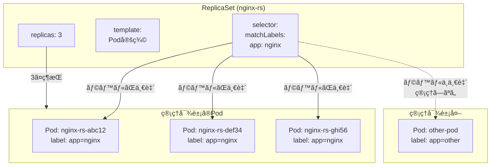

## ã¯ã˜ã‚ã«

Kubernetesã§ã‚¢ãƒ—リケーションを動ã‹ã™ã¨ãã€Podã‚’ç›´æ¥ä½œæˆã™ã‚‹ã ã‘ã§ã¯æœ¬ç•ªé‹ç”¨ã«è€ãˆã‚‰ã‚Œã¾ã›ã‚“。PodãŒè½ã¡ãŸã‚‰æ‰‹å‹•ã§å†ä½œæˆã™ã‚‹å¿…è¦ãŒã‚ã‚Šã€è² è·ã«å¿œã˜ã¦Pod数を増やã™ã®ã‚‚一苦労ã§ã™ã€‚

ã“ã®è¨˜äº‹ã§ã¯ã€ReplicaSetを使ã£ã¦ã“れらã®èª²é¡Œã‚’解決ã™ã‚‹æ–¹æ³•ã‚’紹介ã—ã¾ã™ã€‚

:::message
実際ã®é‹ç”¨ã§ã¯ReplicaSetå˜ä½“ã§ã¯ãªãDeploymentを使ã†ã®ãŒä¸€èˆ¬çš„ã§ã™ã€‚ãŸã ã—ã€Deploymentã¯ReplicaSetを内部ã§åˆ©ç”¨ã—ã¦ã„ã‚‹ãŸã‚ã€ReplicaSetã®å‹•ä½œã‚’ç†è§£ã—ã¦ãŠãã“ã¨ã¯é‡è¦ã§ã™ã€‚
:::

## 環境

- Kubernetes クラスター: Docker Desktop

## Podã ã‘ã§é‹ç”¨ã™ã‚‹ã¨ä½•ãŒå›°ã‚‹ã‹

å˜ä¸€ã®Podã§nginxã‚’å‹•ã‹ã™å ´åˆã‚’考ãˆã¦ã¿ã¾ã™ã€‚

```yaml
apiVersion: v1
kind: Pod
metadata:
  name: nginx
  namespace: dev
spec:
  containers:
  - name: nginx
    image: nginx:latest
```

ã“ã®æ§‹æˆã«ã¯ä»¥ä¸‹ã®å•é¡ŒãŒã‚ã‚Šã¾ã™ã€‚

**1. 障害ã«å¼±ã„**
PodãŒã‚¯ãƒ©ãƒƒã‚·ãƒ¥ã—ãŸã‚Šã€ãƒãƒ¼ãƒ‰ãŒè½ã¡ãŸã‚Šã™ã‚‹ã¨ã€ã‚µãƒ¼ãƒ“スãŒåœæ­¢ã—ã¾ã™ã€‚手動ã§å†ä½œæˆã™ã‚‹ã¾ã§å¾©æ—§ã—ã¾ã›ã‚“。

**2. スケールã§ããªã„**
アクセスãŒå¢—ãˆã¦ã‚‚Podã¯1ã¤ã®ã¾ã¾ã§ã™ã€‚è² è·åˆ†æ•£ã™ã‚‹ã«ã¯ã€åŒã˜Podを複数作æˆã—ã¦ç®¡ç†ã™ã‚‹å¿…è¦ãŒã‚ã‚Šã¾ã™ã€‚

**3. 状態管ç†ãŒç…©é›‘**
複数ã®Podを手動ã§ç®¡ç†ã™ã‚‹ã¨ã€ã©ã®PodãŒå‹•ã„ã¦ã„ã‚‹ã‹æŠŠæ¡ã™ã‚‹ã®ãŒå¤§å¤‰ã«ãªã‚Šã¾ã™ã€‚

## ReplicaSetãŒè§£æ±ºã™ã‚‹ã“ã¨

ReplicaSetã¯ã€ŒæŒ‡å®šã—ãŸæ•°ã®Podを常ã«ç¶­æŒã™ã‚‹ã€ãƒªã‚½ãƒ¼ã‚¹ã§ã™ã€‚

```yaml
apiVersion: apps/v1
kind: ReplicaSet
metadata:
  name: nginx-rs
  namespace: dev
spec:
  replicas: 3
  selector:
    matchLabels:
      app: nginx
  template:
    metadata:
      labels:
        app: nginx
    spec:
      containers:
      - name: nginx
        image: nginx:latest
```

ã“ã‚Œã«ã‚ˆã‚Šä»¥ä¸‹ãŒå®Ÿç¾ã—ã¾ã™ã€‚

- **自動復旧**: PodãŒè½ã¡ã¦ã‚‚ã€è‡ªå‹•çš„ã«æ–°ã—ã„Podを作æˆã—ã¦æŒ‡å®šæ•°ã‚’維æŒ
- **スケーリング**: `replicas`ã®å€¤ã‚’変ãˆã‚‹ã ã‘ã§Pod数を増減
- **宣言的管ç†**: ã‚ã‚‹ã¹ã状態をmanifestã§å®šç¾©ã—ã€KubernetesãŒè‡ªå‹•ã§ç¶­æŒ

### ReplicaSetã¨Podã®é–¢ä¿‚

ReplicaSetãŒPodを管ç†ã™ã‚‹ä»•çµ„ã¿ã‚’図ã§è¡¨ã™ã¨ä»¥ä¸‹ã®ã‚ˆã†ã«ãªã‚Šã¾ã™ã€‚


```mermaid
flowchart TB
    subgraph ReplicaSet["ReplicaSet (nginx-rs)"]
        direction TB
        selector["selector:\n  matchLabels:\n    app: nginx"]
        template["template:\n  Pod定義"]
        replicas["replicas: 3"]
    end

    subgraph Pods["管ç†å¯¾è±¡ã®Pod"]
        pod1["Pod: nginx-rs-abc12\nlabel: app=nginx"]
        pod2["Pod: nginx-rs-def34\nlabel: app=nginx"]
        pod3["Pod: nginx-rs-ghi56\nlabel: app=nginx"]
    end

    subgraph Other["管ç†å¯¾è±¡å¤–"]
        pod4["Pod: other-pod\nlabel: app=other"]
    end

    selector -->|"ラベルãŒä¸€è‡´"| pod1
    selector -->|"ラベルãŒä¸€è‡´"| pod2
    selector -->|"ラベルãŒä¸€è‡´"| pod3
    selector -.->|"ラベルä¸ä¸€è‡´\n管ç†ã—ãªã„"| pod4

    replicas -->|"3ã¤ç¶­æŒ"| Pods
```

ãƒã‚¤ãƒ³ãƒˆã¯ä»¥ä¸‹ã®é€šã‚Šã§ã™ã€‚

- ReplicaSetã¯`selector`ã§æŒ‡å®šã—ãŸãƒ©ãƒ™ãƒ«ã‚’æŒã¤Podã ã‘を管ç†ã™ã‚‹
- `template`ã«åŸºã¥ã„ã¦æ–°ã—ã„Podを作æˆã™ã‚‹
- `replicas`ã§æŒ‡å®šã—ãŸæ•°ã‚’常ã«ç¶­æŒã—よã†ã¨ã™ã‚‹
- ラベルãŒä¸€è‡´ã—ãªã„Podã¯ç®¡ç†å¯¾è±¡å¤–

## manifestを書ã„ã¦ãƒ‡ãƒ—ロイã™ã‚‹

### namespaceを作æˆã™ã‚‹

```bash
kubectl create namespace dev
```

### ReplicaSetを作æˆã™ã‚‹

以下ã®å†…容ã§`nginx-replicaset.yaml`を作æˆã—ã¾ã™ã€‚

```yaml
apiVersion: apps/v1
kind: ReplicaSet
metadata:
  name: nginx-rs
  namespace: dev
spec:
  replicas: 3
  selector:
    matchLabels:
      app: nginx
  template:
    metadata:
      labels:
        app: nginx
    spec:
      containers:
      - name: nginx
        image: nginx:latest
```

å„フィールドã®æ„味ã¯ä»¥ä¸‹ã®é€šã‚Šã§ã™ã€‚

| フィールド | èª¬æ˜ |
|-----------|------|
| `replicas` | 維æŒã™ã‚‹Podã®æ•° |
| `selector.matchLabels` | 管ç†å¯¾è±¡ã¨ã™ã‚‹Podã®ãƒ©ãƒ™ãƒ«æ¡ä»¶ |
| `template` | 作æˆã™ã‚‹Podã®å®šç¾© |
| `template.metadata.labels` | Podã«ä»˜ä¸ã™ã‚‹ãƒ©ãƒ™ãƒ«ï¼ˆselectorã¨ä¸€è‡´ã•ã›ã‚‹ï¼‰ |

### デプロイã™ã‚‹

```bash
kubectl apply -f nginx-replicaset.yaml
```

### 状態を確èªã™ã‚‹

ReplicaSetã®çŠ¶æ…‹ã‚’確èªã—ã¾ã™ã€‚

```bash
kubectl get rs -n dev
```

```
NAME       DESIRED   CURRENT   READY   AGE
nginx-rs   3         3         3       30s
```

Podも確èªã—ã¦ã¿ã¾ã™ã€‚

```bash
kubectl get pod -n dev
```

```
NAME             READY   STATUS    RESTARTS   AGE
nginx-rs-abc12   1/1     Running   0          45s
nginx-rs-def34   1/1     Running   0          45s
nginx-rs-ghi56   1/1     Running   0          45s
```

3ã¤ã®PodãŒè‡ªå‹•çš„ã«ä½œæˆã•ã‚Œã¾ã—ãŸã€‚Podåã«ã¯ReplicaSetå + ランダムãªæ–‡å­—列ãŒä»˜ãã¾ã™ã€‚

### describeã§è©³ç´°ã‚’確èªã™ã‚‹

`kubectl describe`を使ã†ã¨ã€ReplicaSetã®è©³ç´°æƒ…報やイベントログを確èªã§ãã¾ã™ã€‚トラブルシューティングã§é‡å®ã™ã‚‹ã‚³ãƒãƒ³ãƒ‰ã§ã™ã€‚

```bash
kubectl describe rs nginx-rs -n dev
```

```
Name:         nginx-rs
Namespace:    dev
Selector:     app=nginx
Labels:       <none>
Annotations:  <none>
Replicas:     3 current / 3 desired
Pods Status:  3 Running / 0 Waiting / 0 Succeeded / 0 Failed
Pod Template:
  Labels:  app=nginx
  Containers:
   nginx:
    Image:        nginx:latest
    Port:         <none>
    Host Port:    <none>
    Environment:  <none>
    Mounts:       <none>
  Volumes:        <none>
Events:
  Type    Reason            Age   From                   Message
  ----    ------            ----  ----                   -------
  Normal  SuccessfulCreate  60s   replicaset-controller  Created pod: nginx-rs-abc12
  Normal  SuccessfulCreate  60s   replicaset-controller  Created pod: nginx-rs-def34
  Normal  SuccessfulCreate  60s   replicaset-controller  Created pod: nginx-rs-ghi56
```

確èªã§ãる主ãªæƒ…å ±ã¯ä»¥ä¸‹ã®é€šã‚Šã§ã™ã€‚

| é …ç›® | èª¬æ˜ |
|------|------|
| `Selector` | 管ç†å¯¾è±¡Podを識別ã™ã‚‹ãƒ©ãƒ™ãƒ«æ¡ä»¶ |
| `Replicas` | ç¾åœ¨ã®Podæ•° / 期待ã™ã‚‹Podæ•° |
| `Pods Status` | Running/Waiting/Succeeded/Failedã®å†…訳 |
| `Events` | Pod作æˆãƒ»å‰Šé™¤ãªã©ã®æ“作履歴 |

PodãŒèµ·å‹•ã—ãªã„å ´åˆã¯ã€`Events`セクションã«ã‚¨ãƒ©ãƒ¼ã®åŸå› ãŒè¨˜éŒ²ã•ã‚Œã¾ã™ã€‚å•é¡ŒãŒç™ºç”Ÿã—ãŸã‚‰ã¾ãš`describe`ã§ç¢ºèªã™ã‚‹ç¿’慣をã¤ã‘ã¾ã—ょã†ã€‚

## スケーリングを試ã™

Pod数を変更ã™ã‚‹æ–¹æ³•ã‚’2ã¤ç´¹ä»‹ã—ã¾ã™ã€‚

### kubectl scaleã§å³åº§ã«å¤‰æ›´ã™ã‚‹

開発中やトラブル対応ãªã©ã€ã™ãã«Pod数を変ãˆãŸã„ã¨ãã«ä½¿ã„ã¾ã™ã€‚

```bash
kubectl scale rs nginx-rs -n dev --replicas=5
```

```bash
kubectl get pod -n dev
```

```
NAME             READY   STATUS    RESTARTS   AGE
nginx-rs-abc12   1/1     Running   0          2m
nginx-rs-def34   1/1     Running   0          2m
nginx-rs-ghi56   1/1     Running   0          2m
nginx-rs-jkl78   1/1     Running   0          5s
nginx-rs-mno90   1/1     Running   0          5s
```

2ã¤ã®PodãŒè¿½åŠ ã•ã‚Œã€5ã¤ã«ãªã‚Šã¾ã—ãŸã€‚

### manifestを編集ã—ã¦applyã™ã‚‹

本番é‹ç”¨ã§ã¯ã€manifestを変更ã—ã¦Gitã§ç®¡ç†ã™ã‚‹æ–¹æ³•ãŒæ¨å¥¨ã•ã‚Œã¾ã™ã€‚

```diff
spec:
-  replicas: 5
+  replicas: 2
```

```bash
kubectl apply -f nginx-replicaset.yaml
```

```bash
kubectl get pod -n dev
```

```
NAME             READY   STATUS    RESTARTS   AGE
nginx-rs-abc12   1/1     Running   0          5m
nginx-rs-def34   1/1     Running   0          5m
```

5ã¤ã‹ã‚‰2ã¤ã«æ¸›ã‚Šã¾ã—ãŸã€‚ä¸è¦ãªPodã¯è‡ªå‹•çš„ã«å‰Šé™¤ã•ã‚Œã¾ã™ã€‚

## 自己修復を試ã™

ReplicaSetã®è‡ªå·±ä¿®å¾©æ©Ÿèƒ½ã‚’確èªã—ã¦ã¿ã¾ã—ょã†ã€‚

### Podを監視ã™ã‚‹

別ã®ã‚¿ãƒ¼ãƒŸãƒŠãƒ«ã§Podã®çŠ¶æ…‹ã‚’監視ã—ã¾ã™ã€‚

```bash
kubectl get pod -n dev --watch
```

### Podを削除ã—ã¦ã¿ã‚‹

å‹•ã„ã¦ã„ã‚‹Podã‚’1ã¤å‰Šé™¤ã—ã¾ã™ã€‚

```bash
kubectl delete pod nginx-rs-abc12 -n dev
```

監視中ã®ã‚¿ãƒ¼ãƒŸãƒŠãƒ«ã‚’見るã¨ã€ä»¥ä¸‹ã®ã‚ˆã†ãªå¤‰åŒ–ãŒè¦³å¯Ÿã§ãã¾ã™ã€‚

```
NAME             READY   STATUS        RESTARTS   AGE
nginx-rs-abc12   1/1     Terminating   0          10m
nginx-rs-def34   1/1     Running       0          10m
nginx-rs-xyz99   0/1     Pending       0          0s
nginx-rs-xyz99   0/1     ContainerCreating   0   0s
nginx-rs-xyz99   1/1     Running       0          2s
```

PodãŒå‰Šé™¤ã•ã‚Œã‚‹ã¨ã€ã™ãã«æ–°ã—ã„PodãŒä½œæˆã•ã‚Œã¦`replicas: 2`ã®çŠ¶æ…‹ãŒç¶­æŒã•ã‚Œã¾ã™ã€‚ã“ã‚ŒãŒReplicaSetã®è‡ªå·±ä¿®å¾©æ©Ÿèƒ½ã§ã™ã€‚

## ラベルセレクターã®ä»•çµ„ã¿ã‚’ç†è§£ã™ã‚‹

ReplicaSetã¯`selector.matchLabels`ã§æŒ‡å®šã—ãŸãƒ©ãƒ™ãƒ«ã‚’æŒã¤Podを管ç†å¯¾è±¡ã¨ã—ã¾ã™ã€‚ã“ã®ä»•çµ„ã¿ã‚’確èªã—ã¦ã¿ã¾ã—ょã†ã€‚

### åŒã˜ãƒ©ãƒ™ãƒ«ã‚’æŒã¤Podを追加ã™ã‚‹

ReplicaSetãŒç®¡ç†ã™ã‚‹ãƒ©ãƒ™ãƒ«ï¼ˆ`app: nginx`）をæŒã¤Podを手動ã§ä½œæˆã—ã¾ã™ã€‚

```bash
kubectl run extra-nginx --image=nginx:latest -n dev --labels="app=nginx"
```

```bash
kubectl get pod -n dev
```

作æˆã—ãŸPodã¯ã™ãã«å‰Šé™¤ã•ã‚Œã¾ã™ã€‚ReplicaSetã¯`replicas: 2`を維æŒã™ã‚‹ãŸã‚ã€3ã¤ç›®ã®Podã¯ä¸è¦ã¨åˆ¤æ–­ã•ã‚Œã‚‹ã‹ã‚‰ã§ã™ã€‚

### ç•°ãªã‚‹ãƒ©ãƒ™ãƒ«ã‚’æŒã¤Podを追加ã™ã‚‹

今度ã¯åˆ¥ã®ãƒ©ãƒ™ãƒ«ï¼ˆ`app: other`）ã§Podを作æˆã—ã¾ã™ã€‚

```bash
kubectl run other-nginx --image=nginx:latest -n dev --labels="app=other"
```

```bash
kubectl get pod -n dev
```

```
NAME             READY   STATUS    RESTARTS   AGE
nginx-rs-abc12   1/1     Running   0          15m
nginx-rs-def34   1/1     Running   0          15m
other-nginx      1/1     Running   0          5s
```

ã“ã®Podã¯å‰Šé™¤ã•ã‚Œã¾ã›ã‚“。ラベルãŒç•°ãªã‚‹ãŸã‚ã€ReplicaSetã®ç®¡ç†å¯¾è±¡å¤–ã ã‹ã‚‰ã§ã™ã€‚

確èªã§ããŸã‚‰å‰Šé™¤ã—ã¦ãŠãã¾ã™ã€‚

```bash
kubectl delete pod other-nginx -n dev
```

## よãã‚る失敗パターン

ReplicaSetã®manifestを書ãéš›ã«é™¥ã‚Šã‚„ã™ã„ミスを紹介ã—ã¾ã™ã€‚

### selectorã¨templateã®ãƒ©ãƒ™ãƒ«ãŒä¸€è‡´ã—ãªã„

以下ã®manifestã«ã¯å•é¡ŒãŒã‚ã‚Šã¾ã™ã€‚

```yaml
apiVersion: apps/v1
kind: ReplicaSet
metadata:
  name: nginx-rs-broken
  namespace: dev
spec:
  replicas: 3
  selector:
    matchLabels:
      app: nginx        # selectorã¯ã€Œapp: nginxã€
  template:
    metadata:
      labels:
        app: web-server # templateã¯ã€Œapp: web-serverã€â† ä¸ä¸€è‡´ï¼
    spec:
      containers:
      - name: nginx
        image: nginx:latest
```

ã“ã®manifestã‚’é©ç”¨ã™ã‚‹ã¨ã€ä»¥ä¸‹ã®ã‚¨ãƒ©ãƒ¼ãŒç™ºç”Ÿã—ã¾ã™ã€‚

```bash
kubectl apply -f nginx-replicaset-broken.yaml
```

```
The ReplicaSet "nginx-rs-broken" is invalid: spec.template.metadata.labels: Invalid value: map[string]string{"app":"web-server"}: `selector` does not match template `labels`
```

ReplicaSetã¯`selector`ã§æŒ‡å®šã—ãŸãƒ©ãƒ™ãƒ«ã‚’æŒã¤Podを管ç†å¯¾è±¡ã¨ã™ã‚‹ãŸã‚ã€`template`ã§ä½œæˆã™ã‚‹Podã«ã‚‚åŒã˜ãƒ©ãƒ™ãƒ«ãŒå¿…è¦ã§ã™ã€‚両者ãŒä¸€è‡´ã—ãªã„ã¨ã€ä½œæˆã—ãŸPodを自分ã§ç®¡ç†ã§ããªããªã£ã¦ã—ã¾ã„ã¾ã™ã€‚

:::message alert
`selector.matchLabels`ã¨`template.metadata.labels`ã¯å¿…ãšä¸€è‡´ã•ã›ã¦ãã ã•ã„。
:::

## 後片付ã‘

ReplicaSetを削除ã™ã‚‹ã¨ã€ç®¡ç†ä¸‹ã®Podも一緒ã«å‰Šé™¤ã•ã‚Œã¾ã™ã€‚

```bash
kubectl delete -f nginx-replicaset.yaml
```

```bash
kubectl get all -n dev
```

```
No resources found in dev namespace.
```

## ã¾ã¨ã‚

- **ReplicaSet**ã¯æŒ‡å®šã—ãŸæ•°ã®Podを常ã«ç¶­æŒã™ã‚‹ãƒªã‚½ãƒ¼ã‚¹
- **自己修復**: PodãŒè½ã¡ã¦ã‚‚自動的ã«å¾©æ—§ã™ã‚‹
- **スケーリング**: `replicas`ã®å€¤ã‚’変ãˆã‚‹ã ã‘ã§Pod数を増減ã§ãã‚‹
- **ラベルセレクター**ã§ç®¡ç†å¯¾è±¡ã®Podを識別ã™ã‚‹
- 実é‹ç”¨ã§ã¯**Deployment**経由ã§ReplicaSetを使ã†ã®ãŒä¸€èˆ¬çš„

## å‚考資料

- [ReplicaSet | Kubernetes](https://kubernetes.io/ja/docs/concepts/workloads/controllers/replicaset/)
