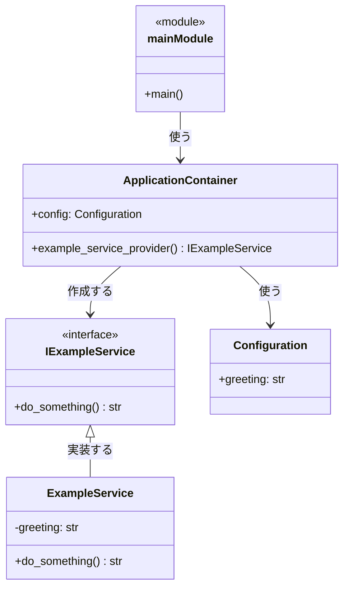

[dependency_injector](https://python-dependency-injector.ets-labs.org/) は Python 向けの依存性注入ライブラリです。

# 基本的な使い方

## ディレクトリ構成

```plaintext
.
├── containers.py
├── main.py
└── services.py
```

Laravelではサービスプロバイダを用いて依存性を注入しますが、dependency_injectorではコンテナを通じて依存性注入を実現します。この例では、main.pyはExampleServiceの具体的な実装を直接参照することなく、ApplicationContainerからExampleServiceのインスタンスを取得しています。



## 1. サービスの定義

まずはサービスのインターフェースと実装を定義します。

```Python
from abc import ABC, abstractmethod

class IExampleService(ABC):
    @abstractmethod
    def do_something(self) -> str:
        pass

class ExampleService(IExampleService):
    def __init__(self, greeting: str):
        self.greeting = greeting

    def do_something(self) -> str:
        return f"{self.greeting}, Dependency Injection!"
```

## 2. コンテナの定義

サービスを提供するためのコンテナを作成します。

```Python
from dependency_injector import containers, providers
from services import ExampleService


class ApplicationContainer(containers.DeclarativeContainer):
    config = providers.Configuration()


    example_service_provider = providers.Factory(
        ExampleService,
        greeting=config.greeting,
    )
```

## 3. コンテナを使った依存性の注入

作成したコンテナを使用して依存性を注入します。

```Python
from containers import ApplicationContainer
from services import IExampleService


def main():
    container = ApplicationContainer()
    container.config.from_dict({"greeting": "Hello"})

    example_service: IExampleService = container.example_service_provider()

    print(example_service.do_something())  # "Hello, Dependency Injection!"


if __name__ == "__main__":
    main()
```

## 4. @injectで依存性を注入する

dependency_injector は自動で依存性を注入する仕組みも提供しています。

```Python
from dependency_injector.wiring import inject, Provide
from containers import ApplicationContainer
from services import ExampleService


@inject
def run_service(
        service: ExampleService = Provide[ApplicationContainer.example_service_provider]
):
    print(service.do_something())


if __name__ == "__main__":
    container = ApplicationContainer()
    container.config.from_dict({"greeting": "Hello"})
    container.wire(modules=[__name__])

run_service()
```

## 実行してみる

```bash
$ python main.py
Hello, Dependency Injection!
```

# まとめ

fastapiの依存注入だと、依存性を注入するために関数の引数に依存性を渡す必要がありますが、dependency_injector
を使うと、依存性を注入するためのコンテナを作成し、コンテナを使って依存性を注入することができます。
