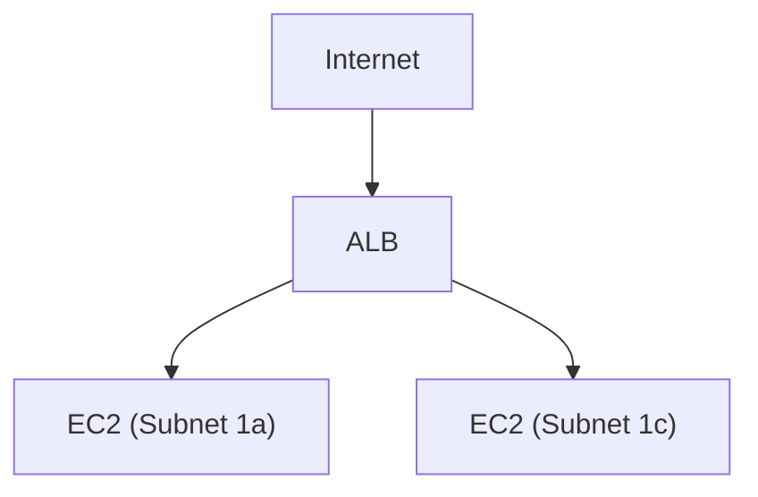
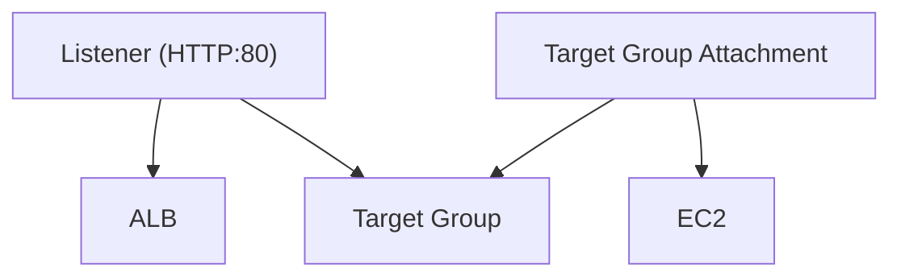

前回の記事では、VPCを構築してEC2上のWebサーバーにアクセスしました。
しかし、EC2が1台だけの構成ではその1台が落ちるとサービスが停止します。また、アクセスが増えたときに1台では処理しきれません。

この記事では、ALB（Application Load Balancer）を導入して、2台のEC2にリクエストを分散する構成を作ります。

## 最終構成



ALBのDNS名にアクセスすると、2台のEC2に交互にリクエストが振り分けられることをゴールとします。

## ALB関連リソースの依存関係

この記事で作成するALB関連リソースと、その依存関係です。

| リソース | Terraform リソース | 役割 |
|---------|-------------------|------|
| ALB | `aws_lb` | リクエストを受け付けるエンドポイント。DNS名が割り当てられる |
| Listener | `aws_lb_listener` | ALBがどのポート・プロトコルでリクエストを待ち受け、どこに転送するかを定義する |
| Target Group | `aws_lb_target_group` | 転送先のグループ。ヘルスチェックの設定を持つ |
| Target Group Attachment | `aws_lb_target_group_attachment` | Target GroupにEC2を登録する紐付けリソース |
| EC2 | `aws_instance` | 実際にリクエストを処理するWebサーバー |

`terraform graph` の出力をもとに依存関係を図にしたものです。矢印は「依存している」方向を示します。



ListenerはALBとTarget Groupの両方が先に存在しないと作れません。同様に、Target Group AttachmentはTarget GroupとEC2の両方に依存します。

## 前提

- AWSアカウントがあること
- Terraform CLIがインストールされていること
- AWS CLIで認証情報が設定されていること
- [前回の記事](https://zenn.dev/maitake_and/articles/aws_network_e1903e24071d9e)でVPCの基本を理解していること

## 1. ネットワークを構築する

前回と同じVPC + パブリックサブネットの構成を作ります。ここでは説明を省略します。詳しくは[前回の記事](https://zenn.dev/maitake_and/articles/aws_network_e1903e24071d9e)を参照してください。

```hcl
resource "aws_vpc" "main" {
  cidr_block           = "10.0.0.0/16"
  enable_dns_support   = true
  enable_dns_hostnames = true
  tags = {
    Name = "alb-basics-vpc"
  }
}

resource "aws_internet_gateway" "main" {
  vpc_id = aws_vpc.main.id
  tags = {
    Name = "alb-basics-igw"
  }
}

resource "aws_subnet" "public_a" {
  vpc_id                  = aws_vpc.main.id
  cidr_block              = "10.0.1.0/24"
  availability_zone       = "ap-northeast-1a"
  map_public_ip_on_launch = true
  tags = {
    Name = "alb-basics-public-a"
  }
}

resource "aws_subnet" "public_c" {
  vpc_id                  = aws_vpc.main.id
  cidr_block              = "10.0.2.0/24"
  availability_zone       = "ap-northeast-1c"
  map_public_ip_on_launch = true
  tags = {
    Name = "alb-basics-public-c"
  }
}

resource "aws_route_table" "public" {
  vpc_id = aws_vpc.main.id

  route {
    cidr_block = "0.0.0.0/0"
    gateway_id = aws_internet_gateway.main.id
  }

  tags = {
    Name = "alb-basics-public-rt"
  }
}

resource "aws_route_table_association" "public_a" {
  subnet_id      = aws_subnet.public_a.id
  route_table_id = aws_route_table.public.id
}

resource "aws_route_table_association" "public_c" {
  subnet_id      = aws_subnet.public_c.id
  route_table_id = aws_route_table.public.id
}
```

## 2. セキュリティグループを設計する

前回はEC2のセキュリティグループに `0.0.0.0/0`（全IP）からのHTTPアクセスを許可していました。ALBを導入する場合、セキュリティグループの設計が変わります。

### なぜセキュリティグループを分けるのか

ALBがない構成では、ユーザーが直接EC2にアクセスします。

```
ユーザー → EC2
```

ALBを導入すると、ユーザーはALBにアクセスし、ALBがEC2に転送します。

```
ユーザー → ALB → EC2
```

EC2にはALBからのリクエストだけを受け付ければよいので、セキュリティグループを以下のように分けます。

| セキュリティグループ | インバウンド許可 |
|-------------------|----------------|
| ALB用 | `0.0.0.0/0` からHTTP（80） |
| EC2用 | **ALBのセキュリティグループ**からHTTP（80） |

EC2のインバウンドにCIDRではなくALBのセキュリティグループIDを指定することで、「ALBを経由した通信のみ許可」を実現できます。EC2にパブリックIPがあっても、直接アクセスしようとすると拒否されます。

### Terraformで作成

```hcl
# ALB用セキュリティグループ
resource "aws_security_group" "alb" {
  name   = "alb-basics-alb-sg"
  vpc_id = aws_vpc.main.id

  ingress {
    from_port   = 80
    to_port     = 80
    protocol    = "tcp"
    cidr_blocks = ["0.0.0.0/0"]
  }

  egress {
    from_port   = 0
    to_port     = 0
    protocol    = "-1"
    cidr_blocks = ["0.0.0.0/0"]
  }

  tags = {
    Name = "alb-basics-alb-sg"
  }
}

# EC2用セキュリティグループ
resource "aws_security_group" "web" {
  name   = "alb-basics-web-sg"
  vpc_id = aws_vpc.main.id

  ingress {
    from_port       = 80
    to_port         = 80
    protocol        = "tcp"
    security_groups = [aws_security_group.alb.id]  # ALBからのみ許可
  }

  egress {
    from_port   = 0
    to_port     = 0
    protocol    = "-1"
    cidr_blocks = ["0.0.0.0/0"]
  }

  tags = {
    Name = "alb-basics-web-sg"
  }
}
```

### AWS CLIで確認する

```bash
aws ec2 describe-security-groups \
  --filters "Name=group-name,Values=alb-basics-*" \
  --query "SecurityGroups[].{Name:GroupName,GroupId:GroupId,IngressFrom:IpPermissions[0].IpRanges[0].CidrIp,IngressFromSG:IpPermissions[0].UserIdGroupPairs[0].GroupId}" \
  --output table
```

EC2用のセキュリティグループでは `IngressFromSG` にALBのセキュリティグループIDが入っていることを確認します。

## 3. EC2を2台起動する

各AZに1台ずつ、計2台のEC2を起動します。どのEC2にリクエストが振り分けられたかわかるように、User DataでインスタンスIDとAZをレスポンスに含めます。

```hcl
data "aws_ami" "amazon_linux_2023" {
  most_recent = true
  owners      = ["amazon"]

  filter {
    name   = "name"
    values = ["al2023-ami-*-x86_64"]
  }

  filter {
    name   = "state"
    values = ["available"]
  }
}

resource "aws_instance" "web_a" {
  ami                    = data.aws_ami.amazon_linux_2023.id
  instance_type          = "t2.micro"
  subnet_id              = aws_subnet.public_a.id
  vpc_security_group_ids = [aws_security_group.web.id]

  user_data = <<-EOF
    #!/bin/bash
    yum install -y httpd
    systemctl start httpd
    systemctl enable httpd
    INSTANCE_ID=$(ec2-metadata -i | cut -d' ' -f2)
    AZ=$(ec2-metadata -z | cut -d' ' -f2)
    echo "Hello from $INSTANCE_ID ($AZ)" > /var/www/html/index.html
  EOF

  tags = {
    Name = "alb-basics-web-a"
  }
}

resource "aws_instance" "web_c" {
  ami                    = data.aws_ami.amazon_linux_2023.id
  instance_type          = "t2.micro"
  subnet_id              = aws_subnet.public_c.id
  vpc_security_group_ids = [aws_security_group.web.id]

  user_data = <<-EOF
    #!/bin/bash
    yum install -y httpd
    systemctl start httpd
    systemctl enable httpd
    INSTANCE_ID=$(ec2-metadata -i | cut -d' ' -f2)
    AZ=$(ec2-metadata -z | cut -d' ' -f2)
    echo "Hello from $INSTANCE_ID ($AZ)" > /var/www/html/index.html
  EOF

  tags = {
    Name = "alb-basics-web-c"
  }
}
```

### AWS CLIで確認する

```bash
aws ec2 describe-instances \
  --filters "Name=tag:Name,Values=alb-basics-web-*" "Name=instance-state-name,Values=running" \
  --query "Reservations[].Instances[].{Name:Tags[?Key=='Name']|[0].Value,InstanceId:InstanceId,AZ:Placement.AvailabilityZone,PrivateIp:PrivateIpAddress}" \
  --output table
```

```
---------------------------------------------------------------------
|                        DescribeInstances                          |
+------------------+-------------+------------------+---------------+
|        AZ        | InstanceId  |      Name        |   PrivateIp   |
+------------------+-------------+------------------+---------------+
| ap-northeast-1a  | i-xxxxxxx   | alb-basics-web-a | 10.0.1.xxx    |
| ap-northeast-1c  | i-xxxxxxx   | alb-basics-web-c | 10.0.2.xxx    |
+------------------+-------------+------------------+---------------+
```

2台が異なるAZで起動していることを確認します。

## 4. ALBを作成する

### ALBとは

ALB（Application Load Balancer）は、HTTP/HTTPSのリクエストを複数のターゲットに振り分けるロードバランサーです。ALBはOSI参照モデルのレイヤー7（アプリケーション層）で動作し、URLパスやホストヘッダーに基づくルーティングが可能です。

ALBは3つのコンポーネントで構成されます。

| コンポーネント | 役割 |
|--------------|------|
| ロードバランサー | リクエストを受け付けるエンドポイント。DNS名が割り当てられる |
| リスナー | ポートとプロトコルを指定して、リクエストの受付ルールを定義する |
| ターゲットグループ | リクエストの転送先とヘルスチェックの設定を管理する |

```
ユーザー → ALB (DNS名) → リスナー (HTTP:80) → ターゲットグループ → EC2
```

### ALBには2つ以上のAZが必要

ALBは最低2つのAZにまたがるサブネットを指定する必要があります。これは可用性を確保するためです。1つのAZが障害で使えなくなっても、もう1つのAZでリクエストを処理し続けられます。

### Terraformで作成

```hcl
resource "aws_lb" "main" {
  name               = "alb-basics"
  internal           = false
  load_balancer_type = "application"
  security_groups    = [aws_security_group.alb.id]
  subnets            = [aws_subnet.public_a.id, aws_subnet.public_c.id]

  tags = {
    Name = "alb-basics"
  }
}
```

- `internal = false` でインターネット向け（外部公開）のALBを作成します
- `load_balancer_type = "application"` でALBを指定します（他に `network` でNLBを作成可能）

### AWS CLIで確認する

```bash
aws elbv2 describe-load-balancers \
  --names alb-basics \
  --query "LoadBalancers[0].{DNSName:DNSName,State:State.Code,Scheme:Scheme,AZs:AvailabilityZones[].ZoneName}" \
  --output table
```

```
----------------------------------------------------------------------
|                      DescribeLoadBalancers                         |
+--------------------------------------+----------+-----------------+
|               DNSName                |  Scheme  |     State       |
+--------------------------------------+----------+-----------------+
| alb-basics-xxxxxxxxx.ap-northeast-1.elb.amazonaws.com | internet-facing | active |
+--------------------------------------+----------+-----------------+
```

`Scheme` が `internet-facing`、`State` が `active` になっていればOKです。

## 5. ターゲットグループを作成してEC2を登録する

### ターゲットグループとは

ターゲットグループは、ALBがリクエストを転送する先のグループです。EC2インスタンスをターゲットとして登録し、ヘルスチェックの設定を行います。

### ヘルスチェック

ALBはターゲットグループに登録されたEC2に対して定期的にHTTPリクエストを送り、正常に応答するか確認します。異常と判定されたEC2にはリクエストが振り分けられなくなります。

| 設定 | 値 | 意味 |
|------|---|------|
| path | `/` | ヘルスチェックのリクエスト先 |
| interval | 10秒 | チェックの間隔 |
| healthy_threshold | 2 | 2回連続で成功したら「正常」に戻す |
| unhealthy_threshold | 3 | 3回連続で失敗したら「異常」と判定 |
| timeout | 5秒 | レスポンスの待ち時間 |
| matcher | 200 | 正常と見なすHTTPステータスコード |

### Terraformで作成

```hcl
resource "aws_lb_target_group" "web" {
  name     = "alb-basics-tg"
  port     = 80
  protocol = "HTTP"
  vpc_id   = aws_vpc.main.id

  health_check {
    path                = "/"
    protocol            = "HTTP"
    healthy_threshold   = 2
    unhealthy_threshold = 3
    timeout             = 5
    interval            = 10
    matcher             = "200"
  }

  tags = {
    Name = "alb-basics-tg"
  }
}

resource "aws_lb_target_group_attachment" "web_a" {
  target_group_arn = aws_lb_target_group.web.arn
  target_id        = aws_instance.web_a.id
  port             = 80
}

resource "aws_lb_target_group_attachment" "web_c" {
  target_group_arn = aws_lb_target_group.web.arn
  target_id        = aws_instance.web_c.id
  port             = 80
}
```

### AWS CLIで確認する

ターゲットのヘルスチェック状態を確認します。

```bash
TG_ARN=$(aws elbv2 describe-target-groups \
  --names alb-basics-tg \
  --query "TargetGroups[0].TargetGroupArn" \
  --output text)

aws elbv2 describe-target-health \
  --target-group-arn $TG_ARN \
  --query "TargetHealthDescriptions[].{TargetId:Target.Id,Port:Target.Port,State:TargetHealth.State}" \
  --output table
```

```
--------------------------------------------
|          DescribeTargetHealth            |
+-------------+------+--------------------+
|   TargetId  | Port |       State        |
+-------------+------+--------------------+
| i-xxxxxxx   | 80   | healthy            |
| i-xxxxxxx   | 80   | healthy            |
+-------------+------+--------------------+
```

2台とも `healthy` になっていればヘルスチェックが通っています。起動直後は `initial` の場合があるので、少し待ってから再確認してください。

## 6. リスナーを作成する

### リスナーとは

リスナーは、ALBがどのポート・プロトコルでリクエストを待ち受け、どのターゲットグループに転送するかを定義します。

今回はHTTP（80番ポート）でリクエストを受け付け、ターゲットグループにフォワードする設定にします。

```hcl
resource "aws_lb_listener" "http" {
  load_balancer_arn = aws_lb.main.arn
  port              = 80
  protocol          = "HTTP"

  default_action {
    type             = "forward"
    target_group_arn = aws_lb_target_group.web.arn
  }
}
```

### AWS CLIで確認する

```bash
aws elbv2 describe-listeners \
  --load-balancer-arn $(aws elbv2 describe-load-balancers --names alb-basics --query "LoadBalancers[0].LoadBalancerArn" --output text) \
  --query "Listeners[].{Port:Port,Protocol:Protocol,ActionType:DefaultActions[0].Type}" \
  --output table
```

```
-----------------------------------------
|          DescribeListeners            |
+-------------+------+------------------+
| ActionType  | Port |    Protocol      |
+-------------+------+------------------+
| forward     | 80   | HTTP             |
+-------------+------+------------------+
```

## 7. デプロイと動作確認

### デプロイ

```bash
terraform init
terraform apply
```

### 負荷分散の確認

ALBのDNS名に対してcurlを複数回実行します。

```bash
ALB_DNS=$(terraform output -raw alb_dns_name)

for i in $(seq 1 6); do
  curl -s http://$ALB_DNS
done
```

```
Hello from i-0abc1234 (ap-northeast-1a)
Hello from i-0def5678 (ap-northeast-1c)
Hello from i-0abc1234 (ap-northeast-1a)
Hello from i-0def5678 (ap-northeast-1c)
Hello from i-0abc1234 (ap-northeast-1a)
Hello from i-0def5678 (ap-northeast-1c)
```

リクエストが2台のEC2に交互に振り分けられていることがわかります。これがALBのデフォルトのルーティングアルゴリズム（ラウンドロビン）です。

### EC2への直接アクセスが拒否されることを確認する

EC2にはパブリックIPが割り当てられていますが、セキュリティグループでALBからの通信のみ許可しているため、直接アクセスするとタイムアウトします。

```bash
EC2_IP=$(aws ec2 describe-instances \
  --filters "Name=tag:Name,Values=alb-basics-web-a" "Name=instance-state-name,Values=running" \
  --query "Reservations[0].Instances[0].PublicIpAddress" \
  --output text)

curl --connect-timeout 5 http://$EC2_IP
# => curl: (28) Connection timed out
```

ユーザーは必ずALBを経由してEC2にアクセスする構成になっています。

### 通信の流れを整理する

```
ユーザー
  → Internet
    → ALB (DNS名で解決)
      → リスナー (HTTP:80)
        → ターゲットグループ (ラウンドロビン)
          → EC2-a or EC2-c (Apache)
```

## 8. ヘルスチェックの動作を確認する

1台のEC2を停止して、ALBがリクエストの振り分けから自動的に除外することを確認します。

### EC2を1台停止する

```bash
INSTANCE_ID=$(aws ec2 describe-instances \
  --filters "Name=tag:Name,Values=alb-basics-web-a" "Name=instance-state-name,Values=running" \
  --query "Reservations[0].Instances[0].InstanceId" \
  --output text)

aws ec2 stop-instances --instance-ids $INSTANCE_ID
```

### ヘルスチェック状態を確認する

```bash
aws elbv2 describe-target-health \
  --target-group-arn $TG_ARN \
  --query "TargetHealthDescriptions[].{TargetId:Target.Id,State:TargetHealth.State}" \
  --output table
```

```
-----------------------------------
|      DescribeTargetHealth       |
+-------------+-------------------+
|  TargetId   |      State        |
+-------------+-------------------+
| i-0abc1234  | unhealthy         |
| i-0def5678  | healthy           |
+-------------+-------------------+
```

停止したEC2が `unhealthy` になりました。

### リクエストの振り分けを確認する

```bash
for i in $(seq 1 4); do
  curl -s http://$ALB_DNS
done
```

```
Hello from i-0def5678 (ap-northeast-1c)
Hello from i-0def5678 (ap-northeast-1c)
Hello from i-0def5678 (ap-northeast-1c)
Hello from i-0def5678 (ap-northeast-1c)
```

すべてのリクエストが正常な1台のEC2に振り分けられています。ALBがヘルスチェックで異常を検知し、自動的にその EC2への振り分けを停止しました。

### EC2を復旧する

```bash
aws ec2 start-instances --instance-ids $INSTANCE_ID
```

しばらく待ってからヘルスチェック状態を確認すると、`healthy` に戻ります。リクエストも再び2台に分散されるようになります。

## 9. リソースを削除する

```bash
terraform destroy
```

## まとめ

この記事では、以下のリソースをTerraformで作成しました。

| リソース | 役割 |
|---------|------|
| ALB | リクエストを受け付けて複数のEC2に分散する |
| リスナー | ALBがリクエストを受け付けるポートとプロトコルを定義する |
| ターゲットグループ | 転送先のEC2とヘルスチェックを管理する |
| セキュリティグループ（ALB用） | インターネットからのHTTPを許可する |
| セキュリティグループ（EC2用） | ALBからのHTTPのみ許可する |

ALBを導入することで:

- **負荷分散**: リクエストを複数のEC2に分散できる
- **可用性向上**: 1台が落ちても別のEC2で処理を継続できる
- **セキュリティ**: EC2への直接アクセスを防げる

## 参考

- [ALB ドキュメント](https://docs.aws.amazon.com/ja_jp/elasticloadbalancing/latest/application/introduction.html)
- [ターゲットグループのヘルスチェック](https://docs.aws.amazon.com/ja_jp/elasticloadbalancing/latest/application/target-group-health-checks.html)
