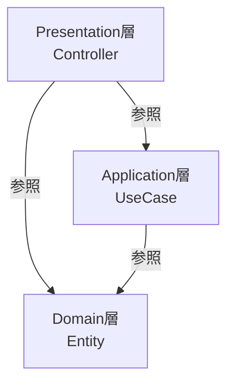

## はじめに

クリーンアーキテクチャやレイヤードアーキテクチャを学んでいて、ふと疑問に思いました。

> EntityをそのままUseCaseの引数にしたり、Presentation層に返したりしても、依存の方向は外から内になっているから問題ないのでは？DTOはどういうときに使うのがいいんだろう？

調べてみると、依存関係のルール的には確かに間違っていません。でも実際にコードを書いてみて、DTOを使ったほうが「考える範囲」が減って楽になることに気づきました。

## 依存関係だけ見れば正しい



外側の層が内側の層を参照する。依存の矢印はすべて内側に向かっているので、依存関係のルールには違反していません。

```php
// Controller
class ProductController
{
    public function show(string $id): JsonResponse
    {
        $product = $this->getProductUseCase->execute($id);

        // Entityを直接JSONに変換
        return response()->json([
            'id' => $product->id,
            'name' => $product->name,
            'price' => $product->price,
        ]);
    }
}

// UseCase
class GetProductUseCase
{
    public function execute(string $id): Product  // Entityを返す
    {
        return $this->productRepository->findById($id);
    }
}
```

これで動くし、依存関係も正しい。では何が問題なのでしょうか。

## 問題は「考える範囲」が広がること

### 1. Entityの変更がどこまで影響するか分からない

Entityに新しいプロパティを追加したとき、どこまで影響があるか考える必要があります。

```php
class Product
{
    public string $id;
    public string $name;
    public int $price;
    public int $cost;         // 原価を追加（外部に見せたくない）
    public int $stockCount;   // 在庫数を追加（内部管理用）
}
```

「このプロパティ、APIレスポンスに含まれてしまっていないだろうか」

Entityを直接返していると、すべてのControllerを確認しないと安心できません。

### 2. Entityのメソッドを呼んでいいのか迷う

Entityにはドメインロジックを持つメソッドがあります。

```php
class Product
{
    public function changePrice(int $newPrice): void
    {
        $this->price = $newPrice;
    }

    public function decreaseStock(int $quantity): void
    {
        $this->stockCount -= $quantity;
    }
}
```

Controller層でEntityを受け取ったとき、「このメソッドを呼んでいいのか」という疑問が生まれます。

```php
// Controller
public function show(string $id): JsonResponse
{
    $product = $this->getProductUseCase->execute($id);

    // これ、ここで呼んでいいの...？
    $product->changePrice(1000);

    return response()->json([...]);
}
```

「呼ばないでね」というルールを共有すればいいのですが、それは人の注意力に依存したルールです。

### 3. テストで「どこまで検証すべきか」が曖昧になる

UseCaseのテストで、Entityを返す場合を考えてみます。

```php
public function test_商品を取得できる(): void
{
    $product = $this->useCase->execute('product-1');

    // どこまで検証する？
    $this->assertSame('product-1', $product->id);
    $this->assertSame('テスト商品', $product->name);
    $this->assertSame(1000, $product->price);
    // costは検証しない？
    // stockCountは？
}
```

「このUseCaseが保証すべき範囲」が曖昧になります。

## DTOを使うと「考える範囲」が限定される

### 1. 公開する情報が明示的になる

```php
// UseCase層で定義するDTO
class ProductResponse
{
    public function __construct(
        public readonly string $id,
        public readonly string $name,
        public readonly int $price,
    ) {}
}
```

このDTOを見れば、「このUseCaseが外部に公開する情報はこれだけ」と一目で分かります。

Entityに`cost`を追加しても、DTOの変換処理を変えない限り外に漏れません。

### 2. 境界が型で強制される

```php
// UseCase
class GetProductUseCase
{
    public function execute(string $id): ProductResponse
    {
        $product = $this->productRepository->findById($id);

        return new ProductResponse(
            id: $product->id,
            name: $product->name,
            price: $product->price,
        );
    }
}
```

Controller層が受け取るのは`ProductResponse`であって`Product`（Entity）ではありません。

```php
// Controller
public function show(string $id): JsonResponse
{
    $response = $this->getProductUseCase->execute($id);

    // $response->changePrice() なんてメソッドは存在しない
    // 型レベルで不正な操作が防がれる

    return response()->json($response);
}
```

「このオブジェクトで何ができるか」が型で制限されるため、考える必要がなくなります。

### 3. テストの検証範囲が明確になる

```php
public function test_商品を取得できる(): void
{
    $response = $this->useCase->execute('product-1');

    // DTOのプロパティをすべて検証すればOK
    $this->assertSame('product-1', $response->id);
    $this->assertSame('テスト商品', $response->name);
    $this->assertSame(1000, $response->price);
}
```

「DTOに含まれるものをすべて検証する」というシンプルなルールで済みます。

## 入力側も同じ

ここまでUseCaseからの「出力」について説明してきましたが、UseCaseへの「入力」も同様です。

Entityではなく専用のDTO（Commandと呼ばれることもあります）を使うことで、同じメリットが得られます。

```php
// 入力用DTO（Command）
class CreateProductCommand
{
    public function __construct(
        public readonly string $name,
        public readonly int $price,
        public readonly string $categoryId,
    ) {}
}

// UseCase
class CreateProductUseCase
{
    public function execute(CreateProductCommand $command): ProductResponse
    {
        // Commandから必要な情報を取り出してEntityを作る
        $product = Product::create(
            name: $command->name,
            price: $command->price,
            categoryId: $command->categoryId,
        );

        $this->productRepository->save($product);

        return new ProductResponse(...);
    }
}
```

Controller層は「Commandに何を詰めればいいか」だけ考えればよく、Entityの構造を知る必要がありません。

## 「変換コストが...」という懸念への回答

DTOを使うと、Entity ↔ DTO の変換処理が必要になります。

```php
return new ProductResponse(
    id: $product->id,
    name: $product->name,
    price: $product->price,
);
```

「ボイラープレートが増える」「パフォーマンスが心配」という懸念はよく聞きます。

しかし実際には：

- **変換処理は1箇所に集約される**：UseCase内、またはAssembler/Mapperクラスに閉じ込められる。散らばるわけではない
- **パフォーマンス影響は誤差**：オブジェクト生成のコストは、DBアクセスやネットワーク通信に比べれば無視できるレベル
- **変換処理自体がドキュメントになる**：「何を外部に公開しているか」がコードとして明示される。むしろ可読性が上がる

## 使い分けの指針

すべてにDTOを使う必要はありません。

### DTOを使うべき場面

- **レイヤー境界を跨ぐ場合**：UseCase ↔ Controller、UseCase ↔ 外部API
- **公開する情報を制限したい場合**：Entityに外部に見せたくない情報がある
- **長期メンテナンスが予想される場合**：変更の影響範囲を限定したい

### DTOを省略できる場面

- **シンプルなValue Object**：`Money`や`Email`などの不変オブジェクトはそのまま渡しても問題ない
- **内部UseCase間の連携**：同じモジュール内の呼び出しではEntityを直接渡すこともある
- **プロトタイプや短命なコード**：捨てる前提のコードに設計コストをかけすぎない

## まとめ

「依存関係が正しければOK」というのは最低限のルールにすぎません。

DTOを使うことで得られるのは、各層が「自分の責務だけ考えればいい」という状態です。

| 層 | 考えること |
|---|---|
| Controller | DTOをJSONにするだけ |
| UseCase | Entityを操作してDTOを返すだけ |
| Entity | 外部からどう使われるかを気にしなくていい |

「考える範囲が減る」というのは、言い換えれば**認知負荷の軽減**です。コードを書くときも、読むときも、レビューするときも楽になります。

依存関係のルールを守るのは前提です。その上でDTOによる境界の明確化をしておくと、Entityの変更が怖くなくなります。「Entityを変えたらどこに影響するか全部調べなきゃ...」というストレスから解放されるのは、思った以上に大きなメリットです。
