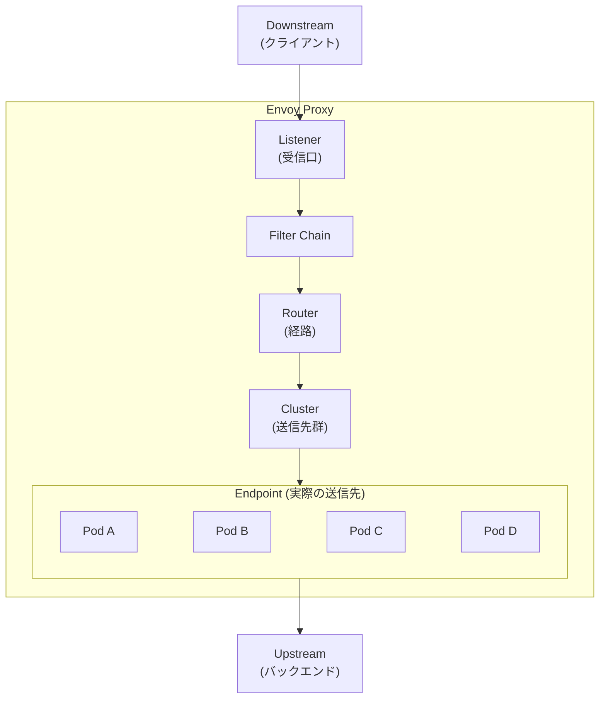
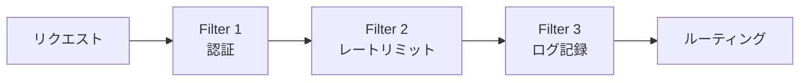
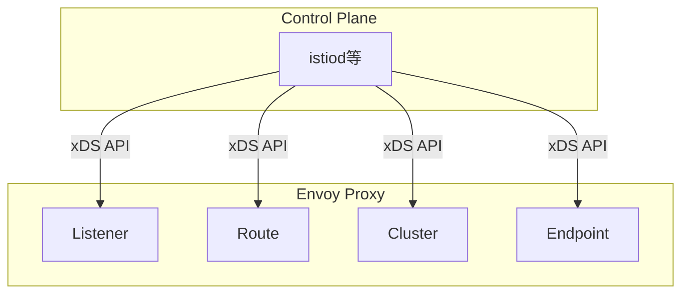
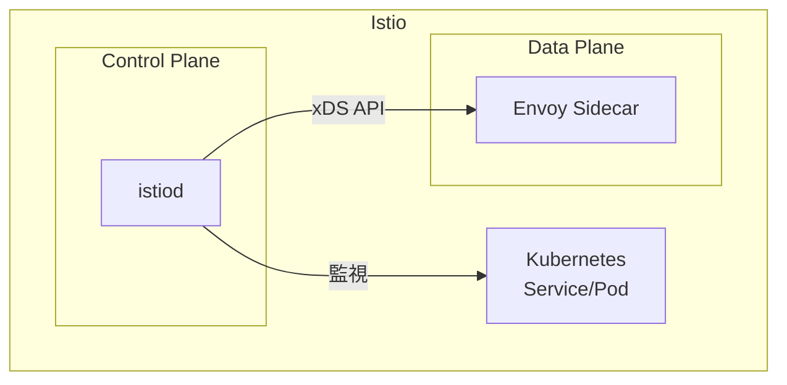

Envoyは、クラウドネイティブアプリケーション向けに設計された高性能なL4/L7プロキシです。Istioのデータプレーンとして採用されており、サービスメッシュの中核を担っています。

この記事では、Istioを学ぶ前に理解しておきたいEnvoyの基本概念を解説します。

## Envoyとは

### 概要

Envoyは、Lyft社が開発しOSSとして公開したプロキシサーバーです。以下の特徴があります：

- **L4/L7プロキシ**: TCP/UDP（L4）とHTTP/gRPC（L7）の両方に対応
- **動的設定**: 再起動なしで設定を変更可能（xDS API）
- **オブザーバビリティ**: メトリクス、ログ、トレーシングを標準サポート
- **拡張性**: フィルターチェーンによる柔軟な機能追加

### なぜEnvoyが必要か

従来のプロキシ（Nginx、HAProxy等）との違い：

| 項目 | 従来のプロキシ | Envoy |
|------|---------------|-------|
| 設定変更 | 再起動が必要 | 動的に反映（xDS API） |
| サービスディスカバリ | 外部ツールが必要 | ネイティブサポート |
| オブザーバビリティ | 追加設定が必要 | 標準組み込み |
| マイクロサービス対応 | 追加設定が必要 | 設計段階から考慮 |

## アーキテクチャ

### 基本構成



### 4つの主要コンポーネント

#### 1. Listener（リスナー）

リクエストを受け付けるエントリーポイントです。

```yaml
listeners:
  - name: listener_0
    address:
      socket_address:
        address: 0.0.0.0
        port_value: 8080
```

- 特定のポート/アドレスでリクエストを待ち受ける
- 複数のListenerを定義可能
- TCP/UDPの両方に対応

#### 2. Filter Chain（フィルターチェーン）

リクエストを処理するフィルターの連鎖です。



主なフィルター：
- `envoy.filters.network.http_connection_manager`: HTTP処理
- `envoy.filters.http.router`: ルーティング
- `envoy.filters.http.jwt_authn`: JWT認証
- `envoy.filters.http.local_ratelimit`: レートリミット

#### 3. Route（ルート）

リクエストの振り分けルールを定義します。

```yaml
route_config:
  name: local_route
  virtual_hosts:
    - name: backend
      domains: ["*"]
      routes:
        - match:
            prefix: "/api/v1"
          route:
            cluster: api_v1_cluster
        - match:
            prefix: "/api/v2"
          route:
            cluster: api_v2_cluster
```

- パス、ヘッダー、メソッド等でマッチング
- 重み付けルーティング（カナリアリリース）
- リダイレクト、リトライ設定

#### 4. Cluster（クラスター）

送信先エンドポイントのグループです。

```yaml
clusters:
  - name: api_v1_cluster
    type: STRICT_DNS
    lb_policy: ROUND_ROBIN
    load_assignment:
      cluster_name: api_v1_cluster
      endpoints:
        - lb_endpoints:
            - endpoint:
                address:
                  socket_address:
                    address: api-v1-service
                    port_value: 80
```

- ロードバランシングポリシー（ROUND_ROBIN、LEAST_REQUEST等）
- ヘルスチェック設定
- サーキットブレーカー設定
- 接続プール設定

## リクエストの流れ

1. **クライアントがリクエスト送信**
2. **Listenerがリクエストを受信**
3. **Filter Chainで処理** - HTTP解析、認証/認可、レートリミット、ログ記録
4. **Routerがルートをマッチング** - パス・ヘッダーで判定し、該当するClusterを選択
5. **Cluster内のエンドポイントへ転送** - ロードバランシング、ヘルスチェック済みの正常なエンドポイントを選択
6. **レスポンスを返却**

## xDS API（動的設定）

Envoyの大きな特徴は、xDS APIによる動的設定です。

### xDS APIの種類

| API | 正式名 | 役割 |
|-----|--------|------|
| LDS | Listener Discovery Service | Listenerの動的設定 |
| RDS | Route Discovery Service | Routeの動的設定 |
| CDS | Cluster Discovery Service | Clusterの動的設定 |
| EDS | Endpoint Discovery Service | Endpointの動的設定 |
| SDS | Secret Discovery Service | TLS証明書の動的設定 |

### 動的設定の仕組み



Istioでは、istiodがControl Planeとして機能します。KubernetesのService/Pod情報を監視し、Envoyの設定に変換してxDS API（gRPC）経由で各Envoy Proxyに配布します。

## 基本的な設定例

### 静的設定（static_resources）

最もシンプルなプロキシ設定の例：

```yaml
# envoy.yaml
static_resources:
  listeners:
    - name: listener_0
      address:
        socket_address:
          address: 0.0.0.0
          port_value: 10000
      filter_chains:
        - filters:
            - name: envoy.filters.network.http_connection_manager
              typed_config:
                "@type": type.googleapis.com/envoy.extensions.filters.network.http_connection_manager.v3.HttpConnectionManager
                stat_prefix: ingress_http
                route_config:
                  name: local_route
                  virtual_hosts:
                    - name: local_service
                      domains: ["*"]
                      routes:
                        - match:
                            prefix: "/"
                          route:
                            cluster: backend_cluster
                http_filters:
                  - name: envoy.filters.http.router
                    typed_config:
                      "@type": type.googleapis.com/envoy.extensions.filters.http.router.v3.Router

  clusters:
    - name: backend_cluster
      type: STRICT_DNS
      lb_policy: ROUND_ROBIN
      load_assignment:
        cluster_name: backend_cluster
        endpoints:
          - lb_endpoints:
              - endpoint:
                  address:
                    socket_address:
                      address: backend-service
                      port_value: 8080
```

### リトライ設定

ルート設定内で、リクエスト失敗時の自動リトライを定義できます。

```yaml
routes:
  - match:
      prefix: "/"
    route:
      cluster: backend_cluster
      retry_policy:
        retry_on: "5xx,reset,connect-failure"
        num_retries: 3
        per_try_timeout: 2s
        retry_back_off:
          base_interval: 0.1s
          max_interval: 1s
```

### サーキットブレーカー設定

クラスター設定内で、過負荷防止と異常なエンドポイントの自動除外を定義できます。

```yaml
clusters:
  - name: backend_cluster
    circuit_breakers:
      thresholds:
        - priority: DEFAULT
          max_connections: 100
          max_pending_requests: 100
          max_requests: 100
          max_retries: 3
    outlier_detection:
      consecutive_5xx: 5
      interval: 10s
      base_ejection_time: 30s
      max_ejection_percent: 50
```

## Dockerでの実行例

### ディレクトリ構成

```
envoy-demo/
├── docker-compose.yaml
├── envoy.yaml
└── backend/
    └── (バックエンドアプリ)
```

### docker-compose.yaml

```yaml
version: '3'
services:
  envoy:
    image: envoyproxy/envoy:v1.28-latest
    ports:
      - "10000:10000"
      - "9901:9901"  # Admin API
    volumes:
      - ./envoy.yaml:/etc/envoy/envoy.yaml
    command: /usr/local/bin/envoy -c /etc/envoy/envoy.yaml

  backend:
    image: nginx:alpine
    # Envoy経由でアクセス
```

### 起動と確認

```bash
# 起動
docker-compose up -d

# Envoy Admin APIでステータス確認
curl http://localhost:9901/stats

# クラスター情報
curl http://localhost:9901/clusters

# 設定ダンプ
curl http://localhost:9901/config_dump
```

## Admin API

Envoyは管理用のAPIを提供しています（デフォルト: 9901ポート）。

### 主なエンドポイント

| エンドポイント | 説明 |
|---------------|------|
| `/stats` | メトリクス一覧 |
| `/clusters` | クラスター情報 |
| `/config_dump` | 現在の設定をJSON出力 |
| `/listeners` | リスナー情報 |
| `/ready` | ヘルスチェック |
| `/logging` | ログレベル変更 |

## Istioとの関係

### IstioはEnvoyの設定を自動生成



### Istio CRDとEnvoy設定の対応

| Istio CRD | Envoy設定 |
|-----------|-----------|
| VirtualService | Route |
| DestinationRule | Cluster (circuit breaker, load balancing) |
| Gateway | Listener |
| ServiceEntry | Cluster (外部サービス) |
| EnvoyFilter | 直接Envoy設定を変更 |

### Istio環境でのEnvoy設定確認

```bash
# Pod内のEnvoy設定を確認
istioctl proxy-config listeners <pod-name>
istioctl proxy-config routes <pod-name>
istioctl proxy-config clusters <pod-name>
istioctl proxy-config endpoints <pod-name>

# 詳細な設定出力
istioctl proxy-config dump <pod-name>
```

## まとめ

### Envoyの主要概念

1. **Listener**: リクエストの受信口
2. **Filter Chain**: リクエスト処理パイプライン
3. **Route**: リクエストの振り分けルール
4. **Cluster**: 送信先エンドポイントのグループ

### Istioを学ぶ前に理解しておくべきこと

- Envoyは「設定駆動型」のプロキシである
- xDS APIにより動的に設定を変更できる
- IstioはEnvoyの設定を自動生成するControl Plane
- トラブルシューティング時はEnvoyの設定を確認する

### 次のステップ

1. Dockerで実際にEnvoyを動かしてみる
2. Admin APIで設定やメトリクスを確認
3. Istioをインストールし、自動生成されるEnvoy設定を観察
