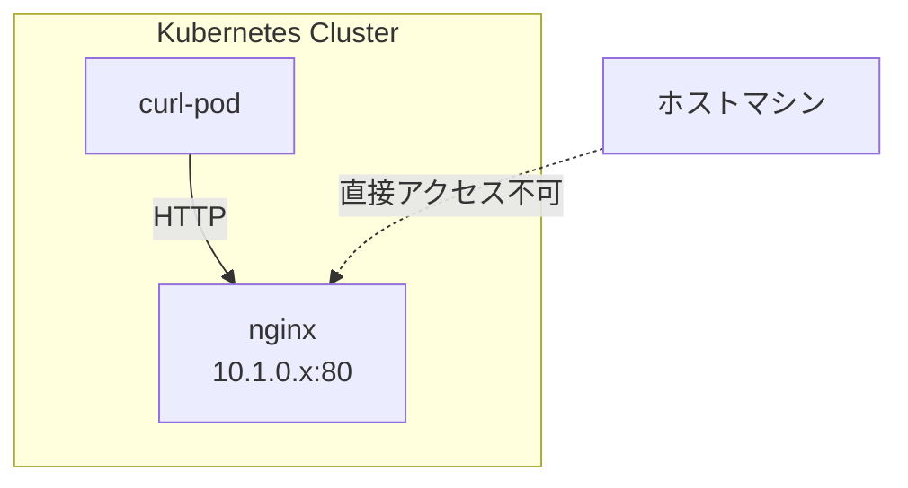

Kubernetesの最小デプロイ単位であるPodの操作を学びます。
nginxコンテナを使ってPodの起動・確認・削除を実践します。

## 環境

- Kubernetes クラスター: Docker Desktop

## 1. 環境セットアップ

### 1.1. クラスターの確認

Docker Desktopでクラスターが起動していることを確認します。

```bash
k cluster-info
```

### 1.2. kubectlのエイリアス設定（推奨）

`kubectl`を`k`で呼び出せるようにエイリアスを設定すると便利です。
Kubernetes界隈ではほぼ標準的な慣習で、CKA/CKAD認定試験でもデフォルトで用意されています。

```bash
# ~/.zshrc に追加
cat >> ~/.zshrc << 'EOF'

# kubectl alias
alias k='kubectl'
source <(kubectl completion zsh)
compdef k=kubectl
EOF

# 設定を反映
source ~/.zshrc
```

設定後は`k`で`kubectl`コマンドが使えます:

```bash
k get pod
k describe pod nginx
k -n dev get pod
```

## 2. Podを動かしてみる

### 2.1. Podの起動 (kubectl run)

`nginx`という名前のPodを起動します。

```bash
k run nginx --image=nginx:latest
```

### 2.2. Podの確認

#### Podの一覧を確認 (kubectl get pod)

```bash
k get pod
```

STATUSが`Running`になっていればOKです。

#### Podの詳細情報を確認 (kubectl describe pod)

```bash
k describe pod nginx
```

Eventsの項目はPodが起動しない時のトラブルシュートに役立ちます。

#### コンテナのログを確認 (kubectl logs)

```bash
# ログを表示
k logs nginx

# リアルタイムでフォロー（tail -f的な）
k logs -f nginx

# 直近の行数を指定
k logs --tail=100 nginx
```

**describe vs logs:**

| コマンド | 用途 |
|---|---|
| `k describe pod` | Podのイベント・状態（起動失敗の原因など） |
| `k logs` | コンテナ内アプリのログ（stdout/stderr） |

### 2.3. Podを削除 (kubectl delete pod)

```bash
k delete pod nginx
```

削除されたか確認:

```bash
k get pod
```

## 3. namespaceでリソースを整理する

namespaceはKubernetesリソースを論理的に分離するために使用します。

### 3.1. namespaceの確認

全namespaceのPodを確認:

```bash
k get pod --all-namespaces
```

namespace一覧を確認:

```bash
k get namespaces
```

| Namespace | 説明 |
|-----------|------|
| default | デフォルトのnamespace。指定がない場合はここが使われる |
| kube-node-lease | ノードの死活監視用leaseリソースを管理 |
| kube-public | 誰でも読み取り可能なリソース用 |
| kube-system | Kubernetesのシステムコンポーネント用 |

### 3.2. namespaceを作成 (kubectl create namespace)

```bash
k create namespace dev
```

### 3.3. 特定のnamespaceにPodを作成

#### 方法1: --namespaceオプションを使う

```bash
k run nginx --image=nginx:latest --namespace dev
# または
k run nginx --image=nginx:latest -n dev
```

#### 方法2: contextでnamespaceを設定する

現在のcontext設定を確認:

```bash
k config get-contexts
```

デフォルトnamespaceを変更:

```bash
k config set-context --current --namespace=dev
```

変更後は`-n`オプションなしで`dev`が使われます。

## 4. nginxにアクセスしてみる

Podが正しく動作しているか確認します。

1. **クラスター内から確認** - 別のPodからcurlでアクセス
2. **コンテナを操作** - 中に入ってHTMLを編集
3. **ホストから確認** - port-forwardでブラウザからアクセス

### 4.1. PodのIPアドレスを確認

```bash
k get pod nginx -n dev --output wide
```

### 4.2. クラスター内からリクエストする

ホストマシンからPodのIPに直接アクセスはできません。
同じクラスター内のPod同士であればIPで直接通信できます。



curl用のPodを立ち上げて、その中からnginxにリクエストしてみましょう。

#### 1. curl用Podを起動

```bash
k run curl-pod --image=curlimages/curl:latest -- sleep 3600
```

#### 2. Podが起動したか確認

```bash
k get pod curl-pod
```

STATUSが`Running`になるまで待ちます。

#### 3. curl-podに入ってリクエスト

```bash
k exec -it curl-pod -- sh
```

シェル内で:

```bash
curl http://<PodのIP>
```

nginxのHTMLが返ってくれば成功です。`exit`でシェルを抜けます。

#### 4. curl-podを削除

```bash
k delete pod curl-pod
```

### 4.3. コンテナに入る (kubectl exec)

Podの中のコンテナにシェルで入ることができます。

```bash
k exec -it nginx -- /bin/bash
```

### 4.4. コンテナ内でHTMLを編集する

nginxの最小イメージにはvim/vi/nanoなどのエディタが入っていません。
`cat`コマンドで上書きします。

```bash
cat > /usr/share/nginx/html/index.html << 'EOF'
<!DOCTYPE html>
<html>
<head><title>Hello K8s</title></head>
<body><h1>Hello Kubernetes!</h1></body>
</html>
EOF
```

### 4.5. ホストからアクセスする (kubectl port-forward)

`kubectl port-forward`でPodのポートをホストに転送します。

```bash
k port-forward pod/nginx 8080:80
```

別ターミナルで確認:

```bash
curl http://localhost:8080/
```

ブラウザで http://localhost:8080/ にアクセスしてもOKです。

#### Dockerの`-p`オプションとの違い

| | Docker `-p` | kubectl port-forward |
|---|---|---|
| 仕組み | コンテナ起動時にホストのポートにバインド | kubectlプロセスがプロキシとして動作 |
| 永続性 | コンテナが動いている間有効 | コマンド終了で転送も終了 |
| 確認方法 | `docker container ls`のPORTSに表示 | 表示されない |

```
[localhost:8080] → [kubectl] → [K8s API] → [Pod:80]
```

`port-forward`は開発・デバッグ用の一時的な手段です。
Kubernetesで外部公開する正式な方法はService（NodePort/LoadBalancer）やIngressを使います。

## 5. クリーンアップ

### Podを削除

```bash
k -n dev delete pod nginx
```

確認:

```bash
k get pod -n dev
```

### namespaceを削除

```bash
k delete namespace dev
```

## 参考資料

- [Pods | Kubernetes](https://kubernetes.io/docs/concepts/workloads/pods/)
- [Namespaces | Kubernetes](https://kubernetes.io/docs/concepts/overview/working-with-objects/namespaces/)
