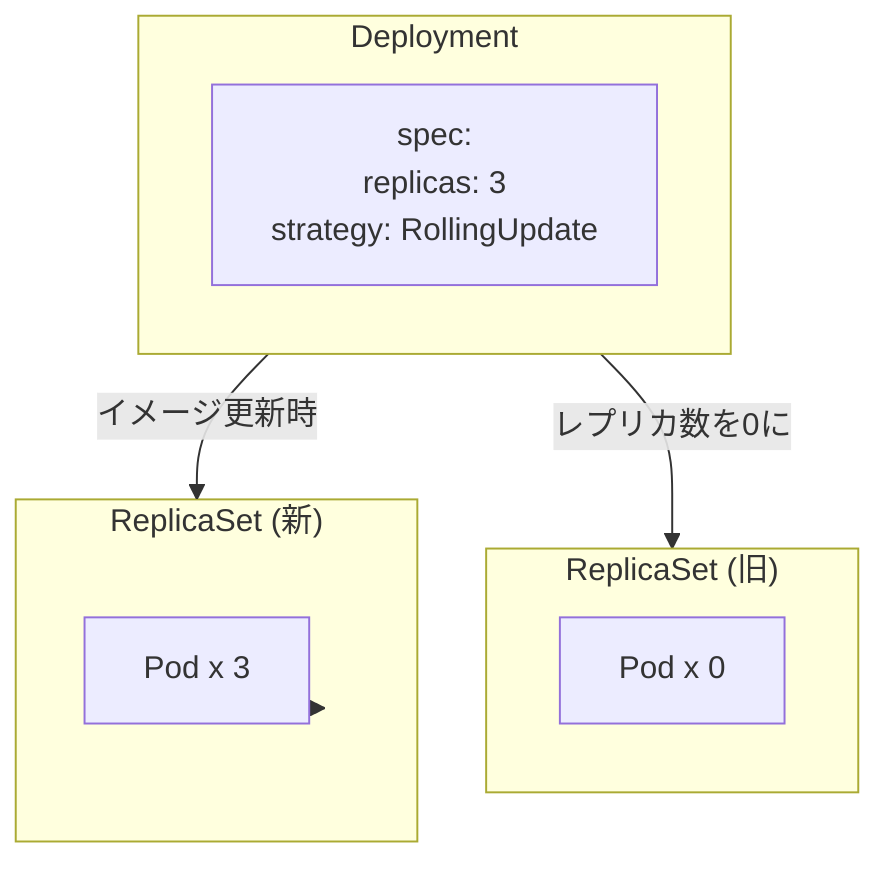

## はじめに

Kubernetesを触り始めたので、学んだことを記録していきます。

「ReplicaSet で Pod を管理しているけど、イメージを更新したいときどうすればいいの？」

この疑問にぶつかったことはありませんか？実は ReplicaSet には**テンプレートを更新しても既存の Pod には反映されない**という特性があります。本記事では、この挙動を実際に確認した上で、Deployment がどのようにこの課題を解決するのかを学びます。

:::message
本記事では `kubectl` のエイリアスとして `k` を使用しています。
:::

## この記事で得られること

- ReplicaSet 単体でアプリケーション更新が困難な理由の理解
- Deployment によるローリングアップデートの仕組み
- ロールバック操作とリビジョン管理の実践
- `maxSurge` / `maxUnavailable` の組み合わせによる挙動の違い

## 環境

- Kubernetes クラスター: kind

```bash
# クラスター作成
kind create cluster

# namespace 作成
k create namespace dev
```

## ReplicaSet のテンプレート更新問題を体験する

まず、Deployment を使わずに ReplicaSet だけでイメージ更新を試みて、何が起こるか確認しましょう。

### ReplicaSet を作成

```yaml
# web-replicaset.yaml
apiVersion: apps/v1
kind: ReplicaSet
metadata:
  name: web-rs
  namespace: dev
spec:
  replicas: 3
  selector:
    matchLabels:
      app: web
  template:
    metadata:
      labels:
        app: web
    spec:
      containers:
      - image: nginx:1.24
        name: web
```

```bash
k apply -f web-replicaset.yaml
```

3 つの Pod が `nginx:1.24` で起動します。

```bash
k -n dev get pods -o custom-columns='NAME:.metadata.name,IMAGE:.spec.containers[0].image'
```

```
NAME           IMAGE
web-rs-abc12   nginx:1.24
web-rs-def34   nginx:1.24
web-rs-ghi56   nginx:1.24
```

### テンプレートのイメージを変更して適用

`nginx:1.24` → `nginx:1.27` に変更して apply します。

```yaml
containers:
- image: nginx:1.27  # 変更
  name: web
```

```bash
k apply -f web-replicaset.yaml
```

再度 Pod のイメージを確認すると...

```bash
k -n dev get pods -o custom-columns='NAME:.metadata.name,IMAGE:.spec.containers[0].image'
```

```
NAME           IMAGE
web-rs-abc12   nginx:1.24
web-rs-def34   nginx:1.24
web-rs-ghi56   nginx:1.24
```

**変わっていません。** これが ReplicaSet の仕様です。

### なぜ更新されないのか

ReplicaSet の役割は「指定数の Pod を維持すること」です。テンプレートは**新しい Pod を作成するときの設計図**であり、既存の Pod を変更する機能は持っていません。

```
ReplicaSet の動作原理:

1. 現在の Pod 数をカウント（selector でマッチするもの）
2. replicas と比較
3. 足りなければ template から新規作成、多ければ削除

→ 既存 Pod の中身を書き換える処理は存在しない
```

### 手動更新の問題点

では手動で Pod を削除して新しいテンプレートで再作成させればよいのでは？

```bash
# Pod を 1 つ削除
k -n dev delete pod web-rs-abc12
```

確かに新しい Pod は `nginx:1.27` で作成されます。

```
NAME           IMAGE
web-rs-def34   nginx:1.24   # 古いまま
web-rs-ghi56   nginx:1.24   # 古いまま
web-rs-xyz99   nginx:1.27   # 新規作成
```

しかしこの方法には問題があります。

| 問題 | 説明 |
|------|------|
| 手作業が必要 | Pod を 1 つずつ削除する必要がある |
| ダウンタイムのリスク | 全削除すると一時的にサービス停止 |
| ロールバック不可 | 戻したいときも同じ手順を繰り返す |
| 履歴が残らない | どのバージョンをデプロイしたか追跡困難 |

:::message alert
確認が終わったら削除しておきます。
`k delete -f web-replicaset.yaml`
:::

## Deployment の役割

Deployment は ReplicaSet を**生成・管理するリソース**です。イメージが変わると新しい ReplicaSet を作成し、古い ReplicaSet と新しい ReplicaSet の Pod 数を調整することで、段階的な入れ替えを実現します。

### リソースの階層構造



## Deployment マニフェストの構成

### manifest

```yaml
# web-deployment.yaml
apiVersion: apps/v1
kind: Deployment
metadata:
  name: web-deploy
  namespace: dev
spec:
  replicas: 3
  selector:
    matchLabels:
      app: web
  strategy:
    type: RollingUpdate
    rollingUpdate:
      maxSurge: 1
      maxUnavailable: 1
  template:
    metadata:
      labels:
        app: web
    spec:
      containers:
      - image: nginx:1.24
        name: web
```

### strategy の選択肢

| type | 動作 | 用途 |
|------|------|------|
| `RollingUpdate` | 新旧 Pod を順次入れ替え | 通常のアプリケーション更新 |
| `Recreate` | 全 Pod 停止後に新規作成 | DB スキーマ変更など新旧混在が許容できない場合 |

### 適用と確認

```bash
k apply -f web-deployment.yaml
```

```bash
k -n dev get deploy,rs,pod
```

```
NAME                         READY   UP-TO-DATE   AVAILABLE
deployment.apps/web-deploy   3/3     3            3

NAME                                    DESIRED   CURRENT   READY
replicaset.apps/web-deploy-5d8c7b6f4    3         3         3

NAME                              READY   STATUS
pod/web-deploy-5d8c7b6f4-xxxxx    1/1     Running
pod/web-deploy-5d8c7b6f4-yyyyy    1/1     Running
pod/web-deploy-5d8c7b6f4-zzzzz    1/1     Running
```

Deployment の apply により、配下の ReplicaSet と Pod が連鎖的に作成されました。

## ローリングアップデートを実行する

### イメージを更新

manifest を編集して apply します。

```yaml
containers:
- image: nginx:1.27  # 1.24 から変更
  name: web
```

```bash
k apply -f web-deployment.yaml
```

### 更新状況をリアルタイムで確認

別ターミナルで監視しておくと、Pod が段階的に入れ替わる様子が見えます。

```bash
k -n dev get pod -w
```

### 更新完了の確認

`rollout status` で更新が完了したか確認できます。

```bash
k -n dev rollout status deployment/web-deploy
```

```
deployment "web-deploy" successfully rolled out
```

このコマンドは更新中はブロックし、完了すると終了します。CI/CD パイプラインで「デプロイ完了まで待機」したいときに使えます。

### 更新後の状態

```bash
k -n dev get rs
```

```
NAME                    DESIRED   CURRENT   READY   AGE
web-deploy-5d8c7b6f4    0         0         0       5m    # 旧（レプリカ 0）
web-deploy-7f9b8c3e2    3         3         3       30s   # 新
```

旧 ReplicaSet は削除されず、レプリカ数が 0 になった状態で保持されます。これがロールバックを可能にする仕組みです。

## ロールバック操作

### デプロイ履歴の確認

```bash
k -n dev rollout history deployment/web-deploy
```

```
REVISION  CHANGE-CAUSE
1         <none>
2         <none>
```

各リビジョンの詳細を見るには `--revision` を指定します。

```bash
k -n dev rollout history deployment/web-deploy --revision=1
```

```
Pod Template:
  Containers:
   web:
    Image:      nginx:1.24
```

### 直前の状態に戻す

```bash
k -n dev rollout undo deployment/web-deploy
```

```
deployment.apps/web-deploy rolled back
```

### 特定リビジョンを指定して戻す

```bash
k -n dev rollout undo deployment/web-deploy --to-revision=1
```

本番環境で「2 つ前のバージョンに戻したい」といった場面で使います。

## 更新の一時停止と再開

大規模な更新で段階的に確認したい場合、更新を途中で止めることができます。

### 更新を一時停止

```bash
k -n dev rollout pause deployment/web-deploy
```

この状態で manifest を変更して apply しても、実際の Pod 入れ替えは発生しません。

### 更新を再開

```bash
k -n dev rollout resume deployment/web-deploy
```

再開すると、pause 中に適用された変更がまとめて反映されます。

## maxSurge と maxUnavailable の挙動を検証する

`replicas: 3` の場合、これらの設定で更新中の Pod 数がどう変化するか確認します。

### 設定値の意味

| 設定 | 説明 |
|------|------|
| `maxSurge` | 更新中に replicas を超えて**同時稼働**できる Pod 数 |
| `maxUnavailable` | 更新中に**一時停止**を許容する Pod 数 |

### パターン別の挙動

#### maxSurge: 1, maxUnavailable: 1（デフォルト）

```
更新中の Pod 数: 2〜4 の範囲
動作: 新 Pod を 1 つ追加 → 旧 Pod を 1 つ削除 → 繰り返し
```

#### maxSurge: 0, maxUnavailable: 1

```bash
k -n dev patch deployment web-deploy -p '{"spec":{"strategy":{"rollingUpdate":{"maxSurge":0,"maxUnavailable":1}}}}'
```

```
更新中の Pod 数: 2〜3 の範囲
動作: 旧 Pod を 1 つ削除 → 新 Pod を 1 つ追加 → 繰り返し
特徴: Pod 数が replicas を超えない（リソース節約）
```

#### maxSurge: 1, maxUnavailable: 0

```
更新中の Pod 数: 3〜4 の範囲
動作: 新 Pod を 1 つ追加 → 旧 Pod を 1 つ削除 → 繰り返し
特徴: 常に replicas 以上の Pod が稼働（ダウンタイムゼロ）
```

#### maxSurge: 0, maxUnavailable: 0（無効な設定）

```bash
k -n dev patch deployment web-deploy -p '{"spec":{"strategy":{"rollingUpdate":{"maxSurge":0,"maxUnavailable":0}}}}'
```

```
The Deployment "web-deploy" is invalid:
spec.strategy.rollingUpdate.maxUnavailable: Invalid value: 0: may not be 0 when `maxSurge` is 0
```

新しい Pod を作れず、古い Pod も削除できないため、更新が永遠に完了しません。Kubernetes はこの設定を拒否します。

### 設定の選び方

| 優先事項 | 推奨設定 |
|----------|----------|
| リソースに余裕がない | `maxSurge: 0` |
| ダウンタイムを許容できない | `maxUnavailable: 0` |
| バランス重視 | 両方 1 または 25% |

## よくあるトラブルと対処

### Pod が Pending のまま進まない

```bash
k -n dev describe pod <pod-name>
```

Events セクションを確認。リソース不足（CPU/メモリ）が原因のことが多い。

### ImagePullBackOff で更新が止まる

イメージ名やタグの typo、レジストリの認証エラーを確認。

```bash
k -n dev get events --sort-by='.lastTimestamp'
```

### ロールバックしても直らない

履歴が残っていない可能性。`revisionHistoryLimit`（デフォルト 10）を超えると古いリビジョンは削除されます。

## クリーンアップ

```bash
k delete -f web-deployment.yaml
```

クラスターごと削除する場合:

```bash
kind delete cluster
```

## まとめ

| ReplicaSet 単体の課題 | Deployment による解決 |
|----------------------|----------------------|
| テンプレート変更が既存 Pod に反映されない | 新 ReplicaSet 作成で自動反映 |
| 手動で Pod 削除が必要 | ローリングアップデートで自動化 |
| ロールバック手順が煩雑 | `rollout undo` で即時復旧 |
| 更新履歴が残らない | リビジョン管理で追跡可能 |

Deployment の真価は「問題が起きたときにすぐ戻せる」点にあります。本番環境では障害からの復旧速度がサービス品質に直結するため、ロールバックの容易さは運用上の大きなメリットです。

## 参考資料

- [Deployments | Kubernetes](https://kubernetes.io/docs/concepts/workloads/controllers/deployment/)
- [kubectl rollout | Kubernetes](https://kubernetes.io/docs/reference/kubectl/generated/kubectl_rollout/)
