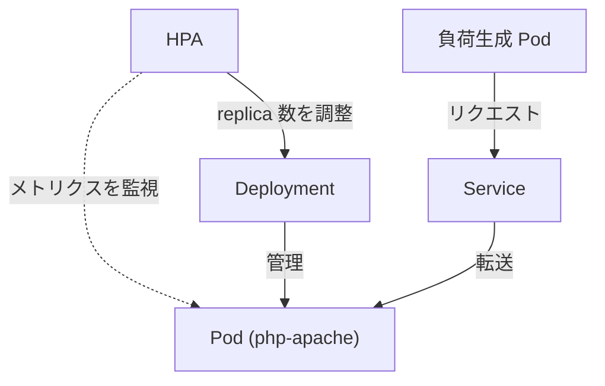
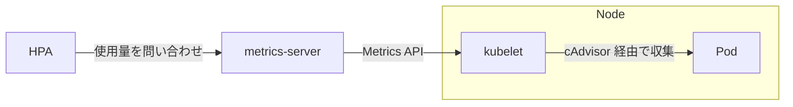

## はじめに

「アクセスが急増してサーバーが落ちた」「深夜は誰も使わないのにリソースが無駄になっている」——こんな経験はありませんか？

Kubernetes の HorizontalPodAutoscaler（HPA）は、CPU やメモリの使用率に応じて Pod 数を自動調整してくれる機能です。本記事では kind クラスター上で HPA を構築し、公式ドキュメントのウォークスルーに沿って負荷テストを行い、スケールアウト・スケールインの動作を体験します。

:::message
本記事では `kubectl` のエイリアスとして `k` を使用しています。
:::

## この記事で得られること

- HPA の仕組みとスケーリング計算式の理解
- metrics-server のセットアップ方法
- requests / limits の役割と設定方法
- 負荷テストによるスケールアウト・スケールインの確認

## kind クラスターを作成する

本記事では kind（Kubernetes IN Docker）を使用します。ローカル PC 上で手軽に Kubernetes クラスターを構築でき、HPA の動作検証に最適です。

### クラスターを作成

```bash
kind create cluster --name hpa-demo
```

```
Creating cluster "hpa-demo" ...
 ✓ Ensuring node image (kindest/node:v1.32.0) 🖼
 ✓ Preparing nodes 📦
 ✓ Writing configuration 📜
 ✓ Starting control-plane 🕹️
 ✓ Installing CNI 🔌
 ✓ Installing StorageClass 💾
Set kubectl context to "kind-hpa-demo"
You can now use your cluster with:

kubectl cluster-info --context kind-hpa-demo

Have a nice day! 👋
```

クラスターが作成されたことを確認します。

```bash
k cluster-info
```

```
Kubernetes control plane is running at https://127.0.0.1:xxxxx
CoreDNS is running at https://127.0.0.1:xxxxx/api/v1/namespaces/kube-system/services/kube-dns:dns/proxy
```

### 作業用 namespace を作成

HPA の検証用に namespace を作成します。

```bash
k create namespace dev
```

```
namespace/dev created
```

:::message
kind 以外の環境（minikube、Docker Desktop、EKS など）でも同様の手順で HPA を構築できます。ただし metrics-server のセットアップ方法は環境によって異なります。
:::

## なぜ HPA が必要なのか

クラスターの準備ができたところで、HPA がなぜ必要なのかを理解しておきましょう。

### Deployment だけでは負荷に対応できない

Deployment は指定された replica 数を維持する機能です。

```yaml
spec:
  replicas: 3  # 常に 3 台を維持
```

Pod が停止したら再作成して 3 台に戻しますが、**負荷は見ていません**。アクセスが急増してリソースが枯渇しても、Deployment は「3 台を維持する」ことしかしません。

| 状況 | Deployment だけ | HPA を使う |
|------|----------------|-----------|
| Pod が停止した | 再作成して 3 台に戻す | 同じ |
| トラフィック増加 | 3 台のまま → 負荷に耐えられない | 自動でスケールアウト |
| トラフィック減少 | 3 台のまま → リソースの無駄 | 自動でスケールイン |

### 固定 replica 数のジレンマ

replica 数を固定で設定する場合、どちらに合わせても問題が発生します。

- **ピーク時に合わせる** → 普段はリソースが無駄になる
- **平均に合わせる** → スパイク時にサービスがダウンする

HPA を使うことで、このジレンマを解消できます。

### HPA のメリット

| メリット | 説明 |
|---------|------|
| コスト最適化 | 必要な分だけリソースを使用。深夜は 1 Pod、ピーク時は 10 Pod のように自動調整 |
| 高可用性 | トラフィックスパイクに人間より速く対応。手動対応では間に合わない急激な負荷増加にも対応 |
| 運用負荷の軽減 | 手動でのスケーリング作業から解放される |

HPA は CPU やメモリの使用率を監視し、Deployment の replica 数を動的に書き換えます。これにより、負荷に応じた適切な Pod 数を自動で維持できます。

## requests / limits の動作を確認する

Pod で動くコンテナに対してリソースの requests（最低限確保したい量） / limits（上限値）を設定できます。

これらは HPA に限らず、Kubernetes のリソース管理において重要な役割を果たします。

| 場面 | 使う側 | 説明 |
|------|--------|------|
| Pod 配置時 | kube-scheduler | requests を見てノードを選択 |
| 実行時 | kubelet / cgroup | limits を超えたら制限（CPU スロットリング、メモリ OOMKill） |
| リソース逼迫時 | kubelet | QoS クラスに基づいて evict 対象を決定 |
| HPA 使用時 | HPA コントローラー | requests を分母にして使用率を計算 |

HPA を設定する前に、requests / limits の基本的な動作を確認しておきましょう。

### limits の動作を確認する

limits はコンテナが使用できるリソースの上限を定義します。この上限を超えるとどうなるか確認してみましょう。

**やること**: メモリ制限 10Mi の Pod で、50MB のメモリを確保しようとする

**期待する結果**: 制限を超えたため、Kubernetes がコンテナを強制終了（OOMKilled）する

```yaml
# manifests/mem-test.yaml
apiVersion: v1
kind: Pod
metadata:
  name: mem-test
spec:
  restartPolicy: Never
  containers:
    - name: mem-test
      image: busybox
      resources:
        limits:
          memory: "10Mi"
      command: ["sh", "-c", "dd if=/dev/zero of=/dev/null bs=50M"]
```

:::message
`dd if=/dev/zero of=/dev/null bs=50M` は、50MB のバッファをメモリに確保してデータを読み書きするコマンドです。10Mi の制限に対して 50MB を確保しようとするため、OOMKilled が発生します。
:::

```bash
k apply -f ./manifests/mem-test.yaml
```

状態を確認します。

```bash
k get pod mem-test
```

```
NAME       READY   STATUS      RESTARTS   AGE
mem-test   0/1     OOMKilled   0          5s
```

**結果**: 期待どおり、メモリ制限を超えたため `OOMKilled` で強制終了しました。

確認できたら Pod を削除します。

```bash
k delete -f ./manifests/mem-test.yaml
```

### requests の動作を確認する

requests はコンテナに最低限確保したいリソース量を定義します。Kubernetes スケジューラーはこの値を見て、十分なリソースを持つノードに Pod を配置します。

**やること**: ノードの容量（数 GB 程度）を大幅に超える 1000Gi のメモリを requests に指定する

**期待する結果**: スケジューラーが条件を満たすノードを見つけられず、Pod が Pending のままになる

```yaml
# manifests/big-request.yaml
apiVersion: v1
kind: Pod
metadata:
  name: big-request
spec:
  restartPolicy: Never
  containers:
    - name: big-request
      image: nginx
      resources:
        requests:
          memory: "1000Gi"
```

```bash
k apply -f ./manifests/big-request.yaml
```

状態を確認します。

```bash
k get pod big-request
```

```
NAME          READY   STATUS    RESTARTS   AGE
big-request   0/1     Pending   0          5s
```

**結果**: 期待どおり `Pending` のままになりました。Events を確認すると理由がわかります。

```bash
k describe pod big-request | grep -A5 "Events:"
```

```
Events:
  Type     Reason            Age  From               Message
  ----     ------            ---  ----               -------
  Warning  FailedScheduling  4s   default-scheduler  0/1 nodes are available: 1 Insufficient memory. ...
```

`Insufficient memory`（メモリ不足）と表示され、スケジュールできませんでした。

確認できたら Pod を削除します。

```bash
k delete -f ./manifests/big-request.yaml
```

## HPA の構成

ここから HPA を構築していきます。最終的に以下の構成を作成します。



まずは HPA のスケール対象となる Deployment と Service を作成します。

## スケール対象のリソースを作成

HPA は単体では動作しません。スケーリング対象となるワークロード（Deployment など）が必要です。

ここでは公式ドキュメントで使用されている **php-apache** を動かす Deployment と Service を作成します。このイメージは CPU 負荷を生成するように設計されており、HPA の動作確認に最適です。

| リソース | 役割 |
|----------|------|
| Deployment | Pod を管理。HPA はこの replica 数を書き換える |
| Service | Pod へのアクセスを抽象化。負荷テスト時に使用 |

```yaml
# manifests/php-apache.yaml
apiVersion: apps/v1
kind: Deployment
metadata:
  name: php-apache
  namespace: dev
spec:
  selector:
    matchLabels:
      run: php-apache
  template:
    metadata:
      labels:
        run: php-apache
    spec:
      containers:
        - name: php-apache
          image: registry.k8s.io/hpa-example
          ports:
            - containerPort: 80
          resources:
            limits:
              cpu: 500m
            requests:
              cpu: 200m
---
apiVersion: v1
kind: Service
metadata:
  name: php-apache
  namespace: dev
spec:
  ports:
    - port: 80
  selector:
    run: php-apache
```

:::message
`registry.k8s.io/hpa-example` は Kubernetes 公式が提供する HPA テスト用イメージです。リクエストを受けると CPU 負荷のかかる計算を行うため、スケールアウトの動作を確認しやすくなっています。
:::

このマニフェストを適用します。

```bash
k apply -f ./manifests/php-apache.yaml
```

リソースが作成されたことを確認しましょう。

```bash
k -n dev get deploy,svc
```

```
NAME                         READY   UP-TO-DATE   AVAILABLE   AGE
deployment.apps/php-apache   1/1     1            1           10s

NAME                 TYPE        CLUSTER-IP      EXTERNAL-IP   PORT(S)   AGE
service/php-apache   ClusterIP   10.96.xxx.xxx   <none>        80/TCP    10s
```

Deployment の READY が `1/1` になっていれば準備完了です。

## metrics-server をインストールする

HPA は Pod の CPU・メモリ使用量を定期的に取得してスケーリングを判断します。この使用量データを提供するのが **metrics-server** です。



metrics-server がないと HPA は使用量を取得できず、スケーリングが機能しません。

kind では metrics-server を手動でインストールする必要があります。

```bash
k apply -f https://github.com/kubernetes-sigs/metrics-server/releases/latest/download/components.yaml
```

kind クラスターは自己署名証明書を使っているため、metrics-server が kubelet との通信で TLS エラーを起こします。これを回避するオプションを追加します。

```bash
k patch deployment metrics-server -n kube-system --type='json' -p='[
  {
    "op": "add",
    "path": "/spec/template/spec/containers/0/args/-",
    "value": "--kubelet-insecure-tls"
  }
]'
```

:::message alert
`--kubelet-insecure-tls` はローカル開発環境専用のオプションです。本番環境では適切な証明書を設定してください。
:::

metrics-server が起動するまで待ちます。

```bash
k get deployment metrics-server -n kube-system -w
```

```
NAME             READY   UP-TO-DATE   AVAILABLE   AGE
metrics-server   1/1     1            1           3m45s
```

READY が `1/1` になれば metrics-server のセットアップは完了です。

## HPA はどうやってスケーリングを判断するのか

HPA を作成する前に、スケーリングの仕組みを理解しておきましょう。

### スケーリング計算式

HPA は以下の計算式で「理想の Pod 数」を求めます。

```
必要な Pod 数 = ceil(現在の Pod 数 × (現在の使用率 / 目標使用率))
```

`ceil` は切り上げ関数です。小数点以下を切り上げて整数にします。

**具体例**: 現在 1 Pod、CPU 使用率 250%、目標 50% の場合

```
必要な Pod 数 = ceil(1 × (250 / 50))
             = ceil(1 × 5)
             = ceil(5)
             = 5
```

使用率を目標値に近づけるには 5 Pod 必要、と HPA は判断します。

### requests が分母になる

HPA は「現在の CPU 使用量 ÷ requests」で使用率を計算します。

今回の設定では `requests.cpu: 200m` なので：
- 1 Pod が 200m 使用 → 使用率 100%
- 1 Pod が 500m 使用 → 使用率 250%

requests を設定していないと HPA は使用率を計算できません。

## HPA を作成する

### 方法 1: kubectl autoscale コマンド（簡易）

最も簡単な方法は `kubectl autoscale` コマンドです。

```bash
k -n dev autoscale deployment php-apache --cpu-percent=50 --min=1 --max=10
```

| オプション | 意味 |
|-----------|------|
| `--cpu-percent=50` | CPU 使用率が 50% になるようスケーリング |
| `--min=1` | 最小 1 Pod |
| `--max=10` | 最大 10 Pod |

状態を確認します。

```bash
k -n dev get hpa
```

```
NAME         REFERENCE               TARGETS         MINPODS   MAXPODS   REPLICAS   AGE
php-apache   Deployment/php-apache   <unknown>/50%   1         10        1          30s
```

:::message
適用直後は TARGETS が `<unknown>` と表示されることがあります。metrics-server がメトリクスを収集するまで 1〜2 分待ってみてください。
:::

### 方法 2: マニフェストファイル（推奨）

本番運用ではマニフェストファイルで管理することを推奨します。Git で変更履歴を追跡でき、再現性も確保できます。

:::message
方法 1 で HPA を作成済みの場合は、先に削除してください。

```bash
k -n dev delete hpa php-apache
```
:::

```yaml
# manifests/php-apache-hpa.yaml
apiVersion: autoscaling/v2
kind: HorizontalPodAutoscaler
metadata:
  name: php-apache
  namespace: dev
spec:
  scaleTargetRef:
    apiVersion: apps/v1
    kind: Deployment
    name: php-apache
  minReplicas: 1
  maxReplicas: 10
  metrics:
    - type: Resource
      resource:
        name: cpu
        target:
          type: Utilization
          averageUtilization: 50
```

### マニフェストの解説

**スケール範囲の指定**

| フィールド | 値 | 意味 |
|------------|-----|------|
| `minReplicas` | 1 | 最小 1 Pod。どれだけ暇でもこれ以下にしない |
| `maxReplicas` | 10 | 最大 10 Pod。どれだけ忙しくてもこれを超えない |

**スケール対象の指定**

`scaleTargetRef` で HPA が制御する Deployment を指定します。HPA はこの Deployment の `spec.replicas` を自動的に書き換えます。

**メトリクスの指定**

| フィールド | 意味 |
|------------|------|
| `type: Resource` | CPU やメモリなどのリソースメトリクスを使用 |
| `name: cpu` | CPU を監視対象にする |
| `averageUtilization: 50` | 全 Pod の平均 CPU 使用率が 50% になるようスケーリング |

### HPA を適用

```bash
k apply -f ./manifests/php-apache-hpa.yaml
```

状態を確認します。

```bash
k -n dev get hpa
```

```
NAME         REFERENCE               TARGETS   MINPODS   MAXPODS   REPLICAS   AGE
php-apache   Deployment/php-apache   0%/50%    1         10        1          30s
```

TARGETS に `0%/50%` と表示されていれば正常に動作しています。

## 負荷をかけて HPA の動作を体験する

設定だけでは実感がわかないので、実際に負荷をかけて Pod が増減する様子を観察しましょう。

### 準備：ターミナルを 2 つ開く

負荷テストでは複数のターミナルを使って、リアルタイムで変化を追います。

```
┌─────────────────────────┬─────────────────────────┐
│      ターミナル 1        │      ターミナル 2        │
│                         │                         │
│  HPA と Pod を           │  負荷生成 Pod を         │
│  watch で監視            │  実行                   │
└─────────────────────────┴─────────────────────────┘
```

**ターミナル 1** - 監視用（このターミナルを見ながら負荷テストの結果を確認します）

```bash
k -n dev get hpa php-apache --watch
```

### 負荷をかける

**ターミナル 2** で負荷生成 Pod を起動します。公式ドキュメントと同じ方法で、busybox コンテナから継続的にリクエストを送信します。

```bash
k -n dev run -i --tty load-generator --rm --image=busybox:1.28 --restart=Never -- /bin/sh -c "while sleep 0.01; do wget -q -O- http://php-apache; done"
```

| オプション | 意味 |
|-----------|------|
| `-i --tty` | 対話モードで実行 |
| `--rm` | 終了時に Pod を自動削除 |
| `--restart=Never` | 再起動しない（1 回限りの実行） |
| `while sleep 0.01; do ...; done` | 0.01 秒間隔で無限ループ |

:::message
このコマンドは **Kubernetes クラスター内部** から Service に対してリクエストを送信します。ローカル環境の ab コマンドと異なり、port-forward なしで直接 Service にアクセスできます。
:::

### 観察：Pod が増える（スケールアウト）

負荷をかけ始めると、ターミナル 1 の表示が変化します。

```
NAME         REFERENCE               TARGETS    MINPODS   MAXPODS   REPLICAS   AGE
php-apache   Deployment/php-apache   0%/50%     1         10        1          2m
php-apache   Deployment/php-apache   250%/50%   1         10        1          3m
php-apache   Deployment/php-apache   250%/50%   1         10        4          3m30s
php-apache   Deployment/php-apache   82%/50%    1         10        5          4m
php-apache   Deployment/php-apache   64%/50%    1         10        7          4m30s
```

CPU 使用率が目標の 50% を大きく超えているため、HPA は計算式に従って Pod 数を増やしています。

**何が起きているか**:
1. HPA が metrics-server から CPU 使用率を取得
2. 目標値（50%）を超えていることを検知
3. 計算式で必要な Pod 数を算出
4. Deployment の replica 数を書き換え
5. 新しい Pod が起動

別のターミナルで Pod の状態も確認できます。

```bash
k -n dev get pods
```

```
NAME                          READY   STATUS    RESTARTS   AGE
php-apache-5b56f9df94-xxxxx   1/1     Running   0          5m
php-apache-5b56f9df94-yyyyy   1/1     Running   0          1m
php-apache-5b56f9df94-zzzzz   1/1     Running   0          1m
...
```

### 負荷を止める

ターミナル 2 で `Ctrl+C` を押して負荷生成を停止します。

```
^C
pod "load-generator" deleted
```

### 観察：Pod が減る（スケールイン）

負荷が止まると CPU 使用率が下がります。HPA はすぐには Pod を減らさず、しばらく様子を見てからスケールインします。

これは「負荷が一時的に下がっただけかもしれない」という状況に備えるためです。デフォルトでは **5 分間** 安定してから Pod を減らし始めます。

```
NAME         REFERENCE               TARGETS   MINPODS   MAXPODS   REPLICAS   AGE
php-apache   Deployment/php-apache   64%/50%   1         10        7          5m
php-apache   Deployment/php-apache   0%/50%    1         10        7          6m
php-apache   Deployment/php-apache   0%/50%    1         10        1          11m
```

最終的には `minReplicas` で指定した 1 Pod まで減少します。

:::message
スケールインの待機時間（stabilizationWindowSeconds）はデフォルトで 300 秒（5 分）です。検証を急ぎたい場合は HPA の `behavior.scaleDown.stabilizationWindowSeconds` で短くできます。
:::

## クリーンアップ

検証が終わったらリソースを削除しておきましょう。

```bash
# HPA と Deployment を削除
k delete -f ./manifests/php-apache-hpa.yaml
k delete -f ./manifests/php-apache.yaml

# kind クラスターを削除（不要になった場合）
kind delete cluster --name hpa-demo
```

## まとめ

本記事では HPA を使って Pod を自動スケーリングさせる方法を学びました。

**押さえておきたいポイント**

| トピック | 内容 |
|----------|------|
| HPA の計算式 | `必要 Pod 数 = ceil(現在 Pod 数 × 現在使用率 / 目標使用率)` |
| requests の重要性 | HPA は `現在使用量 ÷ requests` で使用率を計算する。requests がないと動かない |
| スケールインの遅延 | 負荷が下がっても 5 分間は様子を見る（フラッピング防止） |

**HPA を使うことで得られる効果**

- トラフィック増加時：自動でスケールアウトしてサービスを守る
- トラフィック減少時：自動でスケールインしてコストを削減
- 運用者：深夜のアラート対応から解放される

## 発展的なトピック

本記事で扱った CPU ベースの HPA は基本形です。実運用ではさらに以下のような選択肢があります。

- **メモリベースの HPA**: `metrics` に `memory` を追加することで、メモリ使用率でもスケーリング可能
- **カスタムメトリクス HPA**: リクエスト数やキュー長など、アプリケーション固有のメトリクスでスケーリング
- **VPA（VerticalPodAutoscaler）**: Pod 数ではなく、1 Pod あたりのリソース量を自動調整
- **KEDA**: イベント駆動型のオートスケーラー。0 Pod からのスケールアウトも可能

## 参考資料

- [Horizontal Pod Autoscaling | Kubernetes](https://kubernetes.io/docs/tasks/run-application/horizontal-pod-autoscale/)
- [HPA Walkthrough | Kubernetes](https://kubernetes.io/docs/tasks/run-application/horizontal-pod-autoscale-walkthrough/)
- [HPA Algorithm Details | Kubernetes](https://kubernetes.io/docs/tasks/run-application/horizontal-pod-autoscale/#algorithm-details)
