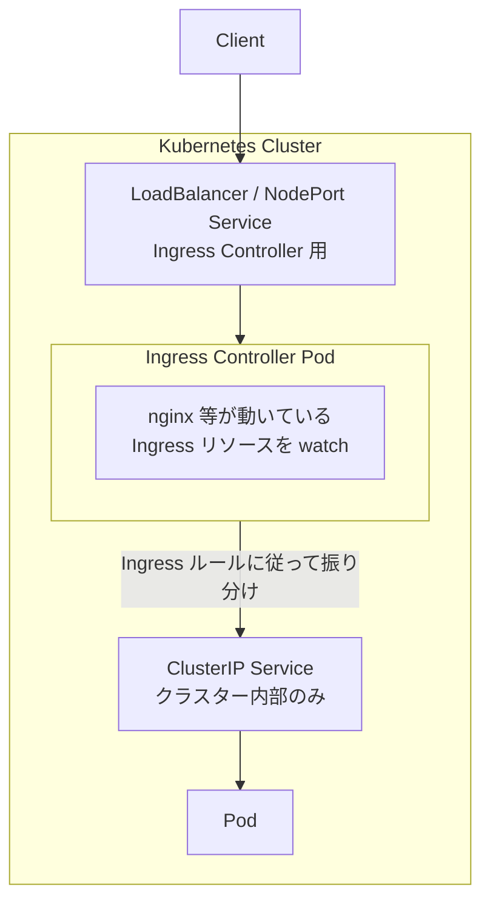

## はじめに

Kubernetes で複数の Web サービスを外部公開する場合、Service（LoadBalancer）だけでは Service ごとにロードバランサーが必要になり、コストがかさみます。

本記事では、**Ingress** を使って 1 つの入口で複数の Service にパスベースでルーティングする方法を学びます。

:::message
本記事では `kubectl` のエイリアスとして `k` を使用しています。
:::

## Service の復習：外部公開の課題

### Service タイプのおさらい

| タイプ | アクセス範囲 | 用途 |
|--------|-------------|------|
| **ClusterIP** | クラスター内部のみ | 内部通信用（デフォルト） |
| **NodePort** | Node の IP + ポート | 開発・テスト用 |
| **LoadBalancer** | 外部 LB 経由 | 本番環境での外部公開 |

### ClusterIP の復習

ClusterIP はクラスター内部からのみアクセス可能な Service です。

```yaml
spec:
  type: ClusterIP
  selector:
    app: nginx
  ports:
    - port: 80
      targetPort: 80
```

```
クラスター外 → ClusterIP:80 → ✗ アクセス不可
クラスター内 → ClusterIP:80 → ○ Pod に到達
```

**ClusterIP だけでは外部公開できません。**

### NodePort の復習

NodePort は全ての Node で同じポート（30000-32767）を開き、外部からアクセス可能にします。

```yaml
spec:
  type: NodePort
  ports:
    - port: 80
      targetPort: 80
      nodePort: 30000
```

```
クライアント → Node1:30000 ─┬→ Pod A
              Node2:30000 ─┤→ Pod B
              Node3:30000 ─┘→ Pod C
```

**NodePort の課題:**

- どの Node にアクセスするかはクライアント次第
- Node が障害で落ちたら、その Node 経由のアクセスは失敗
- 30000-32767 の範囲しか使えない（80 や 443 は使えない）

### LoadBalancer の復習

LoadBalancer は NodePort + 外部ロードバランサーを自動作成します。

```yaml
spec:
  type: LoadBalancer
  ports:
    - port: 80
      targetPort: 80
```

```
クライアント → 外部LB → Node:NodePort → Pod
```

**LoadBalancer の課題:**

```
Service A (type: LoadBalancer) → LB A → 課金
Service B (type: LoadBalancer) → LB B → 課金
Service C (type: LoadBalancer) → LB C → 課金

3 つの Service = 3 つの LB = 3 倍のコスト
```

- **1 Service につき 1 つの LB** が作成される
- Service が増えるとコストが増加
- パスベースのルーティングができない（`/api` → Service A、`/web` → Service B など）

## Ingress とは

Ingress は **1 つのエントリーポイントで複数の Service にルーティング**できる仕組みです。

### LoadBalancer vs Ingress

```
LoadBalancer（Service ごとに LB）:

  /api   → LB A → Service A  ─┐
  /web   → LB B → Service B  ─┼─ 3 つの LB = 3 倍のコスト
  /admin → LB C → Service C  ─┘

Ingress（1 つの入口で振り分け）:

               ┌→ /api   → Service A
  Client → Ingress ─┼→ /web   → Service B  ─── 1 つの入口で済む
               └→ /admin → Service C
```

### L4 と L7 の違い

Service と Ingress の大きな違いは、**どの情報を見てルーティングするか**です。

```
ネットワークレイヤー:

  L7 アプリケーション層  ← HTTP ヘッダー、パス、ホスト名
  L4 トランスポート層    ← TCP/UDP、IP アドレス、ポート番号
```

| レイヤー | 見る情報 | 例 |
|---------|----------|-----|
| **L4** | IP + ポート番号 | `10.0.0.1:80` → Service A |
| **L7** | HTTP の中身（パス、ホスト名） | `GET /api` → Service A、`GET /web` → Service B |

**Service（kube-proxy）の動作（L4）:**

```
リクエスト: 10.96.0.1:80
              ↓
kube-proxy: 「80番ポートへのリクエストだな」
              ↓
           Pod A, B, C のどれかへ（HTTP の中身は見ない）
```

**Ingress Controller の動作（L7）:**

```
リクエスト: GET /api HTTP/1.1
           Host: example.com
              ↓
Ingress Controller: 「/api へのリクエストだな。api-service に送ろう」
              ↓
           api-service へ
```

### Ingress の特徴

| 項目 | Service | Ingress |
|------|---------|---------|
| ルーティング判断 | IP + Port（L4） | Host + Path（L7 / HTTP） |
| LB の数 | Service ごとに 1 つ | 全体で 1 つ |
| パスベース | ✗ | ○ `/api`, `/web` など |
| ホストベース | ✗ | ○ `api.example.com`, `web.example.com` など |
| SSL 終端 | Service ごとに設定 | Ingress で一元管理 |

```
L4（Service）:
  10.0.0.1:80 ──→ Service A
  10.0.0.1:8080 ──→ Service B
  ※ 同じポートで複数 Service には振り分けられない

L7（Ingress）:
  example.com:80/api ──→ Service A ┐
  example.com:80/web ──→ Service B ├ 同じポート(80)で振り分け可能
  example.com:80/admin ──→ Service C ┘
```

### Ingress のトラフィックの流れ



**構成要素:**

| コンポーネント | 説明 |
|---------------|------|
| **LoadBalancer / NodePort Service** | Ingress Controller を外部公開するための Service |
| **Ingress Controller Pod** | nginx 等が動いている。Ingress リソースを watch してルーティング |
| **ClusterIP Service** | バックエンドの Service（クラスター内部のみ） |
| **Pod** | 実際のアプリケーション |

:::message
Ingress Controller はクラスター内部にいるため、バックエンドの Service は ClusterIP でアクセス可能です。
:::

### なぜ Ingress Controller を経由するのか

「外部 LB から ClusterIP に直接アクセスすればいいのでは？」と思うかもしれませんが、それはできません。

**ClusterIP はクラスター内部専用の仮想 IP** だからです。

```
ClusterIP の仕組み:

  ClusterIP: 10.96.0.100（仮想 IP）
       ↓
  Node 内の iptables がパケットをキャッチ
       ↓
  宛先を Pod の実 IP に書き換え
       ↓
  Pod に到達

この iptables ルールは Node 内にしか存在しない
→ 外部からは ClusterIP に到達できない
```

```
外部 LB から見た場合:

  外部 LB のルーティングテーブル:
    10.0.0.0/16   → 到達可能（物理ネットワーク）
    10.96.0.0/16  → ??? 知らない（ClusterIP の範囲）

  → 外部 LB は ClusterIP へのルートを持っていない
```

**だから Ingress Controller が必要:**

```
外部 LB → Ingress Controller Pod → ClusterIP → Pod
          ↑                        ↑
          ここで外部→内部の境界    ここはクラスター内部

Ingress Controller Pod はクラスター内部にいるので
ClusterIP にアクセスできる
```

## 環境構築

### kind クラスターを作成

kind で Ingress を使用するには、クラスター作成時にポートマッピングの設定が必要です。

`kind-config.yaml`:

```yaml
kind: Cluster
apiVersion: kind.x-k8s.io/v1alpha4
nodes:
- role: control-plane
  kubeadmConfigPatches:
  - |
    kind: InitConfiguration
    nodeRegistration:
      kubeletExtraArgs:
        node-labels: "ingress-ready=true"
  extraPortMappings:
  - containerPort: 80
    hostPort: 80
    protocol: TCP
  - containerPort: 443
    hostPort: 443
    protocol: TCP
```

**設定の説明:**

| 項目 | 説明 |
|------|------|
| `ingress-ready=true` | Ingress Controller がこのノードにスケジュールされるためのラベル |
| `extraPortMappings` | コンテナのポートをホストにマッピング（80, 443） |

クラスターを作成します。

```bash
kind create cluster --config kind-config.yaml
```

既存のクラスターがある場合は削除してから作成します。

```bash
kind delete cluster && kind create cluster --config kind-config.yaml
```

### Docker のポートマッピングを確認

kind は Kubernetes の Node を Docker コンテナとして実行しています。

`extraPortMappings` は **Docker の `-p` オプションと同じ**です。

```
extraPortMappings:
  - containerPort: 80
    hostPort: 80

これは以下と同じ:
  docker run -p 80:80 kindest/node
```

`extraPortMappings` が正しく設定されているか確認します。

```bash
docker ps --format "table {{.Names}}\t{{.Ports}}"
```

```
NAMES                 PORTS
kind-control-plane    0.0.0.0:80->80/tcp, 0.0.0.0:443->443/tcp, 127.0.0.1:xxxxx->6443/tcp
```

`0.0.0.0:80->80/tcp` が表示されていれば、ホストの 80 番ポートが Node にマッピングされています。

### NGINX Ingress Controller をインストール

kind 専用の manifest を使用して Ingress Controller をインストールします。

```bash
k apply -f https://raw.githubusercontent.com/kubernetes/ingress-nginx/controller-v1.14.1/deploy/static/provider/kind/deploy.yaml
```

Ingress Controller の Pod が Ready になるまで待ちます。

```bash
k wait --namespace ingress-nginx \
  --for=condition=ready pod \
  --selector=app.kubernetes.io/component=controller \
  --timeout=120s
```

インストール後、以下のコマンドでリソースを確認できます。

```bash
k get all -n ingress-nginx
```

```
NAME                                            READY   STATUS      RESTARTS   AGE
pod/ingress-nginx-admission-create-xxxxx        0/1     Completed   0          60s
pod/ingress-nginx-admission-patch-xxxxx         0/1     Completed   0          60s
pod/ingress-nginx-controller-xxxxxxxxx-xxxxx    1/1     Running     0          60s

NAME                                         TYPE        CLUSTER-IP      EXTERNAL-IP   PORT(S)                      AGE
service/ingress-nginx-controller             NodePort    10.96.xxx.xxx   <none>        80:80/TCP,443:443/TCP        60s
service/ingress-nginx-controller-admission   ClusterIP   10.96.xxx.xxx   <none>        443/TCP                      60s
```

**注目ポイント:**

- Ingress Controller 自体が **NodePort Service** として動作している
- `extraPortMappings` により、ホストの 80/443 がこの NodePort に転送される

```
localhost:80 → (extraPortMappings) → Node:80 → Ingress Controller Pod
```

### Namespace を用意

```bash
k create namespace dev
```

## バックエンドを準備

### ReplicaSet の manifest ファイルを作成

`nginxserver-replicaset.yaml`:

```yaml
apiVersion: apps/v1
kind: ReplicaSet
metadata:
  name: nginxserver-replicaset
  namespace: dev
spec:
  replicas: 3
  selector:
    matchLabels:
      app: nginxserver
  template:
    metadata:
      labels:
        app: nginxserver
    spec:
      containers:
      - image: nginx:latest
        name: nginxserver
```

### Service の manifest ファイルを作成

**Ingress のバックエンドとして使う Service は ClusterIP で十分です。**

`nginxserver-service.yaml`:

```yaml
apiVersion: v1
kind: Service
metadata:
  labels:
    app: nginxserver-service
  name: nginxserver-service
  namespace: dev
spec:
  ports:
    - name: http
      port: 80
      protocol: TCP
      targetPort: 80
  selector:
    app: nginxserver
  type: ClusterIP              # NodePort や LoadBalancer にする必要なし
```

### ReplicaSet と Service を適用

```bash
k apply -f nginxserver-replicaset.yaml
k apply -f nginxserver-service.yaml
```

Pod が作成されたことを確認します。

```bash
k get pod -n dev
```

```
NAME                           READY   STATUS    RESTARTS   AGE
nginxserver-replicaset-cmnhx   1/1     Running   0          10s
nginxserver-replicaset-k52tk   1/1     Running   0          10s
nginxserver-replicaset-vs67s   1/1     Running   0          10s
```

Service が作成されたことを確認します。

```bash
k get service -n dev
```

```
NAME                  TYPE        CLUSTER-IP      EXTERNAL-IP   PORT(S)   AGE
nginxserver-service   ClusterIP   10.104.93.222   <none>        80/TCP    10s
```

:::message
この時点では ClusterIP なのでクラスター外からアクセスできません。
:::

## 単一パスの Ingress

### Ingress の manifest ファイルを作成

`nginxserver-ingress.yaml`:

```yaml
apiVersion: networking.k8s.io/v1
kind: Ingress
metadata:
  name: nginxserver-ingress      # この Ingress リソースの名前
  namespace: dev                 # Service と同じ namespace に作成
spec:
  ingressClassName: nginx        # どの Ingress Controller を使うか（nginx を指定）
  rules:                         # ルーティングルールのリスト
    - http:                      # HTTP/HTTPS ルーティング（固定のフィールド名）
        paths:                   # パスベースのルーティング
          - path: /              # このパスにマッチしたら
            pathType: Exact      # 完全一致（/ のみ。/foo は対象外）
            backend:             # 以下の Service に転送
              service:
                name: nginxserver-service  # ← Service の metadata.name と一致
                port:
                  name: http               # ← Service の spec.ports[].name と一致
```

**Service との対応関係:**

| Ingress のフィールド | 値 | 対応する Service のフィールド |
|---------------------|-----|------------------------------|
| `backend.service.name` | `nginxserver-service` | `metadata.name` |
| `backend.service.port.name` | `http` | `spec.ports[].name` |

| フィールド | 説明 |
|-----------|------|
| `ingressClassName` | 使用する Ingress Controller のクラス名（nginx） |
| `rules[].http.paths[]` | HTTP ルーティングルール |
| `backend.service` | ルーティング先の Service（ClusterIP） |
| `path` | マッチするパス |
| `pathType` | パスのマッチ方式（Exact / Prefix） |

### Ingress を適用

```bash
k apply -f nginxserver-ingress.yaml
```

Ingress が作成されたことを確認します。

```bash
k get ingress -n dev
```

```
NAME                  CLASS   HOSTS   ADDRESS   PORTS   AGE
nginxserver-ingress   nginx   *                 80      5s
```

### 動作確認

kind では `extraPortMappings` によりホストの 80 番ポートがコンテナにマッピングされているため、`localhost` でアクセスできます。

```bash
curl --head http://localhost:80
```

```
HTTP/1.1 200 OK
Date: Wed, 14 Aug 2024 03:37:21 GMT
Content-Type: text/html
Content-Length: 615
Connection: keep-alive
Last-Modified: Tue, 28 May 2024 13:22:30 GMT
ETag: "6655da96-267"
Accept-Ranges: bytes
```

**ClusterIP の Service に外部からアクセスできるようになりました！**

### トラフィックの流れを確認

```
curl http://localhost:80
        │
        ▼ extraPortMappings (hostPort:80 → containerPort:80)
┌───────────────────────────────────┐
│  kind Node                        │
│    └─ :80                         │
└───────────────────────────────────┘
        │
        ▼ NodePort Service
┌───────────────────────────────────┐
│  Ingress Controller Pod           │
│  (ingress-nginx-controller)       │
│                                   │
│  Ingress ルールを確認:            │
│  「/ → nginxserver-service:http」 │
└───────────────────────────────────┘
        │
        ▼ ClusterIP Service
┌───────────────────────────────────┐
│  nginxserver-service              │
│  (ClusterIP: 10.104.93.222)       │
└───────────────────────────────────┘
        │
        ▼ kube-proxy による負荷分散
┌───────────────────────────────────┐
│  nginxserver Pod (3台)            │
└───────────────────────────────────┘
```

### NGINX Ingress Controller の設定を確認

Ingress Controller（nginx）が L7 ルーティングをどのように設定しているか確認します。

#### nginx.conf を確認

Ingress Controller Pod の中に入って nginx.conf を確認します。

```bash
# Ingress Controller Pod 名を取得
INGRESS_POD=$(k get pod -n ingress-nginx -l app.kubernetes.io/component=controller -o jsonpath='{.items[0].metadata.name}')

# コンテナの中に入る
k exec -it -n ingress-nginx $INGRESS_POD -- /bin/bash

# コンテナ内で実行
cat /etc/nginx/nginx.conf | grep -B 5 -A 20 "nginxserver-service"
```

```nginx
                location = / {

                        set $namespace      "dev";
                        set $ingress_name   "nginxserver-ingress";
                        set $service_name   "nginxserver-service";
                        set $service_port   "http";
                        set $location_path  "/";
                        ...
```

確認が終わったらコンテナから抜けます。

```bash
exit
```

#### upstream（バックエンド Pod の IP リスト）を確認

Ingress Controller の内部 API でバックエンドの Pod IP を確認します。

:::message
`localhost:10246` は NGINX Ingress Controller が提供する内部 API です。nginx 自体の機能ではなく、Controller（Go 製）が追加で提供しています。
:::

```bash
k exec -n ingress-nginx $INGRESS_POD -- curl -s localhost:10246/configuration/backends | jq '.[] | select(.name | contains("nginxserver")) | {name, endpoints}'
```

```json
{
  "name": "dev-nginxserver-service-http",
  "endpoints": [
    { "address": "10.244.0.5", "port": "80" },
    { "address": "10.244.0.6", "port": "80" },
    { "address": "10.244.0.7", "port": "80" }
  ]
}
```

**確認ポイント:**

- `name` が `dev-nginxserver-service-http`（namespace-service-port 形式）
- `endpoints` に 3 つの Pod IP が登録されている（ReplicaSet で 3 つ作成したため）
- nginx がこれらの IP にリクエストを分散する

### 単一パスの Ingress を削除

次のセクションで複数パスの Ingress を作成するため、現在の Ingress を削除します。

```bash
k delete -f nginxserver-ingress.yaml
```

## pathType について

Ingress にはパスのマッチルールを `pathType` で指定できます。

### Prefix と Exact の挙動の違い

例: `path: /hoge` の設定に対する挙動

| リクエストされたパス | Prefix | Exact | 説明 |
|---------------------|--------|-------|------|
| `/hoge` | ○ | ○ | どちらも完全一致として処理する |
| `/hoge/fuga` | ○ | × | Prefix は前方一致。Exact は完全一致でないためマッチしない |
| `/hogehoge` | × | × | どちらも /hoge に一致しないため、マッチしない |
| `/Hoge` | × | × | 大文字小文字を区別するため、両方マッチしない |
| `/hoge/` | ○ | × | Prefix は前方一致。Exact では /hoge と /hoge/ は別パス |

### ImplementationSpecific

上記の PathType の他に `ImplementationSpecific` があります。これは Ingress Controller の実装に依存する設定で、Controller ごとに挙動が異なる可能性があります。通常は `Prefix` または `Exact` を使用することが推奨されます。

## 複数パスのルーティング

Ingress の強みは、1 つの入口で複数の Service にルーティングできることです。

### 構成例

```
Client
  │
  ▼
Ingress Controller
  ├─ /app  → nginxserver-service → Pod
  ├─ /web  → nginxserver-service → Pod
  └─ /hoge → ✗ ルールなし（404）
```

:::message
本来は異なる Service にルーティングしますが、ここでは既存の `nginxserver-service` を使って複数パスの設定方法を学びます。
:::

### 複数パスの Ingress manifest を作成

`multi-path-ingress.yaml`:

```yaml
apiVersion: networking.k8s.io/v1
kind: Ingress
metadata:
  name: multi-path-ingress
  namespace: dev
spec:
  ingressClassName: nginx
  rules:
    - http:
        paths:
          # /app へのリクエスト
          - path: /app
            pathType: Prefix                   # 前方一致（/app, /app/xxx）
            backend:
              service:
                name: nginxserver-service      # ← Service の metadata.name
                port:
                  name: http                   # ← Service の spec.ports[].name
          # /web へのリクエスト
          - path: /web
            pathType: Prefix
            backend:
              service:
                name: nginxserver-service
                port:
                  name: http
```

**ポイント:**

| 設定 | 説明 |
|------|------|
| `paths` に複数のルールを定義 | 最も長くマッチするパスが優先される |
| `pathType: Prefix` | 前方一致。`/app` は `/app/users` にもマッチ |
| 定義されていないパス | Ingress Controller が 404 を返す |

### Ingress を適用

```bash
k apply -f multi-path-ingress.yaml
```

### /app と /web 用のコンテンツを作成

動作確認のため、nginx に `/app` と `/web` のコンテンツを作成します。

ReplicaSet で Pod が 3 つあるため、**全ての Pod** にファイルを作成する必要があります。

```bash
# 全ての Pod にファイルを作成
for pod in $(k get pod -n dev -l app=nginxserver -o jsonpath='{.items[*].metadata.name}'); do
  echo "Creating files in $pod"
  k exec -n dev $pod -- mkdir -p /usr/share/nginx/html/app
  k exec -n dev $pod -- sh -c 'echo "<h1>Hello from /app</h1>" > /usr/share/nginx/html/app/index.html'
  k exec -n dev $pod -- mkdir -p /usr/share/nginx/html/web
  k exec -n dev $pod -- sh -c 'echo "<h1>Hello from /web</h1>" > /usr/share/nginx/html/web/index.html'
done
```

:::message
1 つの Pod にだけファイルを作成すると、ロードバランスにより他の Pod にリクエストが振り分けられた際に 404 になります。
:::

### 動作確認

```bash
# /app へのアクセス（Ingress → nginx に到達）
curl http://localhost:80/app/
```

```html
<h1>Hello from /app</h1>
```

```bash
# /web へのアクセス（Ingress → nginx に到達）
curl http://localhost:80/web/
```

```html
<h1>Hello from /web</h1>
```

```bash
# /hoge へのアクセス（Ingress にルールがないので 404）
curl --head http://localhost:80/hoge
```

```
HTTP/1.1 404 Not Found
...
```

| パス | 結果 | 理由 |
|------|------|------|
| `/app/` | `200 OK` | Ingress ルールにマッチ、バックエンドに到達 |
| `/web/` | `200 OK` | Ingress ルールにマッチ、バックエンドに到達 |
| `/hoge` | `404 Not Found` | Ingress ルールにマッチせず |

### ホストベースのルーティング

パスだけでなく、ホスト名でも振り分けできます。

```yaml
apiVersion: networking.k8s.io/v1
kind: Ingress
metadata:
  name: host-based-ingress
  namespace: dev
spec:
  ingressClassName: nginx
  rules:
    # api.example.com へのリクエスト
    - host: api.example.com            # Host ヘッダーでマッチ
      http:
        paths:
          - path: /
            pathType: Prefix
            backend:
              service:
                name: api-service
                port:
                  name: http
    # web.example.com へのリクエスト
    - host: web.example.com
      http:
        paths:
          - path: /
            pathType: Prefix
            backend:
              service:
                name: web-service
                port:
                  name: http
```

**ルーティングの例:**

| リクエスト | マッチするルール | 転送先 Service |
|-----------|-----------------|----------------|
| `api.example.com/` | `host: api.example.com` | `api-service` |
| `api.example.com/users` | `host: api.example.com` | `api-service` |
| `web.example.com/` | `host: web.example.com` | `web-service` |
| `other.example.com/` | なし | Ingress Controller が 404 |

## クリーンアップ

k8s リソースを削除します。

```bash
k delete -f multi-path-ingress.yaml
k delete -f nginxserver-service.yaml
k delete -f nginxserver-replicaset.yaml
```

Ingress Controller も削除する場合:

```bash
k delete -f https://raw.githubusercontent.com/kubernetes/ingress-nginx/controller-v1.14.1/deploy/static/provider/kind/deploy.yaml
```

クラスターごと削除する場合:

```bash
kind delete cluster
```

## まとめ

### Service との関係

| 概念 | 役割 |
|------|------|
| **ClusterIP** | Ingress のバックエンドとして使用（外部公開不要） |
| **NodePort** | Ingress Controller が使用（kind の場合） |
| **LoadBalancer** | Ingress が代替手段となる |
| **Ingress** | L7 ルーティングで複数 Service を 1 つの入口で公開 |

### Ingress のメリット

- **コスト削減**: 複数 Service を 1 つの LB で公開
- **パスベースルーティング**: `/api` → Service A、`/web` → Service B
- **ホストベースルーティング**: `api.example.com` → Service A
- **SSL 終端**: Ingress で一元管理

### 本記事で学んだこと

- Service の外部公開における課題と Ingress による解決
- L4（Service）と L7（Ingress）の違い
- kind での Ingress 環境構築（extraPortMappings）
- 単一パス・複数パスのルーティング設定
- pathType（Exact / Prefix）の使い分け

## 参考資料

- [Ingress | Kubernetes](https://kubernetes.io/docs/concepts/services-networking/ingress/)
- [NGINX Ingress Controller](https://kubernetes.github.io/ingress-nginx/)
- [kind - Ingress](https://kind.sigs.k8s.io/docs/user/ingress/)
