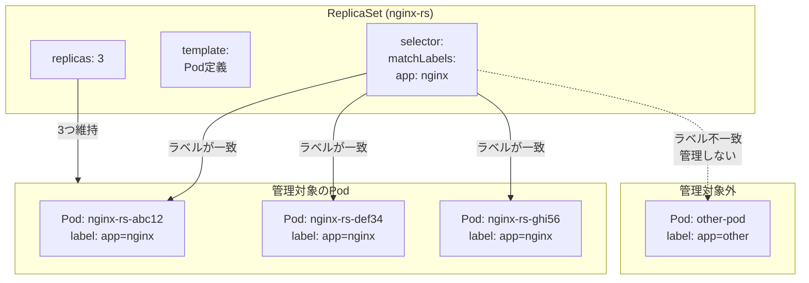

## はじめに

Kubernetesでアプリケーションを動かすとき、Podを直接作成するだけでは本番運用に耐えられません。Podが落ちたら手動で再作成する必要があり、負荷に応じてPod数を増やすのも一苦労です。

この記事では、ReplicaSetを使ってこれらの課題を解決する方法を紹介します。

:::message
実際の運用ではReplicaSet単体ではなくDeploymentを使うのが一般的です。ただし、DeploymentはReplicaSetを内部で利用しているため、ReplicaSetの動作を理解しておくことは重要です。
:::

## 環境

- Kubernetes クラスター: Docker Desktop

## Podだけで運用すると何が困るか

単一のPodでnginxを動かす場合を考えてみます。

```yaml
apiVersion: v1
kind: Pod
metadata:
  name: nginx
  namespace: dev
spec:
  containers:
  - name: nginx
    image: nginx:latest
```

この構成には以下の問題があります。

**1. 障害に弱い**
Podがクラッシュしたり、ノードが落ちたりすると、サービスが停止します。手動で再作成するまで復旧しません。

**2. スケールできない**
アクセスが増えてもPodは1つのままです。負荷分散するには、同じPodを複数作成して管理する必要があります。

**3. 状態管理が煩雑**
複数のPodを手動で管理すると、どのPodが動いているか把握するのが大変になります。

## ReplicaSetが解決すること

ReplicaSetは「指定した数のPodを常に維持する」リソースです。

```yaml
apiVersion: apps/v1
kind: ReplicaSet
metadata:
  name: nginx-rs
  namespace: dev
spec:
  replicas: 3
  selector:
    matchLabels:
      app: nginx
  template:
    metadata:
      labels:
        app: nginx
    spec:
      containers:
      - name: nginx
        image: nginx:latest
```

これにより以下が実現します。

- **自動復旧**: Podが落ちても、自動的に新しいPodを作成して指定数を維持
- **スケーリング**: `replicas`の値を変えるだけでPod数を増減
- **宣言的管理**: あるべき状態をmanifestで定義し、Kubernetesが自動で維持

### ReplicaSetとPodの関係

ReplicaSetがPodを管理する仕組みを図で表すと以下のようになります。



ポイントは以下の通りです。

- ReplicaSetは`selector`で指定したラベルを持つPodだけを管理する
- `template`に基づいて新しいPodを作成する
- `replicas`で指定した数を常に維持しようとする
- ラベルが一致しないPodは管理対象外

## manifestを書いてデプロイする

### namespaceを作成する

```bash
kubectl create namespace dev
```

### ReplicaSetを作成する

以下の内容で`nginx-replicaset.yaml`を作成します。

```yaml
apiVersion: apps/v1
kind: ReplicaSet
metadata:
  name: nginx-rs
  namespace: dev
spec:
  replicas: 3
  selector:
    matchLabels:
      app: nginx
  template:
    metadata:
      labels:
        app: nginx
    spec:
      containers:
      - name: nginx
        image: nginx:latest
```

各フィールドの意味は以下の通りです。

| フィールド | 説明 |
|-----------|------|
| `replicas` | 維持するPodの数 |
| `selector.matchLabels` | 管理対象とするPodのラベル条件 |
| `template` | 作成するPodの定義 |
| `template.metadata.labels` | Podに付与するラベル（selectorと一致させる） |

### デプロイする

```bash
kubectl apply -f nginx-replicaset.yaml
```

### 状態を確認する

ReplicaSetの状態を確認します。

```bash
kubectl get rs -n dev
```

```
NAME       DESIRED   CURRENT   READY   AGE
nginx-rs   3         3         3       30s
```

Podも確認してみます。

```bash
kubectl get pod -n dev
```

```
NAME             READY   STATUS    RESTARTS   AGE
nginx-rs-abc12   1/1     Running   0          45s
nginx-rs-def34   1/1     Running   0          45s
nginx-rs-ghi56   1/1     Running   0          45s
```

3つのPodが自動的に作成されました。Pod名にはReplicaSet名 + ランダムな文字列が付きます。

### describeで詳細を確認する

`kubectl describe`を使うと、ReplicaSetの詳細情報やイベントログを確認できます。トラブルシューティングで重宝するコマンドです。

```bash
kubectl describe rs nginx-rs -n dev
```

```
Name:         nginx-rs
Namespace:    dev
Selector:     app=nginx
Labels:       <none>
Annotations:  <none>
Replicas:     3 current / 3 desired
Pods Status:  3 Running / 0 Waiting / 0 Succeeded / 0 Failed
Pod Template:
  Labels:  app=nginx
  Containers:
   nginx:
    Image:        nginx:latest
    Port:         <none>
    Host Port:    <none>
    Environment:  <none>
    Mounts:       <none>
  Volumes:        <none>
Events:
  Type    Reason            Age   From                   Message
  ----    ------            ----  ----                   -------
  Normal  SuccessfulCreate  60s   replicaset-controller  Created pod: nginx-rs-abc12
  Normal  SuccessfulCreate  60s   replicaset-controller  Created pod: nginx-rs-def34
  Normal  SuccessfulCreate  60s   replicaset-controller  Created pod: nginx-rs-ghi56
```

確認できる主な情報は以下の通りです。

| 項目 | 説明 |
|------|------|
| `Selector` | 管理対象Podを識別するラベル条件 |
| `Replicas` | 現在のPod数 / 期待するPod数 |
| `Pods Status` | Running/Waiting/Succeeded/Failedの内訳 |
| `Events` | Pod作成・削除などの操作履歴 |

Podが起動しない場合は、`Events`セクションにエラーの原因が記録されます。問題が発生したらまず`describe`で確認する習慣をつけましょう。

## スケーリングを試す

Pod数を変更する方法を2つ紹介します。

### kubectl scaleで即座に変更する

開発中やトラブル対応など、すぐにPod数を変えたいときに使います。

```bash
kubectl scale rs nginx-rs -n dev --replicas=5
```

```bash
kubectl get pod -n dev
```

```
NAME             READY   STATUS    RESTARTS   AGE
nginx-rs-abc12   1/1     Running   0          2m
nginx-rs-def34   1/1     Running   0          2m
nginx-rs-ghi56   1/1     Running   0          2m
nginx-rs-jkl78   1/1     Running   0          5s
nginx-rs-mno90   1/1     Running   0          5s
```

2つのPodが追加され、5つになりました。

### manifestを編集してapplyする

本番運用では、manifestを変更してGitで管理する方法が推奨されます。

```diff
spec:
-  replicas: 5
+  replicas: 2
```

```bash
kubectl apply -f nginx-replicaset.yaml
```

```bash
kubectl get pod -n dev
```

```
NAME             READY   STATUS    RESTARTS   AGE
nginx-rs-abc12   1/1     Running   0          5m
nginx-rs-def34   1/1     Running   0          5m
```

5つから2つに減りました。不要なPodは自動的に削除されます。

## 自己修復を試す

ReplicaSetの自己修復機能を確認してみましょう。

### Podを監視する

別のターミナルでPodの状態を監視します。

```bash
kubectl get pod -n dev --watch
```

### Podを削除してみる

動いているPodを1つ削除します。

```bash
kubectl delete pod nginx-rs-abc12 -n dev
```

監視中のターミナルを見ると、以下のような変化が観察できます。

```
NAME             READY   STATUS        RESTARTS   AGE
nginx-rs-abc12   1/1     Terminating   0          10m
nginx-rs-def34   1/1     Running       0          10m
nginx-rs-xyz99   0/1     Pending       0          0s
nginx-rs-xyz99   0/1     ContainerCreating   0   0s
nginx-rs-xyz99   1/1     Running       0          2s
```

Podが削除されると、すぐに新しいPodが作成されて`replicas: 2`の状態が維持されます。これがReplicaSetの自己修復機能です。

## ラベルセレクターの仕組みを理解する

ReplicaSetは`selector.matchLabels`で指定したラベルを持つPodを管理対象とします。この仕組みを確認してみましょう。

### 同じラベルを持つPodを追加する

ReplicaSetが管理するラベル（`app: nginx`）を持つPodを手動で作成します。

```bash
kubectl run extra-nginx --image=nginx:latest -n dev --labels="app=nginx"
```

```bash
kubectl get pod -n dev
```

作成したPodはすぐに削除されます。ReplicaSetは`replicas: 2`を維持するため、3つ目のPodは不要と判断されるからです。

### 異なるラベルを持つPodを追加する

今度は別のラベル（`app: other`）でPodを作成します。

```bash
kubectl run other-nginx --image=nginx:latest -n dev --labels="app=other"
```

```bash
kubectl get pod -n dev
```

```
NAME             READY   STATUS    RESTARTS   AGE
nginx-rs-abc12   1/1     Running   0          15m
nginx-rs-def34   1/1     Running   0          15m
other-nginx      1/1     Running   0          5s
```

このPodは削除されません。ラベルが異なるため、ReplicaSetの管理対象外だからです。

確認できたら削除しておきます。

```bash
kubectl delete pod other-nginx -n dev
```

## よくある失敗パターン

ReplicaSetのmanifestを書く際に陥りやすいミスを紹介します。

### selectorとtemplateのラベルが一致しない

以下のmanifestには問題があります。

```yaml
apiVersion: apps/v1
kind: ReplicaSet
metadata:
  name: nginx-rs-broken
  namespace: dev
spec:
  replicas: 3
  selector:
    matchLabels:
      app: nginx        # selectorは「app: nginx」
  template:
    metadata:
      labels:
        app: web-server # templateは「app: web-server」← 不一致！
    spec:
      containers:
      - name: nginx
        image: nginx:latest
```

このmanifestを適用すると、以下のエラーが発生します。

```bash
kubectl apply -f nginx-replicaset-broken.yaml
```

```
The ReplicaSet "nginx-rs-broken" is invalid: spec.template.metadata.labels: Invalid value: map[string]string{"app":"web-server"}: `selector` does not match template `labels`
```

ReplicaSetは`selector`で指定したラベルを持つPodを管理対象とするため、`template`で作成するPodにも同じラベルが必要です。両者が一致しないと、作成したPodを自分で管理できなくなってしまいます。

:::message alert
`selector.matchLabels`と`template.metadata.labels`は必ず一致させてください。
:::

## クリーンアップ

ReplicaSetを削除すると、管理下のPodも一緒に削除されます。

```bash
kubectl delete -f nginx-replicaset.yaml
```

```bash
kubectl get all -n dev
```

```
No resources found in dev namespace.
```

## まとめ

- **ReplicaSet**は指定した数のPodを常に維持するリソース
- **自己修復**: Podが落ちても自動的に復旧する
- **スケーリング**: `replicas`の値を変えるだけでPod数を増減できる
- **ラベルセレクター**で管理対象のPodを識別する
- 実運用では**Deployment**経由でReplicaSetを使うのが一般的

## 参考資料

- [ReplicaSet | Kubernetes](https://kubernetes.io/ja/docs/concepts/workloads/controllers/replicaset/)
