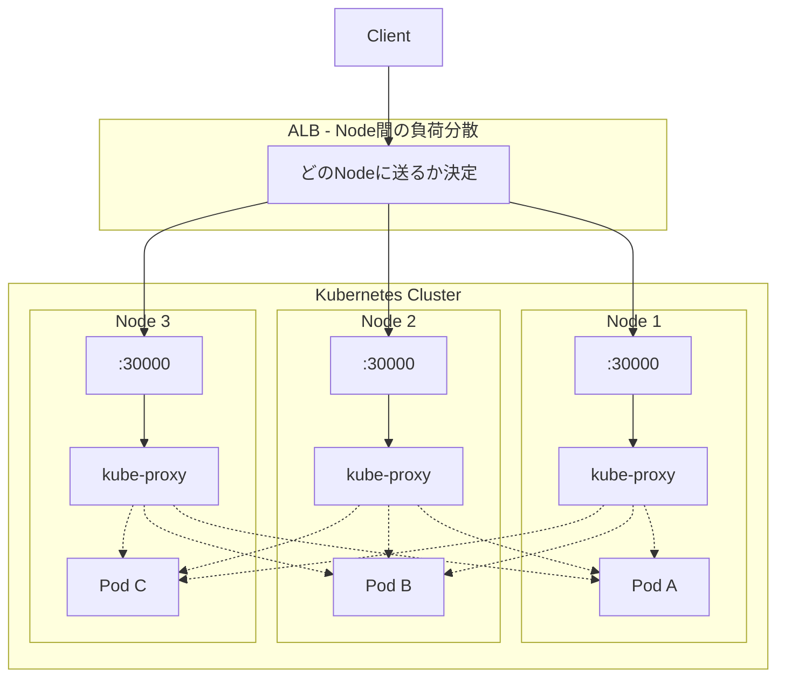

# はじめに

ReplicaSet で Pod を増やしたとき、どうやってアクセスすればいいのでしょうか？

Pod にはそれぞれ固有の IP アドレスが割り当てられますが、個別に指定するのは面倒です。複数の Pod にリクエストを分散させたいときに使うのが **Service** です。

この記事では **kind** を使って複数 Node のクラスターを構築し、**ClusterIP** と **NodePort** の動作を確認します。

:::message
この記事は前後編に分かれています。
- **前編（この記事）**: ClusterIP と NodePort
- **後編**: LoadBalancer と ExternalName
:::

# 準備

## kind のインストール

```bash
brew install kind
```

## 複数 Node のクラスターを作成

3 Node（control-plane 1台 + worker 2台）のクラスターを作成します。

```yaml:manifests/kind-config.yaml
kind: Cluster
apiVersion: kind.x-k8s.io/v1alpha4
nodes:
  - role: control-plane
  - role: worker
  - role: worker
```

クラスターを作成:

```bash
kind create cluster --name service-demo --config=./manifests/kind-config.yaml
```

## コンテキストの確認

kind クラスター作成時に自動でコンテキストが切り替わります。

```bash
kubectl config current-context
```

```
kind-service-demo
```

:::details コンテキスト一覧を確認
```bash
kubectl config get-contexts
```

```
CURRENT   NAME                 CLUSTER              AUTHINFO             NAMESPACE
          docker-desktop       docker-desktop       docker-desktop
*         kind-service-demo    kind-service-demo    kind-service-demo
```

複数クラスターがある場合は `kubectl config use-context kind-service-demo` で切り替えられます。
:::

## Node の確認

```bash
kubectl get nodes
```

```
NAME                         STATUS   ROLES           AGE   VERSION
service-demo-control-plane   Ready    control-plane   60s   v1.27.3
service-demo-worker          Ready    <none>          30s   v1.27.3
service-demo-worker2         Ready    <none>          30s   v1.27.3
```

## namespace を用意

```bash
kubectl create namespace dev
```

## ReplicaSet を用意

Pod がどの Node で動いているか確認できるように環境変数を設定します。

```yaml:manifests/nginx-replicaset.yaml
apiVersion: apps/v1
kind: ReplicaSet
metadata:
  name: nginx-replicaset      # ReplicaSet の名前
  namespace: dev              # 作成する namespace
spec:
  replicas: 6                 # 作成する Pod の数
  selector:                   # 管理対象の Pod を選択するラベル
    matchLabels:
      app: nginx
  template:                   # Pod のテンプレート
    metadata:
      labels:
        app: nginx            # Pod に付与するラベル（selector と一致させる）
    spec:
      containers:
      - name: nginx
        image: nginx:latest
        env:
        - name: NODE_NAME               # 環境変数 NODE_NAME
          valueFrom:
            fieldRef:
              fieldPath: spec.nodeName  # Pod が動いている Node 名を取得
        - name: POD_NAME                # 環境変数 POD_NAME
          valueFrom:
            fieldRef:
              fieldPath: metadata.name  # Pod 自身の名前を取得
```

適用:

```bash
kubectl apply -f ./manifests/nginx-replicaset.yaml
```

## Pod の配置を確認

```bash
kubectl get pod -n dev -o wide
```

```
NAME                     READY   STATUS    IP           NODE
nginx-replicaset-abc12   1/1     Running   10.244.1.2   service-demo-worker
nginx-replicaset-def34   1/1     Running   10.244.1.3   service-demo-worker
nginx-replicaset-ghi56   1/1     Running   10.244.2.2   service-demo-worker2
nginx-replicaset-jkl78   1/1     Running   10.244.2.3   service-demo-worker2
nginx-replicaset-mno90   1/1     Running   10.244.0.5   service-demo-control-plane
nginx-replicaset-pqr12   1/1     Running   10.244.0.6   service-demo-control-plane
```

6 つの Pod が 3 つの Node に分散配置されています。

# Service の基本

## 作成方法

```bash
kubectl create service <サービスのタイプ> <サービスの名前> --tcp=<ホスト側のポート>:<コンテナ側のポート>
```

## タイプ一覧

| タイプ | 説明 |
|--------|------|
| **ClusterIP** | Kubernetes 内部ネットワークでのみアクセス可能（デフォルト） |
| **NodePort** | クラスター内共通で 1 つのポート（30000-32767）を各 Node に割り当て、外部からアクセス可能 |
| **LoadBalancer** | クラウドプロバイダのロードバランサーをプロビジョニングし、外部からアクセス可能 |
| **ExternalName** | サービス名を外部ドメイン名に解決する DNS エイリアス |

# ClusterIP: 内部ネットワークでアクセス可能な Service

内部ネットワークでのみ利用できるホスト名を提供したい場合に使用します。

## マニフェスト

```yaml:manifests/nginx-service-clusterip.yaml
apiVersion: v1
kind: Service
metadata:
  labels:
    app: nginx-service
  name: nginx-service         # Service の名前
  namespace: dev
spec:
  ports:
    - name: http              # ポートの名前（任意）
      port: 80                # Service が LISTEN するポート番号
      protocol: TCP
      targetPort: 80          # Pod が LISTEN しているポート番号
  selector:
    app: nginx                # このラベルに一致する Pod にトラフィックを送る
  type: ClusterIP             # Service のタイプ
```

## 適用と確認

```bash
kubectl apply -f ./manifests/nginx-service-clusterip.yaml
kubectl -n dev get svc
```

```
NAME            TYPE        CLUSTER-IP      EXTERNAL-IP   PORT(S)   AGE
nginx-service   ClusterIP   10.96.xxx.xxx   <none>        80/TCP    5s
```

## クラスター外からアクセスできないことを確認

ClusterIP はクラスター内部からのみアクセス可能です。ホストマシンからはアクセスできません。

```bash
# ホストマシンから CLUSTER-IP にアクセス（失敗する）
curl --head --max-time 3 http://10.96.xxx.xxx
```

```
curl: (28) Connection timed out after 3001 milliseconds
```

## クラスター内部からアクセスできることを確認

```bash
kubectl -n dev run curl-pod --restart=Never -it --rm --image=curlimages/curl:latest -- curl --head http://nginx-service
```

```
HTTP/1.1 200 OK
Server: nginx/1.27.0
Date: Tue, 13 Aug 2024 22:54:53 GMT
Content-Type: text/html
Content-Length: 615
Last-Modified: Tue, 28 May 2024 13:22:30 GMT
Connection: keep-alive
ETag: "6655da96-267"
Accept-Ranges: bytes

pod "curl-pod" deleted
```

## 複数の Pod に分散されていることを確認

各 Pod が自分の名前を返すように設定します。

```bash
# 全 Pod の index.html を Pod 名に書き換え
for pod in $(kubectl get pod -n dev -l app=nginx -o jsonpath='{.items[*].metadata.name}'); do
  kubectl exec -n dev $pod -- sh -c "echo $pod > /usr/share/nginx/html/index.html"
done
```

複数回アクセスして、異なる Pod に分散されることを確認します。

```bash
# クラスター内から 10 回アクセス
kubectl -n dev run curl-pod --restart=Never -it --rm --image=curlimages/curl:latest -- \
  sh -c 'for i in $(seq 1 10); do curl -s http://nginx-service; done'
```

```
nginx-replicaset-abc12
nginx-replicaset-ghi56
nginx-replicaset-def34
nginx-replicaset-abc12
nginx-replicaset-mno90
nginx-replicaset-jkl78
nginx-replicaset-pqr12
nginx-replicaset-def34
nginx-replicaset-ghi56
nginx-replicaset-abc12
```

リクエストが複数の Pod に分散されていることが確認できます。

## ClusterIP の Service を削除

```bash
kubectl delete -f ./manifests/nginx-service-clusterip.yaml
```

# NodePort: 外部からアクセス可能な Service

クラスター共通のポートを確保して、全ての Node に設定します。

## マニフェスト

```yaml:manifests/nginx-service-nodeport.yaml
apiVersion: v1
kind: Service
metadata:
  labels:
    app: nginx-service
  name: nginx-service         # Service の名前
  namespace: dev
spec:
  ports:
    - name: http              # ポートの名前（任意）
      port: 80                # Service が LISTEN するポート番号
      protocol: TCP
      targetPort: 80          # Pod が LISTEN しているポート番号
      nodePort: 30000         # Node で LISTEN するポート（30000-32767）
  selector:
    app: nginx                # このラベルに一致する Pod にトラフィックを送る
  type: NodePort              # Service のタイプ
```

## ClusterIP からの差分

```diff
spec:
  ports:
    - name: http
      port: 80
      protocol: TCP
      targetPort: 80
+     nodePort: 30000
  selector:
    app: nginx
- type: ClusterIP
+ type: NodePort
```

## 適用と確認

```bash
kubectl apply -f ./manifests/nginx-service-nodeport.yaml
kubectl -n dev get svc
```

```
NAME            TYPE       CLUSTER-IP      EXTERNAL-IP   PORT(S)        AGE
nginx-service   NodePort   10.96.xxx.xxx   <none>        80:30000/TCP   5s
```

## NodePort の動作確認

NodePort は全ての Node で同じポート(30000)を開きます。

### 特定の Node からアクセスして Pod への分散を確認

worker Node のコンテナに入って確認します:

```bash
docker exec -it service-demo-worker bash
```

Node 内から複数回アクセス:

```bash
for i in {1..10}; do
  curl -s http://localhost:30000 2>/dev/null | head -1
done
```

### 重要: NodePort はクラスター全体の Pod に分散する

```
service-demo-worker:30000 にアクセスしても:

┌─────────────────────────────────────────────────────────────┐
│                                                             │
│  worker:30000 ─→ kube-proxy ─┬─→ worker の Pod             │
│                              ├─→ worker2 の Pod   ← 他Node │
│                              └─→ control-plane の Pod      │
│                                                             │
└─────────────────────────────────────────────────────────────┘
```

:::message alert
**どの Node にアクセスしても、クラスター全体の Pod に負荷分散されます。**
:::

## kube-proxy の転送先リストを確認

各 Node の kube-proxy がクラスター全体の Pod を知っていることを確認します。

### Service の Endpoints（転送先 Pod の IP リスト）を確認

```bash
kubectl get endpoints -n dev nginx-service
```

```
NAME            ENDPOINTS
nginx-service   10.244.1.2:80,10.244.1.3:80,10.244.1.4:80,10.244.2.2:80,10.244.2.3:80,10.244.2.4:80
```

### Pod IP がどの Node に対応するか確認

```bash
kubectl get pod -n dev -o wide
```

```
NAME                     IP           NODE
nginx-replicaset-6tl5f   10.244.1.2   service-demo-worker2
nginx-replicaset-kkqzt   10.244.1.3   service-demo-worker2
nginx-replicaset-kvgnl   10.244.1.4   service-demo-worker2
nginx-replicaset-rvv2x   10.244.2.2   service-demo-worker
nginx-replicaset-l2gkw   10.244.2.3   service-demo-worker
nginx-replicaset-ggbwb   10.244.2.4   service-demo-worker
```

### iptables ルールで確認（詳細）

Node 内に入って、kube-proxy が作成した iptables ルールを確認します:

```bash
docker exec -it service-demo-worker bash
iptables -t nat -L -n | grep "nginx-service:http ->"
```

```
/* dev/nginx-service:http -> 10.244.1.2:80 */ statistic mode random probability 0.16666666651
/* dev/nginx-service:http -> 10.244.1.3:80 */ statistic mode random probability 0.20000000019
/* dev/nginx-service:http -> 10.244.1.4:80 */ statistic mode random probability 0.25000000000
/* dev/nginx-service:http -> 10.244.2.2:80 */ statistic mode random probability 0.33333333349
/* dev/nginx-service:http -> 10.244.2.3:80 */ statistic mode random probability 0.50000000000
/* dev/nginx-service:http -> 10.244.2.4:80 */
```

:::details 確認できること
- `service-demo-worker` の kube-proxy が `worker2` の Pod IP も知っている
- `probability` で各 Pod に均等（約 1/6）に振り分けている
- **自分の Node 以外の Pod にも転送できる**

```
service-demo-worker 内の kube-proxy:

  10.244.1.2 (worker2)  ← 他の Node
  10.244.1.3 (worker2)  ← 他の Node
  10.244.1.4 (worker2)  ← 他の Node
  10.244.2.2 (worker)   ← 自分の Node
  10.244.2.3 (worker)   ← 自分の Node
  10.244.2.4 (worker)   ← 自分の Node
```

他の Node でも同様に確認できます:

```bash
# worker2 でも確認
docker exec -it service-demo-worker2 iptables -t nat -L -n | grep "nginx-service:http ->"

# control-plane でも確認
docker exec -it service-demo-control-plane iptables -t nat -L -n | grep "nginx-service:http ->"
```

どの Node でも同じ 6 つの Pod IP が転送先として登録されています。
:::

## NodePort だけでは足りない理由

NodePort はクラスター内の Pod への負荷分散はしてくれますが、**クラスター外からアクセスする場合、どの Node にアクセスするかは自分で決める必要があります**。

```
クラスター外からのアクセス:

  Client → ??? → Node:30000 → kube-proxy → Pod

  「???」の部分を誰かが解決する必要がある
```

**問題点:**

- 特定の Node IP を指定すると、その Node が障害時にアクセス不可
- 複数 Node に均等にアクセスしたい
- Node の増減に対応したい

## NodePort と ALB の役割分担



:::message
**ポイント**: 各 Node の kube-proxy は、どの Node の Pod にも転送できる（点線）
:::

| 役割 | 担当 |
|------|------|
| Client → Node の振り分け | ALB |
| Node → Pod の振り分け | NodePort (kube-proxy) |

## だから LoadBalancer タイプがある

NodePort + ALB を手動で設定するのは面倒なので、`type: LoadBalancer` を使えば Kubernetes が自動で ALB/NLB を作成してくれます。

```yaml
type: LoadBalancer  # クラウド環境で ALB/NLB を自動作成
```

```
NodePort を使う場合:
  1. NodePort の Service を作成
  2. ALB を手動で作成
  3. ALB のターゲットに各 Node:30000 を登録
  4. Node 増減時に ALB の設定も更新

LoadBalancer を使う場合:
  1. LoadBalancer の Service を作成
  → 以上（ALB の作成・設定は自動）
```

## NodePort の Service を削除

```bash
kubectl delete -f ./manifests/nginx-service-nodeport.yaml
```

# 前編のまとめ

- **Service** は複数の Pod へのリクエストを分散させる
- **ClusterIP**: クラスター内部からのみアクセス可能（デフォルト）
- **NodePort**: 全 Node で同じポートを開き、クラスター全体の Pod に負荷分散

## NodePort の重要ポイント

```
NodePort がやること:
  - 全 Node でポートを開く
  - クラスター全体の Pod へ負荷分散（Node をまたぐ）

NodePort がやらないこと:
  - どの Node にアクセスするかの決定（ALB 等が必要）
```

## コマンドまとめ

| コマンド | 説明 |
|---------|------|
| `kind create cluster --name <name>` | kind クラスターを作成 |
| `kubectl get nodes` | Node の一覧を確認 |
| `kubectl get pod -o wide` | Pod の配置 Node を確認 |
| `kubectl create service <type> <name> --tcp=<port>:<targetPort>` | Service を作成 |
| `kubectl get svc -n <namespace>` | Service の一覧を確認 |
| `docker exec -it <node-container> bash` | kind の Node コンテナに入る |

---

**[後編](/articles/kubernetes-service-guide-part2)では LoadBalancer と ExternalName について解説します。**

# 参考資料

- [Service | Kubernetes](https://kubernetes.io/docs/concepts/services-networking/service/)
- [kind - Quick Start](https://kind.sigs.k8s.io/docs/user/quick-start/)
