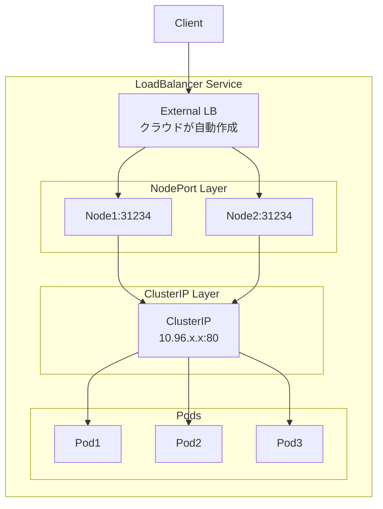
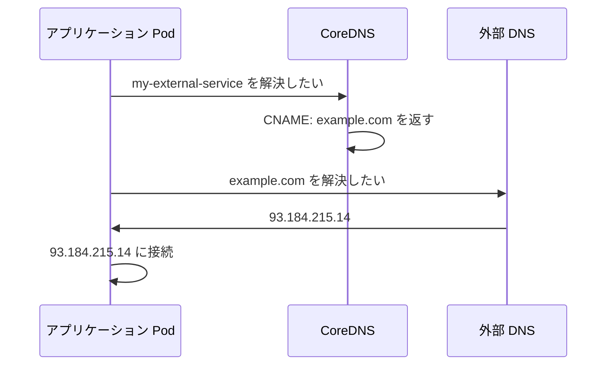

# はじめに

前編では **ClusterIP** と **NodePort** について解説しました。

:::message
この記事は前後編に分かれています。
- **前編**: ClusterIP と NodePort
- **後編（この記事）**: LoadBalancer と ExternalName
  :::

後編では、外部からのアクセスを自動化する **LoadBalancer** と、外部サービスへのエイリアスを作る **ExternalName** について解説します。

## 前編の振り返り

| タイプ | 説明 |
|--------|------|
| **ClusterIP** | クラスター内部からのみアクセス可能（デフォルト） |
| **NodePort** | 全 Node で同じポートを開き、外部からアクセス可能 |

NodePort は便利ですが、「どの Node にアクセスするか」を自分で決める必要がありました。これを解決するのが **LoadBalancer** です。

## 前提条件

前編で作成した kind クラスターと ReplicaSet が動いている前提で進めます。まだの方は前編を参照してください。

# LoadBalancer: ロードバランサー経由でアクセス可能な Service

外部のロードバランサーリソースをプロビジョニングします。

## LoadBalancer の仕組み

LoadBalancer は **ClusterIP + NodePort + 外部LB** の3層構造です。



LoadBalancer Service を作成すると:

1. **ClusterIP** を作成（内部通信用）
2. **NodePort** を作成（全 Node でポート開放）
3. **クラウドコントローラー**が外部 LB をプロビジョニング
4. 外部 LB が各 Node の NodePort にトラフィックを送る

つまり、LoadBalancer は NodePort の上に「外部 LB の自動作成」を追加したものです。

## マニフェスト

```yaml:manifests/nginx-service-loadbalancer.yaml
apiVersion: v1
kind: Service
metadata:
  labels:
    app: nginx-service
  name: nginx-service         # Service の名前
  namespace: dev
spec:
  ports:
    - name: http              # ポートの名前（任意）
      port: 80                # Service が LISTEN するポート番号
      protocol: TCP
      targetPort: 80          # Pod が LISTEN しているポート番号
  selector:
    app: nginx                # このラベルに一致する Pod にトラフィックを送る
  type: LoadBalancer          # Service のタイプ
```

## NodePort からの差分

```diff
spec:
  ports:
    - name: http
      port: 80
      protocol: TCP
      targetPort: 80
-     nodePort: 30000
  selector:
    app: nginx
- type: NodePort
+ type: LoadBalancer
```

## 適用と確認

```bash
kubectl apply -f ./manifests/nginx-service-loadbalancer.yaml
kubectl get svc -n dev nginx-service
```

```
NAME            TYPE           CLUSTER-IP      EXTERNAL-IP   PORT(S)        AGE
nginx-service   LoadBalancer   10.96.xxx.xxx   <pending>     80:31234/TCP   5s
```

kind では `<pending>` のままですが、AWS EKS などでは:

```
NAME            TYPE           CLUSTER-IP      EXTERNAL-IP                              PORT(S)
nginx-service   LoadBalancer   10.96.xxx.xxx   xxx.elb.amazonaws.com                    80:31234/TCP
```

のように外部からアクセス可能な DNS 名が割り当てられます。

# kind で LoadBalancer を確認する（MetalLB）

kind はローカル環境のため、デフォルトでは外部 LB が作成されません。
**MetalLB** を使えばローカルでも LoadBalancer を確認できます。

## MetalLB のインストール

```bash
# MetalLB をインストール
kubectl apply -f https://raw.githubusercontent.com/metallb/metallb/v0.13.12/config/manifests/metallb-native.yaml

# Pod が起動するまで待機
kubectl wait --namespace metallb-system \
  --for=condition=ready pod \
  --selector=app=metallb \
  --timeout=90s
```

## kind の Docker ネットワーク IP 範囲を確認

```bash
docker network inspect -f '{{.IPAM.Config}}' kind
```

```
[{172.18.0.0/16  172.18.0.1 map[]}]
```

この例では `172.18.0.0/16` が kind のネットワークです。

## MetalLB の設定

```yaml:manifests/metallb-config.yaml
apiVersion: metallb.io/v1beta1
kind: IPAddressPool
metadata:
  name: example
  namespace: metallb-system
spec:
  addresses:
  - 172.18.255.200-172.18.255.250  # kind ネットワーク内の未使用 IP 範囲（要調整）
---
apiVersion: metallb.io/v1beta1
kind: L2Advertisement
metadata:
  name: empty
  namespace: metallb-system
```

```bash
kubectl apply -f ./manifests/metallb-config.yaml
```

## LoadBalancer の動作確認

```bash
# LoadBalancer Service を適用
kubectl apply -f ./manifests/nginx-service-loadbalancer.yaml

# EXTERNAL-IP が割り当てられることを確認
kubectl get svc -n dev nginx-service
```

```
NAME            TYPE           CLUSTER-IP      EXTERNAL-IP      PORT(S)        AGE
nginx-service   LoadBalancer   10.96.xxx.xxx   172.18.xxx.xxx   80:31234/TCP   5s
```

`<pending>` ではなく、実際の IP が割り当てられます。

## LoadBalancer は 3 層構造

LoadBalancer Service を作成すると、ClusterIP と NodePort も同時に作成されます:

```bash
kubectl get svc -n dev nginx-service -o yaml | grep -E "clusterIP:|nodePort:|type:"
```

```
  clusterIP: 10.96.xxx.xxx
    nodePort: 31234
  type: LoadBalancer
```

```
┌─────────────────────────────────────────────────────┐
│ LoadBalancer                                        │
│   EXTERNAL-IP: 172.18.xxx.xxx                       │
│                                                     │
│  ┌───────────────────────────────────────────────┐  │
│  │ NodePort                                      │  │
│  │   全 Node で :31234 を LISTEN                 │  │
│  │                                               │  │
│  │  ┌─────────────────────────────────────────┐  │  │
│  │  │ ClusterIP                               │  │  │
│  │  │   10.96.xxx.xxx:80                      │  │  │
│  │  └─────────────────────────────────────────┘  │  │
│  └───────────────────────────────────────────────┘  │
└─────────────────────────────────────────────────────┘
```

| タイプ | 含まれるレイヤー |
|--------|------------------|
| ClusterIP | ClusterIP のみ |
| NodePort | ClusterIP + NodePort |
| LoadBalancer | ClusterIP + NodePort + 外部LB |

## 3 つのレイヤー全てでアクセスできることを確認

### 1. ClusterIP 経由（クラスター内部から）

```bash
kubectl run curl-test -n dev --rm -it --restart=Never --image=curlimages/curl:latest \
  -- curl -s http://10.96.xxx.xxx
```

```
nginx-replicaset-abc12
```

### 2. NodePort 経由（Node から）

```bash
docker exec service-demo-worker curl -s http://localhost:31234
```

```
nginx-replicaset-def34
```

### 3. LoadBalancer 経由（外部から）

macOS の場合、Docker Desktop の制限により、ホストから Docker ネットワーク（`172.18.x.x`）に直接アクセスできません。

```
macOS Host
  └── Docker Desktop (Linux VM)
        └── Docker Network "kind" (172.18.0.0/16)  ← ここにしかルートがない
              ├── kind-control-plane
              ├── kind-worker
              ├── kind-worker2
              └── LoadBalancer IP (172.18.xxx.xxx)
```

同じ Docker ネットワーク内からアクセスする必要があります:

```bash
# Docker ネットワーク "kind" 内から EXTERNAL-IP にアクセス
docker run --rm --network kind curlimages/curl:latest curl -s http://172.18.xxx.xxx
```

```
nginx-replicaset-abc12
```

LoadBalancer 経由でクラスター内の Pod にアクセスできることが確認できます。

## LoadBalancer の Service を削除

```bash
kubectl delete -f ./manifests/nginx-service-loadbalancer.yaml
```

:::details MetalLB を削除する場合
MetalLB が不要な場合は削除します:

```bash
# MetalLB の設定を削除
kubectl delete -f ./manifests/metallb-config.yaml

# MetalLB 本体を削除
kubectl delete -f https://raw.githubusercontent.com/metallb/metallb/v0.13.12/config/manifests/metallb-native.yaml
```
:::

# ExternalName: 外部ドメインのエイリアスになる Service

ExternalName は他の Service タイプとは異なり、**DNS の CNAME レコード**を作成します。クラスター内から外部サービスに「Kubernetes 的な名前」でアクセスできるようになります。

## ExternalName の特徴

| 項目 | ClusterIP / NodePort / LoadBalancer | ExternalName |
|------|-------------------------------------|--------------|
| ClusterIP | あり | **なし** |
| Endpoints | あり | **なし** |
| selector | あり | **なし** |
| 負荷分散 | kube-proxy が行う | **なし**（DNS 任せ） |
| 仕組み | IP ベースのプロキシ | **CNAME レコード** |

## ユースケース

ExternalName は以下のような場面で便利です：

### 1. 外部サービスへの接続を抽象化

```
アプリケーションのコード:
  url = "http://database-service"   ← Kubernetes 内の名前で統一

開発環境:
  database-service → dev-db.internal.example.com

本番環境:
  database-service → prod-db.rds.amazonaws.com
```

環境ごとに ExternalName の `externalName` を変えるだけで、アプリケーションコードの変更なしに接続先を切り替えられます。

### 2. 外部から内部への移行

```
Phase 1: ExternalName で外部 DB を参照
  my-db → external-database.example.com

Phase 2: 内部に DB を構築後、Service を ClusterIP に変更
  my-db → 内部の Pod 群
```

アプリケーションは `my-db` を使い続けるだけで、移行が完了します。

### 3. 長いドメイン名のエイリアス

```yaml
externalName: my-very-long-service-name.region.provider.example.com
```

を `short-name` として参照できます。

## ExternalName の仕組み



:::message alert
**重要**: ExternalName は DNS レベルでの解決のみを行います。kube-proxy によるプロキシは一切行われません。
:::

## マニフェスト

```yaml:manifests/external-name-service.yaml
apiVersion: v1
kind: Service
metadata:
  name: my-external-service
  namespace: dev
spec:
  type: ExternalName
  externalName: example.com   # CNAME の参照先
```

## 適用と確認

```bash
kubectl apply -f ./manifests/external-name-service.yaml
kubectl -n dev get svc --output wide
```

```
NAME                  TYPE           CLUSTER-IP   EXTERNAL-IP   PORT(S)   AGE     SELECTOR
my-external-service   ExternalName   <none>       example.com   <none>    92s     <none>
```

**注目ポイント**:
- `CLUSTER-IP` が `<none>` — IP ベースのルーティングをしない
- `SELECTOR` が `<none>` — Pod を選択しない
- `EXTERNAL-IP` に `externalName` の値が表示される

## 名前解決のテスト

まず、ホストマシンから `example.com` の IP アドレスを確認します：

```bash
dig +short example.com
```

```
93.184.215.14
```

次に、クラスター内から `my-external-service` を名前解決して、同じ IP が返ることを確認します：

```bash
kubectl -n dev run busybox-pod --restart=Never -it --rm --image=busybox:latest -- nslookup my-external-service
```

```
Server:         10.96.0.10
Address:        10.96.0.10:53

** server can't find my-external-service.cluster.local: NXDOMAIN
** server can't find my-external-service.svc.cluster.local: NXDOMAIN

my-external-service.dev.svc.cluster.local       canonical name = example.com
Name:   example.com
Address: 93.184.215.14
```

:::details 出力の解説
1. `NXDOMAIN` エラーは正常です。nslookup は複数の search domain を順番に試します：
    - `my-external-service.cluster.local` → 見つからない
    - `my-external-service.svc.cluster.local` → 見つからない
    - `my-external-service.dev.svc.cluster.local` → **成功**

2. `canonical name = example.com` が CNAME レコードの証拠です

3. 最終的に `example.com` の IP アドレス（`93.184.215.14`）が返され、`dig` で確認した IP と一致します

> **補足**: Pod が `Error` で終了することがありますが、これは nslookup が途中の NXDOMAIN でエラーコードを返すためで、名前解決自体は成功しています。
:::

## ExternalName の Service を削除

```bash
kubectl delete -f ./manifests/external-name-service.yaml
```

# あとかたづけ

## Kubernetes リソースを削除

```bash
kubectl delete -f ./manifests
```

## kind クラスターを削除

```bash
kind delete cluster --name service-demo
```

# まとめ

## 4 つの Service タイプ

| タイプ | 用途 |
|--------|------|
| **ClusterIP** | クラスター内部からのみアクセス可能（デフォルト） |
| **NodePort** | 全 Node で同じポートを開き、クラスター全体の Pod に負荷分散 |
| **LoadBalancer** | クラウドの LB を利用して外部公開（kind では MetalLB で確認可能） |
| **ExternalName** | 外部ドメインへの DNS エイリアス |

## Service タイプの包含関係

```
┌─────────────────────────────────────────┐
│ LoadBalancer                            │
│  ┌───────────────────────────────────┐  │
│  │ NodePort                          │  │
│  │  ┌─────────────────────────────┐  │  │
│  │  │ ClusterIP                   │  │  │
│  │  └─────────────────────────────┘  │  │
│  └───────────────────────────────────┘  │
└─────────────────────────────────────────┘

※ ExternalName は独立（DNS CNAME のみ）
```

## コマンドまとめ

| コマンド | 説明 |
|---------|------|
| `kubectl get svc -n <namespace>` | Service の一覧を確認 |
| `kubectl get endpoints -n <namespace>` | Endpoints（転送先 Pod）を確認 |
| `docker network inspect -f '{{.IPAM.Config}}' kind` | kind の Docker ネットワーク IP 範囲を確認 |
| `kind delete cluster --name <name>` | kind クラスターを削除 |

# 参考資料

- [Service | Kubernetes](https://kubernetes.io/docs/concepts/services-networking/service/)
- [MetalLB](https://metallb.universe.tf/)
- [kind - Quick Start](https://kind.sigs.k8s.io/docs/user/quick-start/)
