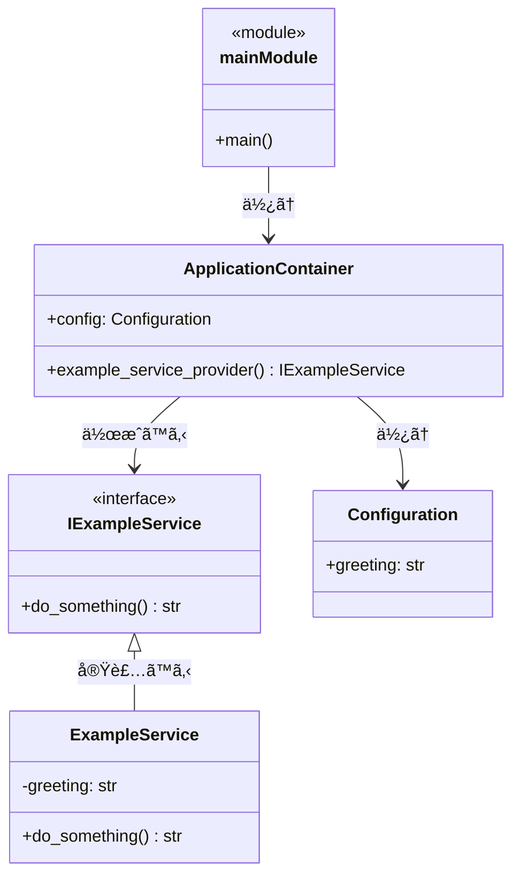

[dependency_injector](https://python-dependency-injector.ets-labs.org/) 㯠Python å‘ã‘ã®ä¾å­˜æ€§æ³¨å…¥ãƒ©ã‚¤ãƒ–ラリã§ã™ã€‚

# 基本的ãªä½¿ã„æ–¹

Dependency Injector を利用ã—ã¦ä¾å­˜æ€§æ³¨å…¥ã‚’è¡Œã†åŸºæœ¬çš„ãªæµã‚Œã¯ã€ä»¥ä¸‹ã®æ‰‹é †ã§å®Ÿç¾ã—ã¾ã™ã€‚

1. サービスã®å®šç¾©
   ã¾ãšã€æŠ½è±¡ã‚¯ãƒ©ã‚¹ï¼ˆã‚¤ãƒ³ã‚¿ãƒ¼ãƒ•ã‚§ãƒ¼ã‚¹ï¼‰ã‚’定義ã—ã€ãã®å®Ÿè£…ã¨ãªã‚‹å…·ä½“çš„ãªã‚µãƒ¼ãƒ“スクラスを作æˆã—ã¾ã™ã€‚
   ã“ã‚Œã«ã‚ˆã‚Šã€ã‚µãƒ¼ãƒ“スã®å®Ÿè£…ãŒå‘¼ã³å‡ºã—å…ƒã‹ã‚‰ç‹¬ç«‹ã—ã€å¾Œã‹ã‚‰ç°¡å˜ã«å…¥ã‚Œæ›¿ãˆã‚„テストãŒè¡Œãˆã‚‹è¨­è¨ˆã«ãªã‚Šã¾ã™ã€‚
2. コンテナã®è¨­å®š
   次ã«ã€dependency_injector ã® containers.DeclarativeContainer を継承ã—ãŸã‚³ãƒ³ãƒ†ãƒŠã‚¯ãƒ©ã‚¹ï¼ˆä¾‹: ApplicationContainer）を定義ã—ã¾ã™ã€‚
   ã“ã®ã‚³ãƒ³ãƒ†ãƒŠå†…ã§ã€è¨­å®šå€¤ï¼ˆconfig）やサービスを生æˆã™ã‚‹ãƒ—ロãƒã‚¤ãƒ€ãƒ¼ï¼ˆä¾‹: providers.Factory）を設定ã—ã¾ã™ã€‚
   ã“ã“ã§å®šç¾©ã•ã‚ŒãŸãƒ—ロãƒã‚¤ãƒ€ãƒ¼ã‚’通ã˜ã¦ã€å„サービスã®ã‚¤ãƒ³ã‚¹ã‚¿ãƒ³ã‚¹ãŒå¿…è¦ãªä¾å­˜æ€§ã¨ã¨ã‚‚ã«ç”Ÿæˆã•ã‚Œã¾ã™ã€‚
3. ä¾å­˜æ€§ã®æ³¨å…¥
   アプリケーションã®ã‚¨ãƒ³ãƒˆãƒªãƒ¼ãƒã‚¤ãƒ³ãƒˆï¼ˆä¾‹: main.py）ã§ã¯ã€ã‚³ãƒ³ãƒ†ãƒŠã‚’生æˆã—ã€è¨­å®šå€¤ã‚’読ã¿è¾¼ã¿ã¾ã™ã€‚
   ãã®å¾Œã€ã‚³ãƒ³ãƒ†ãƒŠã‹ã‚‰ã‚µãƒ¼ãƒ“スã®ã‚¤ãƒ³ã‚¹ã‚¿ãƒ³ã‚¹ã‚’å–å¾—ã—ã¦ä½¿ç”¨ã—ã¾ã™ã€‚
   ã“ã‚Œã«ã‚ˆã‚Šã€main.py ã¯ã‚µãƒ¼ãƒ“スã®å…·ä½“çš„ãªå®Ÿè£…ã«ä¾å­˜ã™ã‚‹ã“ã¨ãªãã€ã‚³ãƒ³ãƒ†ãƒŠçµŒç”±ã§å¿…è¦ãªæ©Ÿèƒ½ã‚’利用ã§ãるよã†ã«ãªã‚Šã¾ã™ã€‚
4. 自動ä¾å­˜æ€§æ³¨å…¥ï¼ˆ@inject ã®åˆ©ç”¨ï¼‰
   ã•ã‚‰ã«ã€@inject デコレータを用ã„ã‚‹ã“ã¨ã§ã€é–¢æ•°ã®å¼•æ•°ã«ä¾å­˜æ€§ã‚’自動的ã«æ³¨å…¥ã™ã‚‹ã“ã¨ãŒå¯èƒ½ã§ã™ã€‚

ã“ã®ã‚ˆã†ã«ã€Dependency Injector を利用ã™ã‚‹ã“ã¨ã§ã€ä¾å­˜æ€§ã®ç®¡ç†ãŒã‚·ãƒ³ãƒ—ルã«ãªã‚Šã€ã‚¢ãƒ—リケーションã®æ‹¡å¼µæ€§ã‚„テストã®ã—ã‚„ã™ã•ãŒå‘上ã—ã¾ã™ã€‚以下ã®ã‚³ãƒ¼ãƒ‰ä¾‹ã‚’å‚考ã«ã€å„ステップã®å®Ÿè£…方法を確èªã—ã¦ãã ã•ã„。

## ディレクトリ構æˆ

```plaintext
.
├── containers.py
├── main.py
└── services.py
```

Laravelã§ã¯ã‚µãƒ¼ãƒ“スプロãƒã‚¤ãƒ€ã‚’用ã„ã¦ä¾å­˜æ€§ã‚’注入ã—ã¾ã™ãŒã€dependency_injectorã§ã¯ã‚³ãƒ³ãƒ†ãƒŠã‚’通ã˜ã¦ä¾å­˜æ€§æ³¨å…¥ã‚’実ç¾ã—ã¾ã™ã€‚ã“ã®ä¾‹ã§ã¯ã€main.pyã¯ExampleServiceã®å…·ä½“çš„ãªå®Ÿè£…ã‚’ç›´æ¥å‚ç…§ã™ã‚‹ã“ã¨ãªãã€ApplicationContainerã‹ã‚‰ExampleServiceã®ã‚¤ãƒ³ã‚¹ã‚¿ãƒ³ã‚¹ã‚’å–å¾—ã—ã¦ã„ã¾ã™ã€‚


```mermaid
classDiagram
    class IExampleService {
        <<interface>>
        +do_something() str
    }
    class ExampleService {
        -greeting: str
        +do_something() str
    }
    class ApplicationContainer {
        +config: Configuration
        +example_service_provider() IExampleService
    }
    class Configuration {
        +greeting: str
    }
    class mainModule {
        <<module>>
        +main()
    }
    
    IExampleService <|-- ExampleService : 実装ã™ã‚‹
    ApplicationContainer --> IExampleService : 作æˆã™ã‚‹
    ApplicationContainer --> Configuration : 使ã†
    mainModule --> ApplicationContainer : 使ã†
```

## 1. サービスã®å®šç¾©

ã¾ãšã¯ã‚µãƒ¼ãƒ“スã®ã‚¤ãƒ³ã‚¿ãƒ¼ãƒ•ã‚§ãƒ¼ã‚¹ã¨å®Ÿè£…を定義ã—ã¾ã™ã€‚

```Python
from abc import ABC, abstractmethod

class IExampleService(ABC):
    @abstractmethod
    def do_something(self) -> str:
        pass

class ExampleService(IExampleService):
    def __init__(self, greeting: str):
        self.greeting = greeting

    def do_something(self) -> str:
        return f"{self.greeting}, Dependency Injection!"
```

## 2. コンテナã®å®šç¾©

サービスをæä¾›ã™ã‚‹ãŸã‚ã®ã‚³ãƒ³ãƒ†ãƒŠã‚’作æˆã—ã¾ã™ã€‚

```Python
from dependency_injector import containers, providers
from services import ExampleService


class ApplicationContainer(containers.DeclarativeContainer):
    config = providers.Configuration()


    example_service_provider = providers.Factory(
        ExampleService,
        greeting=config.greeting,
    )
```

## 3. コンテナを使ã£ãŸä¾å­˜æ€§ã®æ³¨å…¥

作æˆã—ãŸã‚³ãƒ³ãƒ†ãƒŠã‚’使用ã—ã¦ä¾å­˜æ€§ã‚’注入ã—ã¾ã™ã€‚

```Python
from containers import ApplicationContainer
from services import IExampleService


def main():
    container = ApplicationContainer()
    container.config.from_dict({"greeting": "Hello"})

    example_service: IExampleService = container.example_service_provider()

    print(example_service.do_something())  # "Hello, Dependency Injection!"


if __name__ == "__main__":
    main()
```

## 4. @injectã§ä¾å­˜æ€§ã‚’注入ã™ã‚‹

dependency_injector ã¯è‡ªå‹•ã§ä¾å­˜æ€§ã‚’注入ã™ã‚‹ä»•çµ„ã¿ã‚‚æä¾›ã—ã¦ã„ã¾ã™ã€‚

```Python
from dependency_injector.wiring import inject, Provide
from containers import ApplicationContainer
from services import ExampleService


@inject
def run_service(
        service: ExampleService = Provide[ApplicationContainer.example_service_provider]
):
    print(service.do_something())


if __name__ == "__main__":
    container = ApplicationContainer()
    container.config.from_dict({"greeting": "Hello"})
    container.wire(modules=[__name__])

run_service()
```

## 実行ã—ã¦ã¿ã‚‹

```bash
$ python main.py
Hello, Dependency Injection!
```

# ã¾ã¨ã‚

fastapiã®ä¾å­˜æ³¨å…¥ã ã¨ã€ä¾å­˜æ€§ã‚’注入ã™ã‚‹ãŸã‚ã«é–¢æ•°ã®å¼•æ•°ã«ä¾å­˜æ€§ã‚’渡ã™å¿…è¦ãŒã‚ã‚Šã¾ã™ãŒã€dependency_injector を使ã†ã¨ã€ä¾å­˜æ€§ã‚’注入ã™ã‚‹ãŸã‚ã®ã‚³ãƒ³ãƒ†ãƒŠã‚’作æˆã—ã€ã‚³ãƒ³ãƒ†ãƒŠã‚’使ã£ã¦ä¾å­˜æ€§ã‚’注入ã™ã‚‹ã“ã¨ãŒã§ãã¾ã™ã€‚
