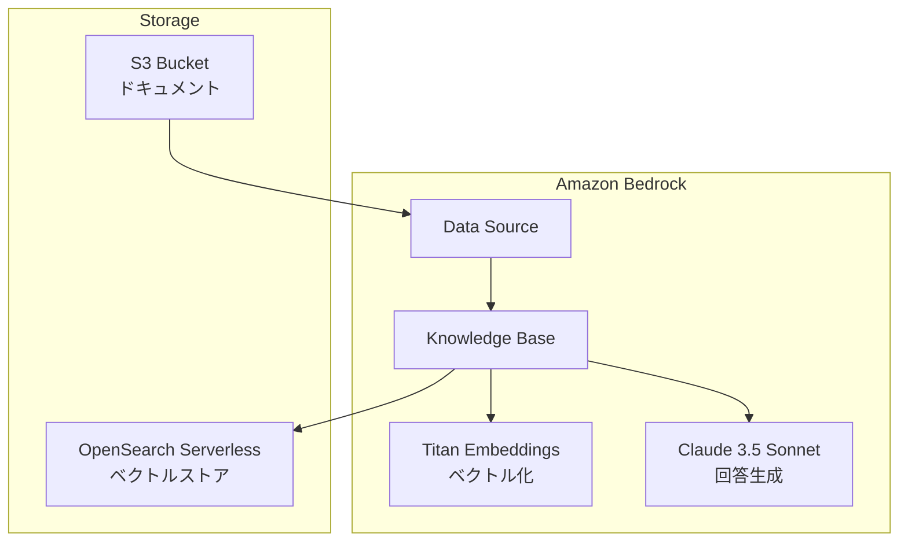

## はじめに

Amazon Bedrock Knowledge Baseを使うと、S3にアップロードしたドキュメントをベクトル化し、Claude等のLLMで自然言語による質問応答ができるRAG（Retrieval-Augmented Generation）システムを構築できます。

今回はこのRAGシステムをTerraformで構築してみました。

## 構築するもの



| コンポーネント | 選択 |
|---------------|------|
| ベクトルDB | OpenSearch Serverless |
| リージョン | ap-northeast-1 (東京) |
| Embedding Model | Amazon Titan Embed Text v1 |
| 回答生成 | Claude 3.5 Sonnet |

## 前提条件

- Terraform >= 1.5.0
- AWS CLI v2
- Bedrockのモデルアクセスが有効化されていること

:::message
AWS Console > Bedrock > Model access から以下のモデルを有効化しておく必要があります。
- Amazon Titan Embeddings G1 - Text
- Anthropic Claude 3.5 Sonnet
  :::

## ディレクトリ構成

```
bedrock/
├── terraform.tf          # プロバイダーバージョン制約
├── provider.tf           # AWS・OpenSearchプロバイダー
├── variables.tf          # 変数定義
├── locals.tf             # ローカル変数
├── iam.tf                # IAMロール・ポリシー
├── s3.tf                 # S3バケット
├── opensearch.tf         # OpenSearch Serverless
├── bedrock.tf            # Knowledge Base・Data Source
├── outputs.tf            # 出力値
├── terraform.tfvars      # 変数値
└── docs/                 # RAG用ドキュメント
```

## Terraformコード

:::details terraform.tf
```hcl:terraform.tf
terraform {
  required_version = ">= 1.5.0"

  required_providers {
    aws = {
      source  = "hashicorp/aws"
      version = "~> 5.48"
    }
    opensearch = {
      source  = "opensearch-project/opensearch"
      version = "= 2.2.0"
    }
    time = {
      source  = "hashicorp/time"
      version = "~> 0.11"
    }
  }
}
```
:::

:::message alert
`opensearch`プロバイダーは`2.2.0`に固定してください。他のバージョンではOpenSearch Serverlessとの認証エラーが発生する場合があります。
:::

:::details provider.tf
```hcl:provider.tf
provider "aws" {
  region = var.aws_region

  default_tags {
    tags = {
      Project     = var.project_name
      Environment = var.environment
      ManagedBy   = "Terraform"
    }
  }
}

provider "opensearch" {
  url         = aws_opensearchserverless_collection.knowledge_base.collection_endpoint
  healthcheck = false
}
```
:::

:::details variables.tf
```hcl:variables.tf
variable "project_name" {
  description = "プロジェクト名"
  type        = string
}

variable "knowledge_base_name" {
  description = "Knowledge Base名"
  type        = string
}

variable "environment" {
  description = "環境名"
  type        = string
  default     = "sandbox"
}

variable "aws_region" {
  description = "AWSリージョン"
  type        = string
  default     = "ap-northeast-1"
}

variable "s3_bucket_name_prefix" {
  description = "S3バケット名のプレフィックス"
  type        = string
  default     = "bedrock-kb-docs"
}

variable "s3_force_destroy" {
  description = "S3バケット削除時にオブジェクトも削除するか"
  type        = bool
  default     = true
}

variable "opensearch_collection_name" {
  description = "OpenSearch Serverlessコレクション名"
  type        = string
  default     = "bedrock-kb-collection"
}

variable "opensearch_index_name" {
  description = "OpenSearchインデックス名"
  type        = string
  default     = "bedrock-knowledge-base-default-index"
}

variable "embedding_model_id" {
  description = "Embedding Model ID"
  type        = string
  default     = "amazon.titan-embed-text-v1"
}

variable "vector_dimension" {
  description = "ベクトル次元数"
  type        = number
  default     = 1536
}

variable "iam_role_delay_seconds" {
  description = "IAMポリシー適用後の待機時間（秒）"
  type        = number
  default     = 20
}
```
:::

:::details locals.tf
```hcl:locals.tf
data "aws_caller_identity" "current" {}
data "aws_partition" "current" {}
data "aws_region" "current" {}

data "aws_bedrock_foundation_model" "embedding" {
  model_id = var.embedding_model_id
}

locals {
  account_id = data.aws_caller_identity.current.account_id
  partition  = data.aws_partition.current.partition
  region     = data.aws_region.current.name

  region_tokens = split("-", local.region)
  region_short  = "${substr(local.region_tokens[0], 0, 2)}${substr(local.region_tokens[1], 0, 1)}${local.region_tokens[2]}"

  opensearch_field_mapping = {
    vector_field   = "bedrock-knowledge-base-default-vector"
    text_field     = "AMAZON_BEDROCK_TEXT_CHUNK"
    metadata_field = "AMAZON_BEDROCK_METADATA"
  }

  common_tags = {
    Project     = var.project_name
    Environment = var.environment
  }
}
```
:::

:::details s3.tf
```hcl:s3.tf
resource "aws_s3_bucket" "documents" {
  bucket        = "${var.s3_bucket_name_prefix}-${local.region_short}-${local.account_id}"
  force_destroy = var.s3_force_destroy

  tags = merge(local.common_tags, {
    Name = "${var.project_name}-documents"
  })
}

resource "aws_s3_bucket_server_side_encryption_configuration" "documents" {
  bucket = aws_s3_bucket.documents.id

  rule {
    apply_server_side_encryption_by_default {
      sse_algorithm = "AES256"
    }
  }
}

resource "aws_s3_bucket_versioning" "documents" {
  bucket = aws_s3_bucket.documents.id

  versioning_configuration {
    status = "Enabled"
  }
}

resource "aws_s3_bucket_public_access_block" "documents" {
  bucket = aws_s3_bucket.documents.id

  block_public_acls       = true
  block_public_policy     = true
  ignore_public_acls      = true
  restrict_public_buckets = true
}
```
:::

:::details iam.tf
```hcl:iam.tf
resource "aws_iam_role" "bedrock_kb" {
  name = "AmazonBedrockExecutionRoleForKnowledgeBase_${var.knowledge_base_name}"

  assume_role_policy = jsonencode({
    Version = "2012-10-17"
    Statement = [
      {
        Action = "sts:AssumeRole"
        Effect = "Allow"
        Principal = {
          Service = "bedrock.amazonaws.com"
        }
        Condition = {
          StringEquals = {
            "aws:SourceAccount" = local.account_id
          }
          ArnLike = {
            "aws:SourceArn" = "arn:${local.partition}:bedrock:${local.region}:${local.account_id}:knowledge-base/*"
          }
        }
      }
    ]
  })
}

resource "aws_iam_role_policy" "bedrock_kb_model" {
  name = "AmazonBedrockFoundationModelPolicy_${var.knowledge_base_name}"
  role = aws_iam_role.bedrock_kb.name

  policy = jsonencode({
    Version = "2012-10-17"
    Statement = [
      {
        Action   = "bedrock:InvokeModel"
        Effect   = "Allow"
        Resource = data.aws_bedrock_foundation_model.embedding.model_arn
      }
    ]
  })
}

resource "aws_iam_role_policy" "bedrock_kb_s3" {
  name = "AmazonBedrockS3Policy_${var.knowledge_base_name}"
  role = aws_iam_role.bedrock_kb.name

  policy = jsonencode({
    Version = "2012-10-17"
    Statement = [
      {
        Action   = "s3:ListBucket"
        Effect   = "Allow"
        Resource = aws_s3_bucket.documents.arn
      },
      {
        Action   = "s3:GetObject"
        Effect   = "Allow"
        Resource = "${aws_s3_bucket.documents.arn}/*"
      }
    ]
  })
}

resource "aws_iam_role_policy" "bedrock_kb_opensearch" {
  name = "AmazonBedrockOSSPolicy_${var.knowledge_base_name}"
  role = aws_iam_role.bedrock_kb.name

  policy = jsonencode({
    Version = "2012-10-17"
    Statement = [
      {
        Action   = "aoss:APIAccessAll"
        Effect   = "Allow"
        Resource = aws_opensearchserverless_collection.knowledge_base.arn
      }
    ]
  })
}

resource "time_sleep" "iam_propagation" {
  create_duration = "${var.iam_role_delay_seconds}s"

  depends_on = [aws_iam_role_policy.bedrock_kb_opensearch]
}
```

:::message
`time_sleep`リソースはIAMポリシーの伝播を待機するためのものです。IAMはEventual Consistencyのため、ポリシー作成直後にKnowledge Baseを作成すると権限エラーになる場合があります。
:::
:::

OpenSearch Serverlessの設定は最も複雑な部分です。

:::details opensearch.tf
```hcl:opensearch.tf
# 暗号化ポリシー（必須：コレクション作成前に必要）
resource "aws_opensearchserverless_security_policy" "encryption" {
  name = var.opensearch_collection_name
  type = "encryption"

  policy = jsonencode({
    Rules = [
      {
        Resource     = ["collection/${var.opensearch_collection_name}"]
        ResourceType = "collection"
      }
    ]
    AWSOwnedKey = true
  })
}

# ネットワークポリシー
resource "aws_opensearchserverless_security_policy" "network" {
  name = var.opensearch_collection_name
  type = "network"

  policy = jsonencode([
    {
      Rules = [
        {
          ResourceType = "collection"
          Resource     = ["collection/${var.opensearch_collection_name}"]
        },
        {
          ResourceType = "dashboard"
          Resource     = ["collection/${var.opensearch_collection_name}"]
        }
      ]
      AllowFromPublic = true
    }
  ])
}

# データアクセスポリシー
resource "aws_opensearchserverless_access_policy" "data_access" {
  name = var.opensearch_collection_name
  type = "data"

  policy = jsonencode([
    {
      Rules = [
        {
          ResourceType = "index"
          Resource     = ["index/${var.opensearch_collection_name}/*"]
          Permission = [
            "aoss:CreateIndex",
            "aoss:DeleteIndex",
            "aoss:DescribeIndex",
            "aoss:ReadDocument",
            "aoss:UpdateIndex",
            "aoss:WriteDocument"
          ]
        },
        {
          ResourceType = "collection"
          Resource     = ["collection/${var.opensearch_collection_name}"]
          Permission = [
            "aoss:CreateCollectionItems",
            "aoss:DescribeCollectionItems",
            "aoss:UpdateCollectionItems"
          ]
        }
      ]
      Principal = [
        aws_iam_role.bedrock_kb.arn,
        data.aws_caller_identity.current.arn
      ]
    }
  ])
}

# コレクション
resource "aws_opensearchserverless_collection" "knowledge_base" {
  name = var.opensearch_collection_name
  type = "VECTORSEARCH"

  depends_on = [
    aws_opensearchserverless_security_policy.encryption,
    aws_opensearchserverless_security_policy.network,
    aws_opensearchserverless_access_policy.data_access
  ]
}

# ベクトルインデックス
resource "opensearch_index" "knowledge_base" {
  name                           = var.opensearch_index_name
  number_of_shards               = "2"
  number_of_replicas             = "0"
  index_knn                      = true
  index_knn_algo_param_ef_search = "512"

  mappings = jsonencode({
    properties = {
      "${local.opensearch_field_mapping.vector_field}" = {
        type      = "knn_vector"
        dimension = var.vector_dimension
        method = {
          name   = "hnsw"
          engine = "faiss"
          parameters = {
            m               = 16
            ef_construction = 512
          }
          space_type = "l2"
        }
      }
      "${local.opensearch_field_mapping.metadata_field}" = {
        type  = "text"
        index = false
      }
      "${local.opensearch_field_mapping.text_field}" = {
        type  = "text"
        index = true
      }
    }
  })

  force_destroy = true

  depends_on = [aws_opensearchserverless_collection.knowledge_base]
}
```
:::

:::details bedrock.tf
```hcl:bedrock.tf
resource "aws_bedrockagent_knowledge_base" "main" {
  name     = var.knowledge_base_name
  role_arn = aws_iam_role.bedrock_kb.arn

  knowledge_base_configuration {
    type = "VECTOR"
    vector_knowledge_base_configuration {
      embedding_model_arn = data.aws_bedrock_foundation_model.embedding.model_arn
    }
  }

  storage_configuration {
    type = "OPENSEARCH_SERVERLESS"
    opensearch_serverless_configuration {
      collection_arn    = aws_opensearchserverless_collection.knowledge_base.arn
      vector_index_name = var.opensearch_index_name
      field_mapping {
        vector_field   = local.opensearch_field_mapping.vector_field
        text_field     = local.opensearch_field_mapping.text_field
        metadata_field = local.opensearch_field_mapping.metadata_field
      }
    }
  }

  depends_on = [
    aws_iam_role_policy.bedrock_kb_model,
    aws_iam_role_policy.bedrock_kb_s3,
    opensearch_index.knowledge_base,
    time_sleep.iam_propagation
  ]
}

resource "aws_bedrockagent_data_source" "s3" {
  knowledge_base_id = aws_bedrockagent_knowledge_base.main.id
  name              = "${var.knowledge_base_name}-s3-datasource"

  data_source_configuration {
    type = "S3"
    s3_configuration {
      bucket_arn = aws_s3_bucket.documents.arn
    }
  }
}
```
:::

:::details outputs.tf
```hcl:outputs.tf
output "s3_bucket_name" {
  description = "ドキュメントソース用S3バケット名"
  value       = aws_s3_bucket.documents.id
}

output "knowledge_base_id" {
  description = "Bedrock Knowledge Base ID"
  value       = aws_bedrockagent_knowledge_base.main.id
}

output "data_source_id" {
  description = "Bedrock Data Source ID"
  value       = aws_bedrockagent_data_source.s3.data_source_id
}
```
:::

:::details terraform.tfvars
```hcl:terraform.tfvars
project_name        = "bedrock-rag"
knowledge_base_name = "my-knowledge-base"
environment         = "sandbox"
```
:::

## デプロイ

### 1. Terraformの実行

```bash
# 初期化
terraform init

# 実行計画の確認
terraform plan

# リソース作成
terraform apply
```

:::message
OpenSearch Serverlessのコレクション作成は、アカウント初の場合**10分以上**かかることがあります。
:::

### 2. ドキュメントのアップロード

```bash
# サンプルドキュメントを作成
mkdir -p docs
cat << 'EOF' > docs/company-policy.md
# 会社ポリシー

## リモートワーク
- 週3日までリモートワーク可能
- 事前申請は不要（チームへの共有は必須）
- セキュリティガイドラインの遵守が必要
EOF

# S3にアップロード
aws s3 cp ./docs/ s3://$(terraform output -raw s3_bucket_name)/ --recursive
```

### 3. データソースの同期

```bash
# Ingestion Jobを開始
aws bedrock-agent start-ingestion-job \
  --knowledge-base-id $(terraform output -raw knowledge_base_id) \
  --data-source-id $(terraform output -raw data_source_id)
```

## 動作確認

### 検索のみ

```bash
aws bedrock-agent-runtime retrieve \
  --knowledge-base-id $(terraform output -raw knowledge_base_id) \
  --retrieval-query '{"text": "リモートワークのルールは？"}'
```

### 回答生成付き（Claude 3.5 Sonnet）

```bash
aws bedrock-agent-runtime retrieve-and-generate \
  --input '{"text": "リモートワークのルールを教えてください"}' \
  --retrieve-and-generate-configuration '{
    "type": "KNOWLEDGE_BASE",
    "knowledgeBaseConfiguration": {
      "knowledgeBaseId": "'$(terraform output -raw knowledge_base_id)'",
      "modelArn": "arn:aws:bedrock:ap-northeast-1::foundation-model/anthropic.claude-3-5-sonnet-20240620-v1:0"
    }
  }'
```

### 実行結果

```json
{
  "output": {
    "text": "リモートワークに関するルールは以下の通りです：\n\n1. 週3日までリモートワークが可能です。\n2. リモートワークの事前申請は不要ですが、チームへの共有は必須となっています。\n3. リモートワーク時にはセキュリティガイドラインを遵守する必要があります。"
  }
}
```

ドキュメントの内容をもとに、的確な回答が返ってきました！

## TIPS

### 1. OpenSearchプロバイダーのバージョン

`opensearch-project/opensearch`プロバイダーは`2.2.0`を使用してください。他のバージョンではOpenSearch Serverlessとの認証でエラーになります。

### 2. IAMの伝播待機

IAMはEventual Consistencyのため、ポリシー作成直後にKnowledge Baseを作成するとエラーになることがあります。`time_sleep`で20秒程度待機を入れています。

### 3. OpenSearchのhealthcheck

OpenSearch Serverlessではhealthcheckが動作しないため、`healthcheck = false`を設定する必要があります。

### 4. フィールドマッピングの整合性

`opensearch_index`のマッピングと`aws_bedrockagent_knowledge_base`の`field_mapping`が一致している必要があります。

## コストについて

:::message alert
OpenSearch Serverlessは最低4 OCU（検索2 + インデックス2）から課金が始まります。検証後は`terraform destroy`でリソースを削除することをおすすめします。
:::

## まとめ

TerraformでAmazon Bedrock Knowledge Base + RAGシステムを構築しました。

- **OpenSearch Serverless**をベクトルストアとして使用
- **Titan Embeddings**でドキュメントをベクトル化
- **Claude 3.5 Sonnet**で自然言語による回答を生成

Infrastructure as Codeで管理することで、環境の再現性や構成の可視化ができるようになりました。

## 参考

- [Deploy Amazon Bedrock Knowledge Bases using Terraform - AWS Blog](https://aws.amazon.com/blogs/machine-learning/deploy-amazon-bedrock-knowledge-bases-using-terraform-for-rag-based-generative-ai-applications/)
- [aws_bedrockagent_knowledge_base - Terraform Registry](https://registry.terraform.io/providers/hashicorp/aws/latest/docs/resources/bedrockagent_knowledge_base)
- [aws_opensearchserverless_collection - Terraform Registry](https://registry.terraform.io/providers/hashicorp/aws/latest/docs/resources/opensearchserverless_collection)
